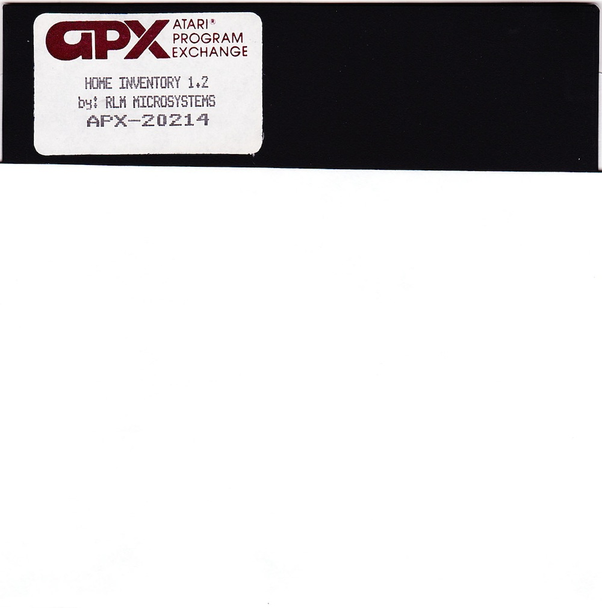
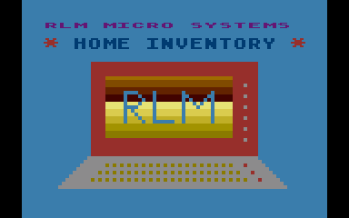
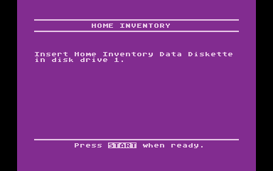
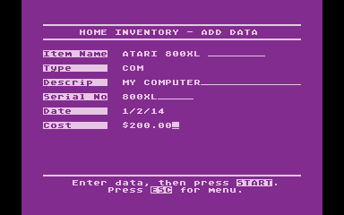
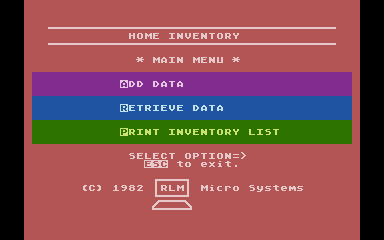
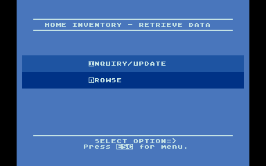

# Home Inventory

Copyright (C) 1982 RLM Micro Systems

Thanks to Wade Ripkowski of the InverseAtascii podcast for the manual and disk scans! :-)))

## ATR-Images

- [Home\_Inventory\_APX-20214.atr](attachments/Home_Inventory_APX-20214.atr)
- [Data\_Diskette.atr](attachments/Data_Diskette.atr)

## Manual

- [Home\_Inventory\_APX-20214.pdf](../../../../media/Companies/Atari/Home_Inventory/attachments/Home_Inventory_APX-20214.pdf) ; size: 7.9 MB

## Images

- Home Inventory - Diskette 

- Home Inventory - screenshot 1 

- Home Inventory - screenshot 2 

- Home Inventory - screenshot 3 

- Home Inventory - screenshot 4 

- Home Inventory - screenshot 5 
