# Mortgage \& Loan Analysis (CX4115)

Copyright (C) 1980 Atari, Inc. under license from Control Data Corporation

MORTGAGE COMPARISON PROGRAM

This program provides a comparison of different mortgage terms. The program will display the monthly payments and total interest for all possible combinations of mortgage amounts, interest rates, and mortgage lives. The mortgage amounts are input in dollars, the interest rates in percents, and the mortgage lives in years. It is a modification of MORTCOST by J. E. Felch, Amos Tuck School of Business.

The program will ask for the input values one at a time. One to ten values may be entered for each category. When all values for a category have been entered, press RETURN without entering any numbers. The program will move to the next category, or begin the calculations. Each mortgage amount will occupy a single display. If all combinations cannot be shown on a single screen, they will be displayed one screen at a time until all have been shown. When all calculation values have been displayed, the program will ask if you wish to consider another set of terms. If the response is Y or YES, it will return to the beginning of the program.

## Manuals

- [Mortgage\_and\_Loan\_Analysis\_CX4115-1.pdf](attachments/Mortgage_and_Loan_Analysis_CX4115-1.pdf) ; size: 918 KB ; version 1 of the manual
- [Mortgage\_and\_Loan\_Analysis\_CX4115-2.pdf](attachments/Mortgage_and_Loan_Analysis_CX4115-2.pdf) ; size: 799 KB ; version 2 of the manual

## ATR-Image

- [Mortgage\_and\_Loan\_Analysis\_CX4115.atr](attachments/Mortgage_and_Loan_Analysis_CX4115.atr) ; diskette-version with all files and DOS 2.0S of the original cassette-version. This is a complete 100 % cassette-import including the introduction from the loading process.

## Box-Image

- Mortgage \& Loan Analysis CX4115 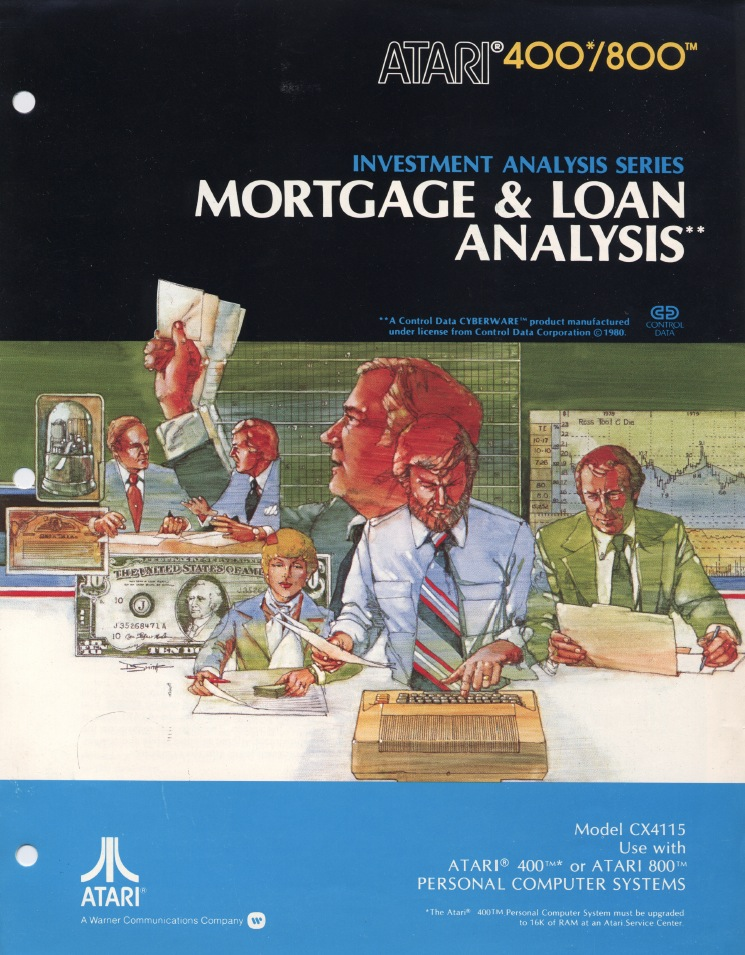

## Cassette-Images

- Mortgage \& Loan Analysis CX4115 - front of cassette 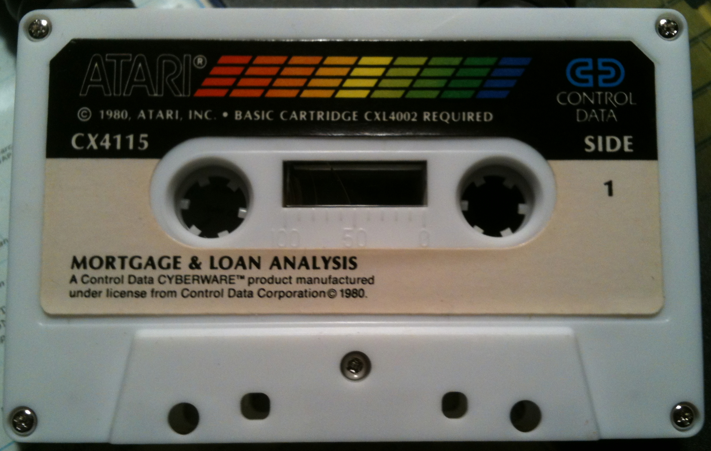

- Mortgage \& Loan Analysis CX4115 - back of cassette 

## Screenshots

- Mortgage \& Loan Analysis CX4115 - screenshot 1 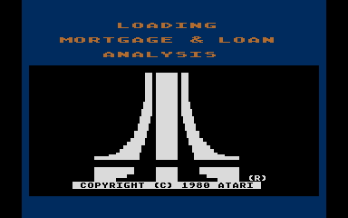

- Mortgage \& Loan Analysis CX4115 - screenshot 2 

- Mortgage \& Loan Analysis CX4115 - screenshot 3 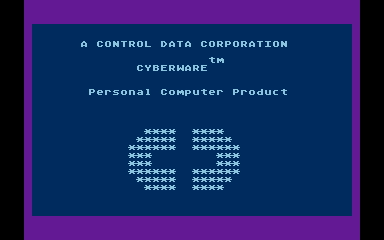

- Mortgage \& Loan Analysis CX4115 - screenshot 4 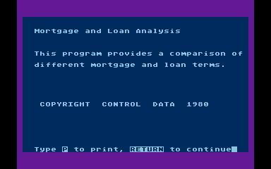

- Mortgage \& Loan Analysis CX4115 - screenshot 5 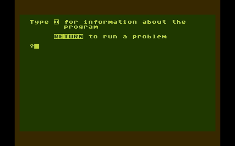

- Mortgage \& Loan Analysis CX4115 - screenshot 6 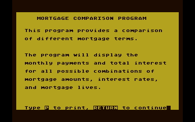

- Mortgage \& Loan Analysis CX4115 - screenshot 7 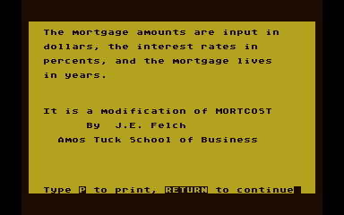

- Mortgage \& Loan Analysis CX4115 - screenshot 8 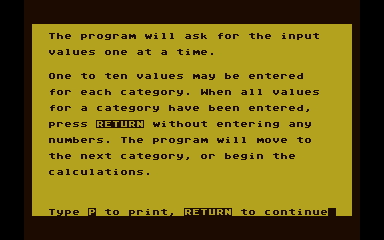

- Mortgage \& Loan Analysis CX4115 - screenshot 9 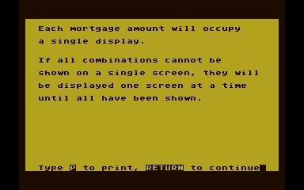

- Mortgage \& Loan Analysis CX4115 - screenshot 10 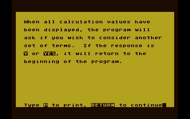

- Mortgage \& Loan Analysis CX4115 - screenshot 11 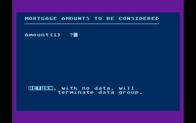

- Mortgage \& Loan Analysis CX4115 - screenshot 12 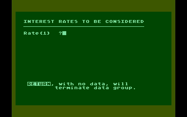

- Mortgage \& Loan Analysis CX4115 - screenshot 13 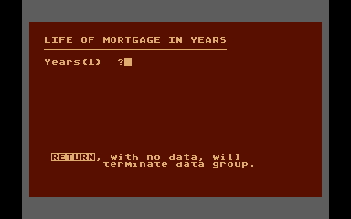

- Mortgage \& Loan Analysis CX4115 - screenshot 14 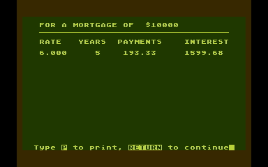
