# PILOT

### Background
PILOT is an extremely simple programming language written in 1968 explicitly for teaching programming to children. The language consists of one-letter commands followed by a colon, one command per line, and a very limited set of commands and operations. Variables are prefixed with $, and labels with a *.

PILOT is unique in that it added a set of commands for graphics and sound using two-letter mnemonics GR and SO. The graphics system used turtle graphics, with the string following the GR command containing multiple sub-commands like DRAW and TURN. The syntax for these commands is similar to [WSFN - Which Stands for Nothing](../../../Languages/WSFN/README.md), allowing a series of commands to be repeated by placing them inside parentheses and putting the number of times to perform them in front.

For editing purposes, PILOT uses line numbers, which were not part of the original language.  However, these can be skipped by using the AUTO feature, which adds these numbers automatically without displaying them on the screen. The screen turns a yellow color when AUTO is active. The editor includes renumbering features, which suggests it might be the one from the [Atari Assembler Editor](../Atari_Assembler_Editor/README.md).

### Example

The following is a simple Hello World in PILOT:
```
R:Hello World in PILOT
T:What is your name?
A:$NAME
R:Hello $NAME!
```
R is a "remark", similar to the REM statement in BASIC, T is "type", the equivalent of PRINT, and A is "accept", the equivalent to INPUT. The following example shows the Atari extensions for graphics:
```
R:Draw a square in the center of the screen
GR:4(DRAW 20; TURN 90)
```
The 4 after the GR: is a looping construct which repeats the section in the (...) four times. This is similar to the [WSFN - Which Stands for Nothing](../../../Languages/WSFN/README.md) language, which had similar turtle graphics and looping structures.

There are several Atari Products related to PILOT:
- PILOT Educators Package (CX405), package with cartridge, two cassette tapes and primer.
- PILOT Programming Language with 'Turtle' Graphics (CXL4018), cartridge
- PILOT Programs for Children and PILOT Turtle Graphics Demonstration with PILOT kit (CX4113), two cassette tapes
- PILOT Primer (CO17809), book

## Images
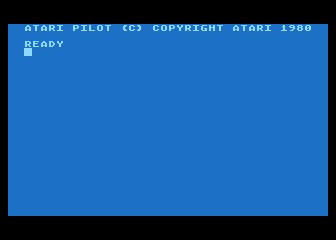
PILOT Cartridge CXL4018 - 1st screen after booting

 ; Thank you so much Atari_Ace from AtariAge for your help in creating the code. We really appreciate your help, please go ahead! :-)))

## Commercials
- [PILOT commercial](../Commercials/attachments/Atari-8bit-Commercial-Pac_Man_PILOT.flv) ; Flash video file, size: 4.7 MB.

## Manuals
- [PILOT_Primer.pdf](../../../../media/Languages/PILOT/PILOT/attachments/PILOT_Primer.pdf) The PILOT Programming Language Instruction Manual
- [PILOT_Demonstration_Programs-Users_Guide.pdf](attachments/PILOT_Demonstration_Programs-Users_Guide.pdf)
- [Student_PILOT-Reference_Guide.pdf](../../../../media/Languages/PILOT/PILOT/attachments/Student_PILOT-Reference_Guide.pdf)
- [PILOT-Pocket_Reference_Card.pdf](attachments/PILOT_Pocket_Reference_Card.pdf)
- [PILOT External Specification-Revision E 1980](../../../../media/Languages/PILOT/PILOT/attachments/PILOT_External_Specification-Revision_E.pdf) 6.2 MB PDF file, b/w only, searchable, PILOT External Specification, Revision E, 1980, thank you so much for your work Kay Savetz! We really appreciate that!

## References
- [PILOT Source Code on archive.org](https://archive.org/details/AtariPILOTSourceCode); Thank you so much Harry & Kevin for your help in getting the code. We really appreciate your help, please go ahead! :-)))
- [PILOT Source Code on AtariAge](https://forums.atariage.com/topic/257991-atari-pilot-source-code/)

## CAR-Images
- [PILOT.car](attachments/PILOT.car)

## ROM-Images
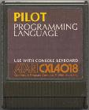
PILOT Cartridge CXL4018
- [PILOT.rom](attachments/PILOT.rom)

## ATR-Images
- [PILOT_Cassettes_CX4113-A_and_B-Side_1_and_2.atr](attachments/PILOT_Cassettes_CX4113-A_and_B-Side_1_and_2.atr)
- [Languages_1.atr](attachments/Languages_1.atr)
- [Languages_2.atr](attachments/Languages_2.atr)
- [PILOT_1.atr](attachments/PILOT_1.atr)
- [PILOT_2.atr](attachments/PILOT_2.atr)
- [PILOT_3.atr](attachments/PILOT_3.atr)

## CAS-Images
- [PILOT_Educators_Package-Cassette_A-Side_1.cas](attachments/PILOT_Educators_Package-Cassette_A-Side_1.cas)
- [PILOT_Educators_Package-Cassette_A-Side_2.cas](attachments/PILOT_Educators_Package-Cassette_A-Side_2.cas)
- [PILOT_Educators_Package-Cassette_B-Side_1.cas](attachments/PILOT_Educators_Package-Cassette_B-Side_1.cas)
- [PILOT_Educators_Package-Cassette_B-Side_2.cas](attachments/PILOT_Educators_Package-Cassette_B-Side_2.cas)

## PILOT Cassettes CX4113
With Giga-Thanks to Allan Bushman (he will never be forgotten!), we are now at 100% of the PILOT CX405 Educators' Package, the complete(!) box.
The package includes two Demonstration Program Cassettes:

- __PILOT Cassette CX4113 A:__

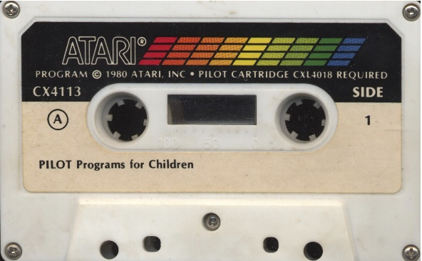
PILOT Programs for Children - cassette A, side 1 - thanks to Allan Bushman for scanning
- [PILOT_Educators_Package-Cassette_A-Side_1.cas](attachments/PILOT_Educators_Package-Cassette_A-Side_1.cas)

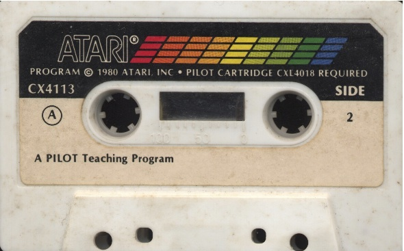
A PILOT Teaching Program - cassette A, side 2 - thanks to Allan Bushman for scanning
- [PILOT_Educators_Package-Cassette_A-Side_2.cas](attachments/PILOT_Educators_Package-Cassette_A-Side_2.cas)

- __PILOT Cassette CX4113 B:__

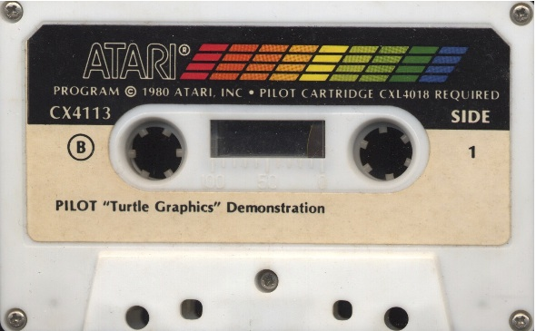
PILOT "Turtle Graphics" Demonstration - cassette B, side 1 - thanks to Allan Bushman for scanning
- [PILOT_Educators_Package-Cassette_B-Side_1.cas](attachments/PILOT_Educators_Package-Cassette_B-Side_1.cas)


PILOT Do-It-Yourself Slide Show - cassette B, side 2 - thanks to Allan Bushman for scanning
- [PILOT_Educators_Package-Cassette_B-Side_2.cas](attachments/PILOT_Educators_Package-Cassette_B-Side_2.cas)

Both cassettes contain only program data, not audio! Therefore, we prefer to have it on a diskette. Please see above under: ATR-Images

## PILOT Cassettes CX4113 Program Pictures
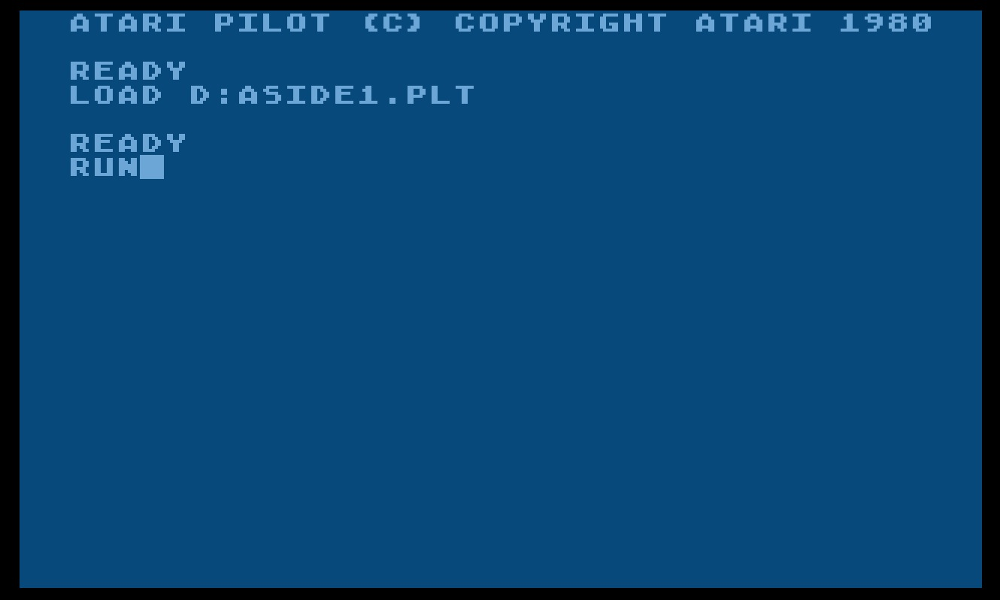
PILOT Demonstration Program Cassettes CX4113-01
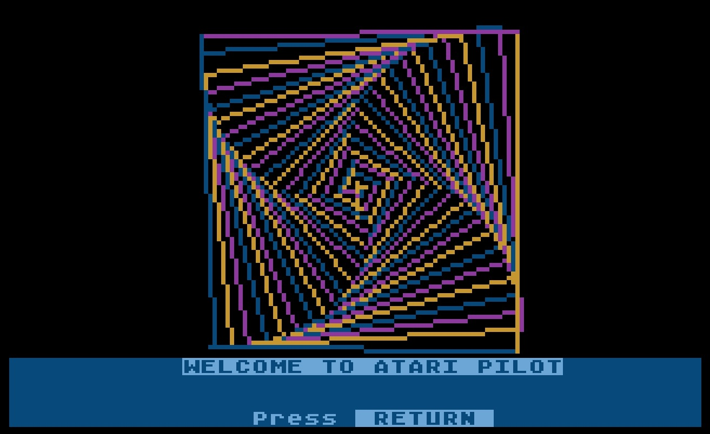
PILOT Demonstration Program Cassettes CX4113-02
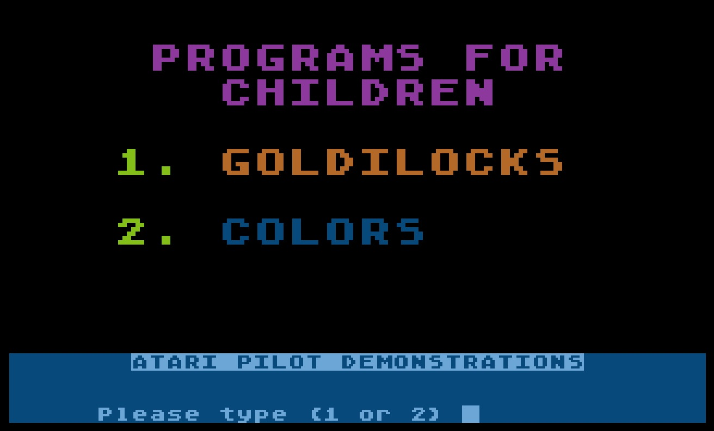
PILOT Demonstration Program Cassettes CX4113-03
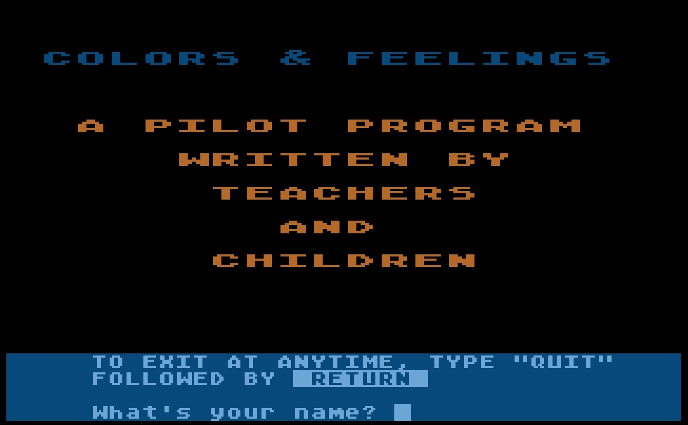
PILOT Demonstration Program Cassettes CX4113-04
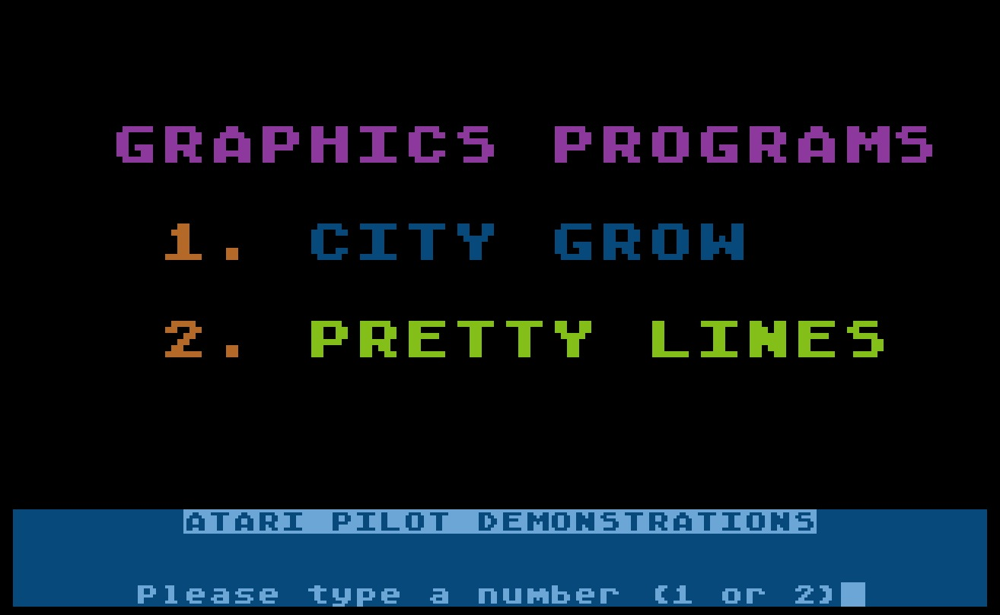
PILOT Demonstration Program Cassettes CX4113-05
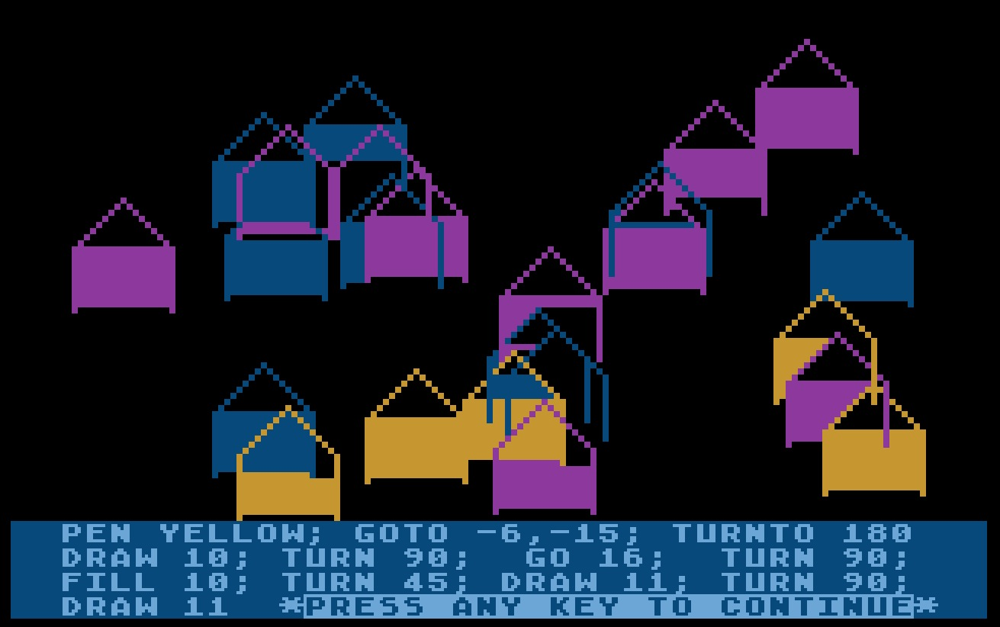
PILOT Demonstration Program Cassettes CX4113-06
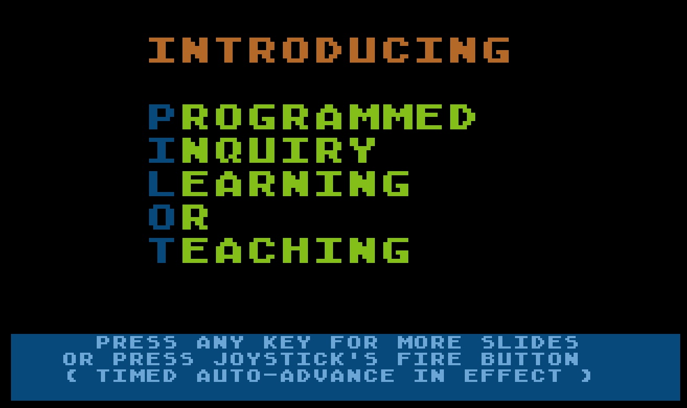
PILOT Demonstration Program Cassettes CX4113-07
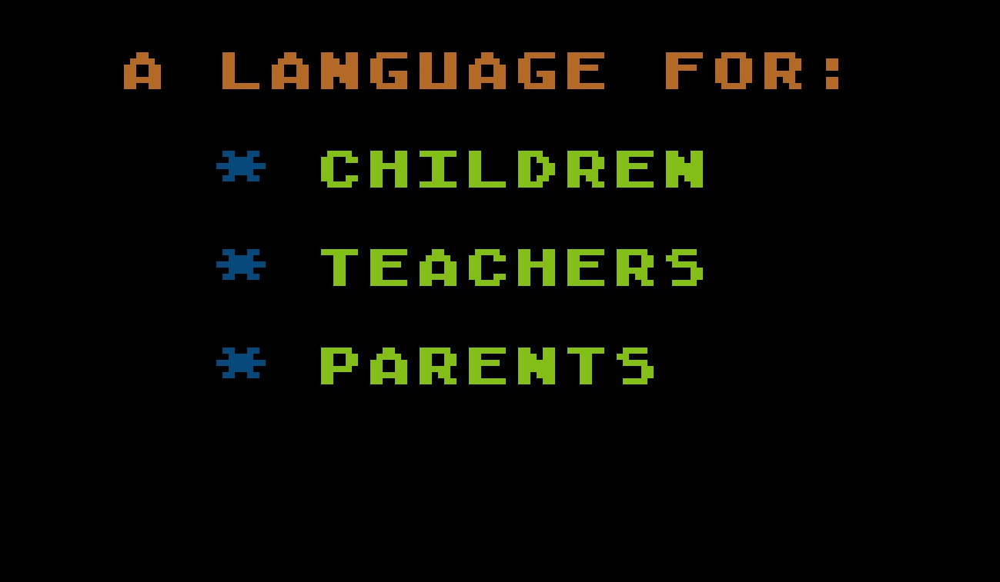
PILOT Demonstration Program Cassettes CX4113-08
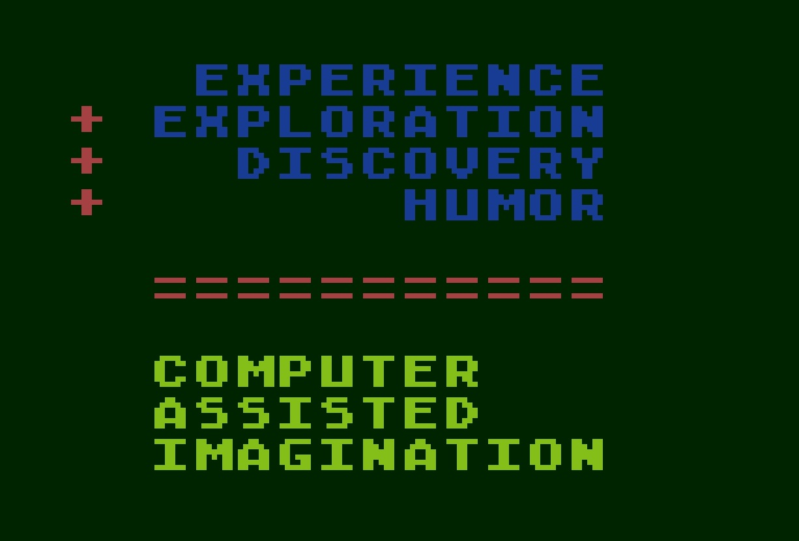
PILOT Demonstration Program Cassettes CX4113-09
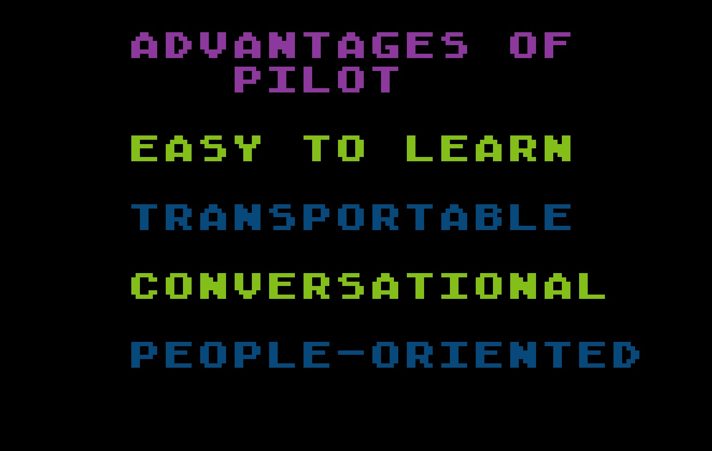
PILOT Demonstration Program Cassettes CX4113-10
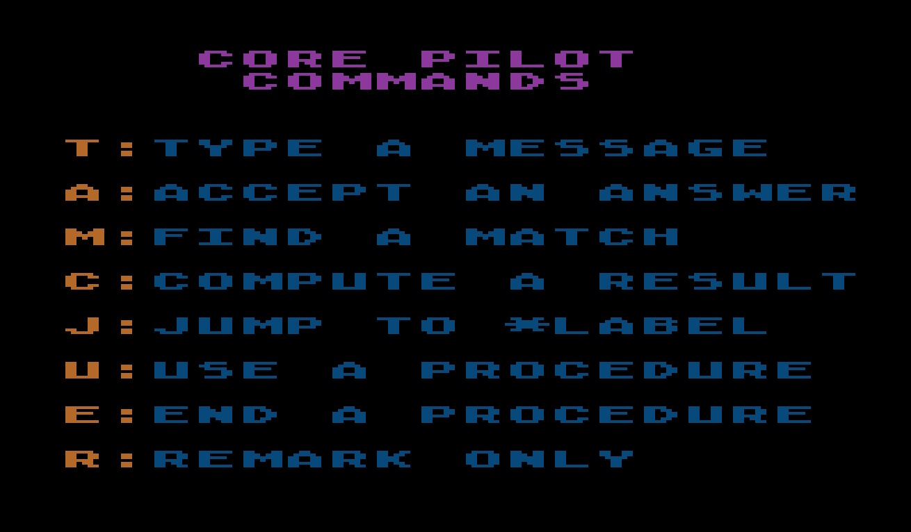
PILOT Demonstration Program Cassettes CX4113-11
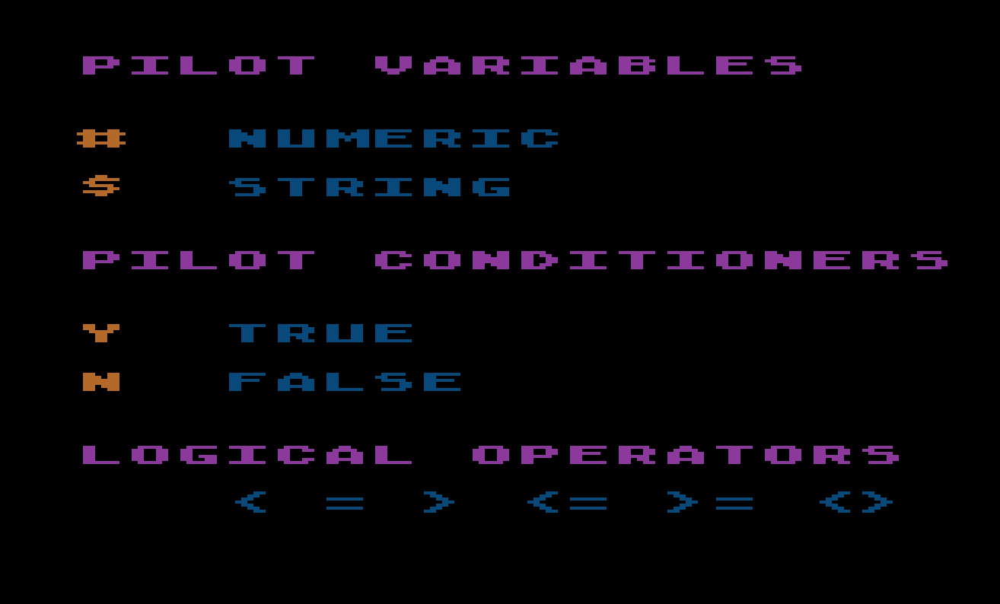
PILOT Demonstration Program Cassettes CX4113-12
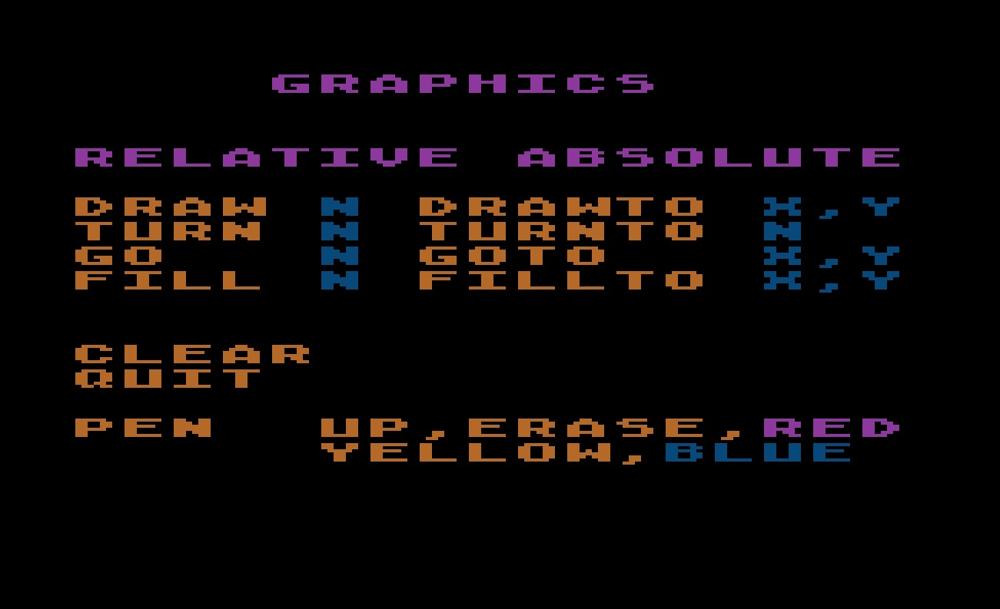
PILOT Demonstration Program Cassettes CX4113-13
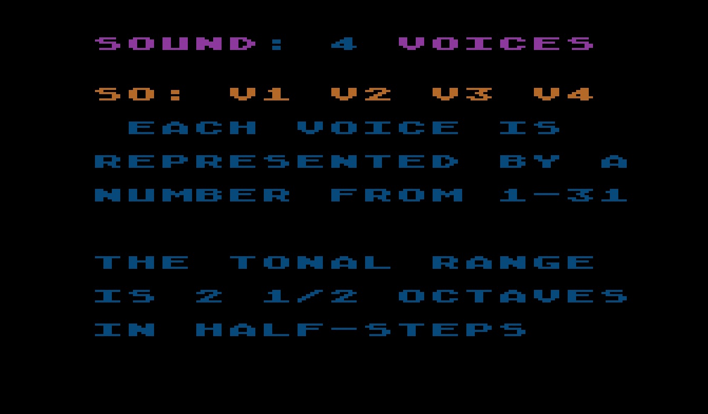
PILOT Demonstration Program Cassettes CX4113-14
