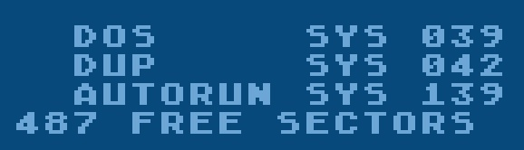
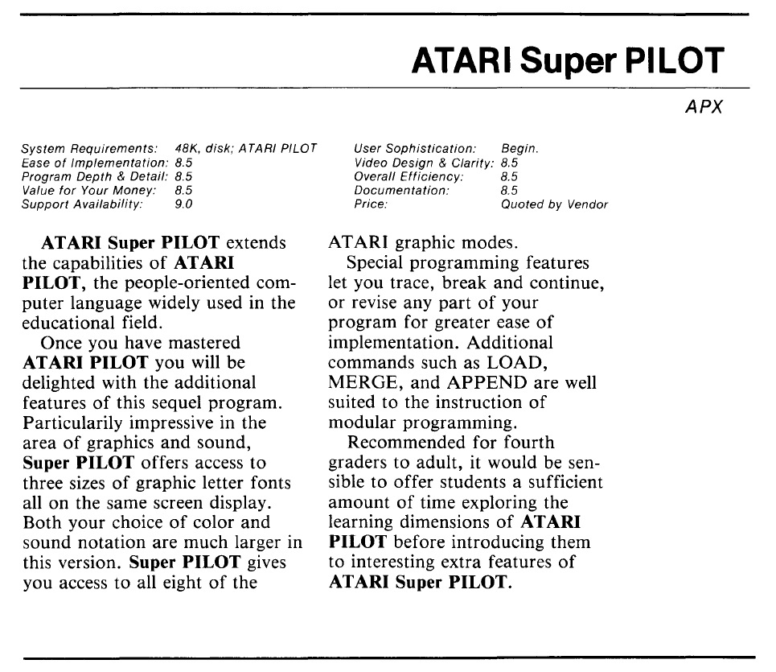
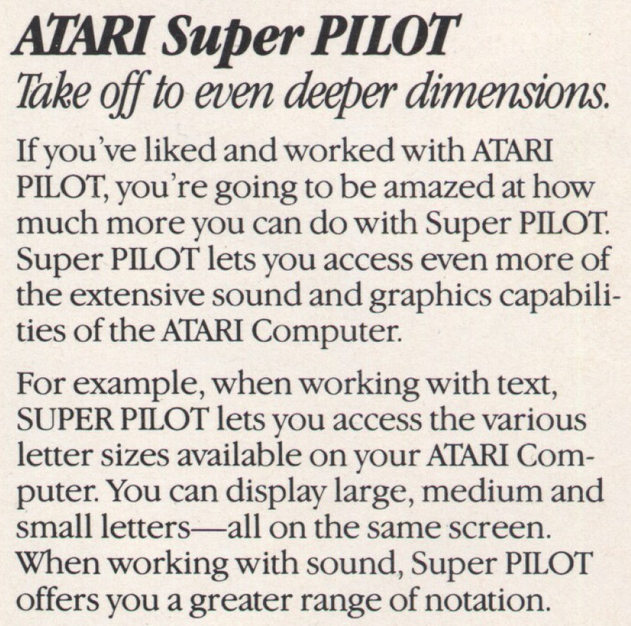
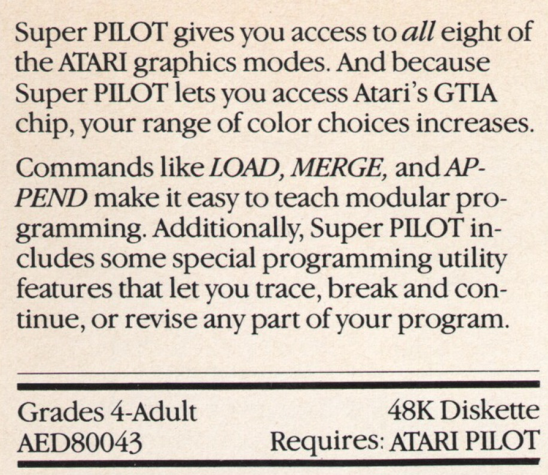

# PILOT II or Super PILOT 

AED80043 48K Diskette; Copyright (C) 1982 Atari, Inc.  
  
### Background  
The PILOT II, or Super PILOT, was never shipped or released to the general public. It was used in the Atari summer camps for educational purposes and delivered on diskette only. Therefore, we deeply thank Kay Savetz again for his outstanding help. Kay, we owe you so much; endless thanks for bringing this lost-to-be-believed language to light. You will never be forgotten! :-)))  
  
For the normal PILOT commands, please see [PILOT](../PILOT/README.md), here, we would just like to introduce the new commands in PILOT II:  
  
PILOT II commands of version 44  
  
## Source Code  
- [PILOT II source code](attachments/PILOT_II-Scoure_Code.txt) ; Thank you so much Atari_Ace from AtariAge for your help in creating the code. We really appreciate your help, please go ahead! :-)))  
## ATR images  
- [PILOT II v44 from 1983-05-26](attachments/PILOT_II-v44-1983-05-26.atr) ; Program diskette of PILOT II from 1983-05-26 __with__ DOS-command  
- [PILOT II v46 from 1983-06-07](attachments/PILOT_II-v46-1983-06-07.atr) ; Program diskette of PILOT II from 1983-06-07 __without__ DOS-command  
Up to now, only the DOS command has been found to differ between the two versions above; maybe there is more. The reader is invited to find out more. :-)  
Both versions show the following content:  
  
Disk directory of the PILOT II program diskettes  
  
As we can see, 139 sectors are used for the language file, while 132 sectors match exactly with the size of 16 KB. Therefore, the size of PILOT II may be 16.85 KB.  
## Manuals  
- [PILOT_II.pdf](attachments/PILOT_II.pdf) ; PILOT II infos  
- [Plotter_Commands_for_PILOT_II.pdf](attachments/Plotter_Commands_for_PILOT_II.pdf) ; Plotter commands for PILOT II  

## References  
- [PILOT Source Code on archive.org](https://archive.org/details/AtariPILOTSourceCode); Thank you so much Harry & Kay for your help in getting the code. We really appreciate your help; please go ahead! :-)))  
- [PILOT Source Code on AtariAge](https://forums.atariage.com/topic/257991-atari-pilot-source-code/)  

## Several PILOT programs on ATR images  
- [PILOT_Utility_Diskette_1_Atari_Computer_Camps_1983.atr](attachments/PILOT_Utility_Diskette_1-Atari_Computer_Camps_1983.atr) ;  
- [PILOT_Utility_Diskette_2_Atari_Computer_Camps_1983.atr](attachments/PILOT_Utility_Diskette_2-Atari_Computer_Camps_1983.atr) ;  
- [PILOT_Cassette_Image.atr](attachments/PILOT_Cassette_Image.atr) ;  
- [New_PILOT_Demo_Disk_menu-based_05091981.atr](attachments/New_PILOT_Demo_Disk-Menu-Based-1991-09-05.atr) ;  
- [Misc_PILOT_Demos.atr](attachments/Misc_PILOT_Demos.atr) ;  
- [PILOT_Activities_and_Games_Book-Programs.atr](attachments/PILOT_Activities_and_Games_Book-Programs.atr) ;  
- [PILOT_II_Rumdrums_v13.atr](attachments/PILOT_II_Rumdrums_v13.atr) ;  
- [PILOT_Card_Shuffling.atr](attachments/PILOT_Card_Shuffling.atr) ;  
- [Dan_Thornburg-Interesting_PILOT_Programs.atr](attachments/Dan_Thornburg-Interesting_PILOT_Programs.atr) ;  

## Advertisements  
  
  
  
