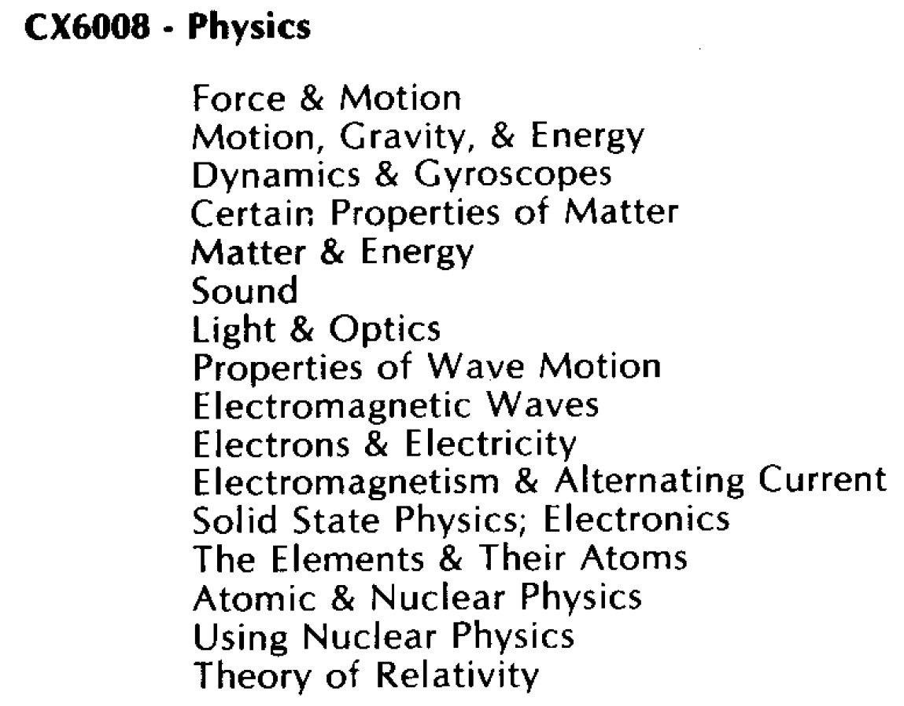

# Physics CX6008

## Box

- Physics CX6008 box 

## Content

- Physics CX6008 content 

## Cassette-Images in FLAC-format

- [http://data.atariwiki.org/FLAC/P/Physics\_CX6008-Cassette\_A-Side\_1.flac](http://data.atariwiki.org/FLAC/P/Physics_CX6008-Cassette_A-Side_1.flac) ; size: 62.7 MB

- [http://data.atariwiki.org/FLAC/P/Physics\_CX6008-Cassette\_A-Side\_2.flac](http://data.atariwiki.org/FLAC/P/Physics_CX6008-Cassette_A-Side_2.flac) ; size: 53.7 MB

- [http://data.atariwiki.org/FLAC/P/Physics\_CX6008-Cassette\_B-Side\_1.flac](http://data.atariwiki.org/FLAC/P/Physics_CX6008-Cassette_B-Side_1.flac) ; size: 62.5 MB

- [http://data.atariwiki.org/FLAC/P/Physics\_CX6008-Cassette\_B-Side\_2.flac](http://data.atariwiki.org/FLAC/P/Physics_CX6008-Cassette_B-Side_2.flac) ; size: 65.3 MB

- [http://data.atariwiki.org/FLAC/P/Physics\_CX6008-Cassette\_C-Side\_1.flac](http://data.atariwiki.org/FLAC/P/Physics_CX6008-Cassette_C-Side_1.flac) ; size: 67.1 MB

- [http://data.atariwiki.org/FLAC/P/Physics\_CX6008-Cassette\_C-Side\_2.flac](http://data.atariwiki.org/FLAC/P/Physics_CX6008-Cassette_C-Side_2.flac) ; size: 56.1 MB

- [http://data.atariwiki.org/FLAC/P/Physics\_CX6008-Cassette\_D-Side\_1.flac](http://data.atariwiki.org/FLAC/P/Physics_CX6008-Cassette_D-Side_1.flac) ; size: 55.8 MB

- [http://data.atariwiki.org/FLAC/P/Physics\_CX6008-Cassette\_D-Side\_2.flac](http://data.atariwiki.org/FLAC/P/Physics_CX6008-Cassette_D-Side_2.flac) ; size: 68.2 MB
