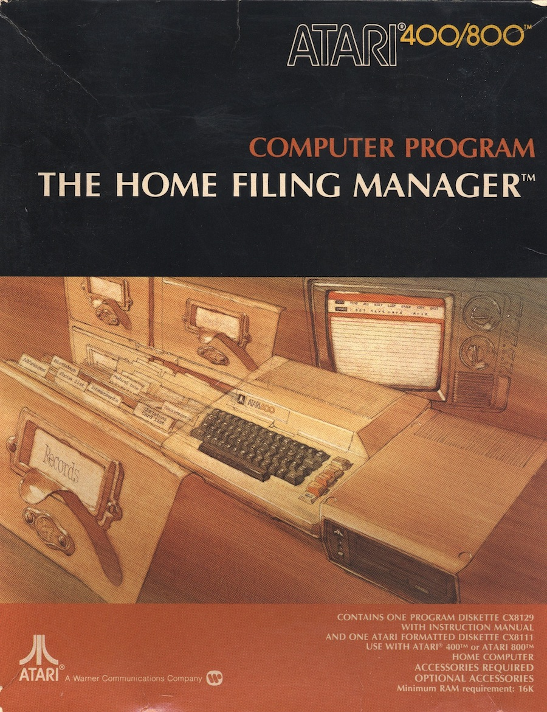
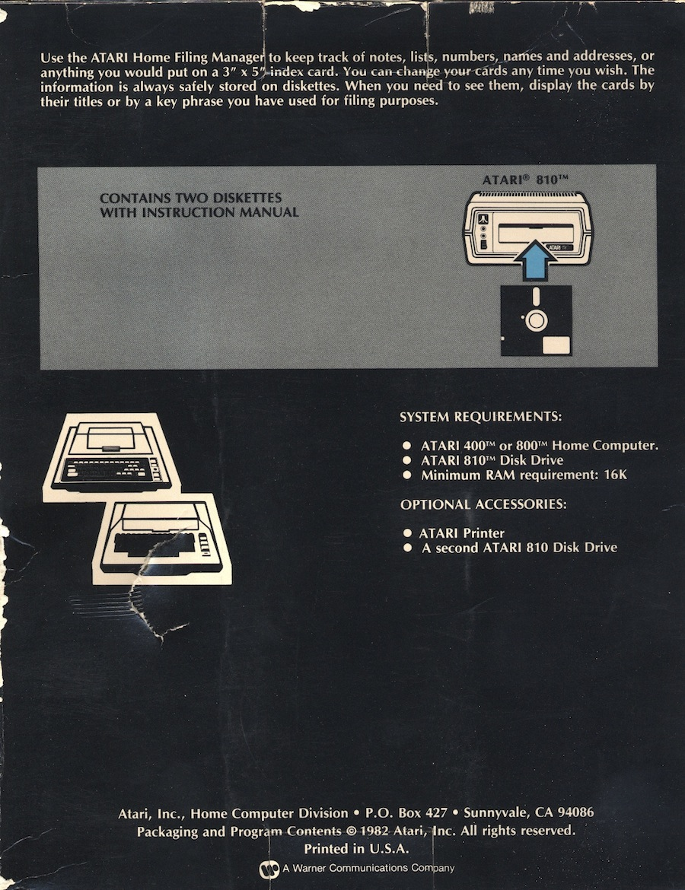
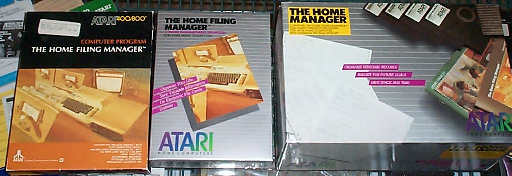
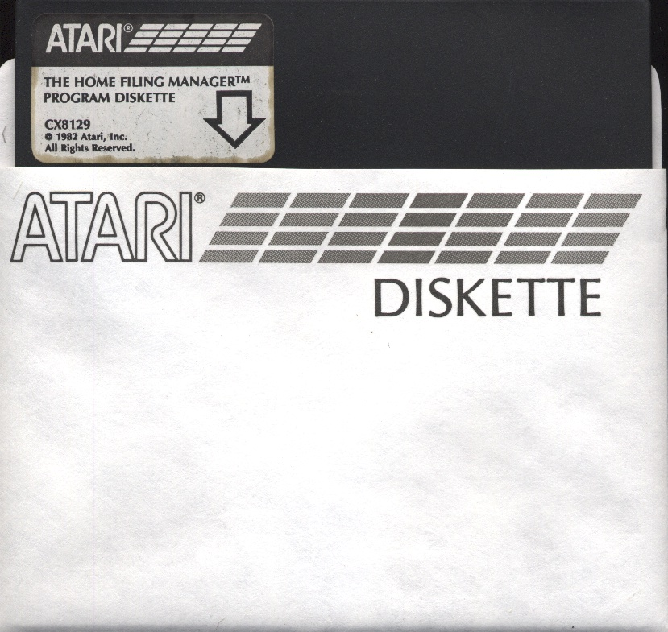
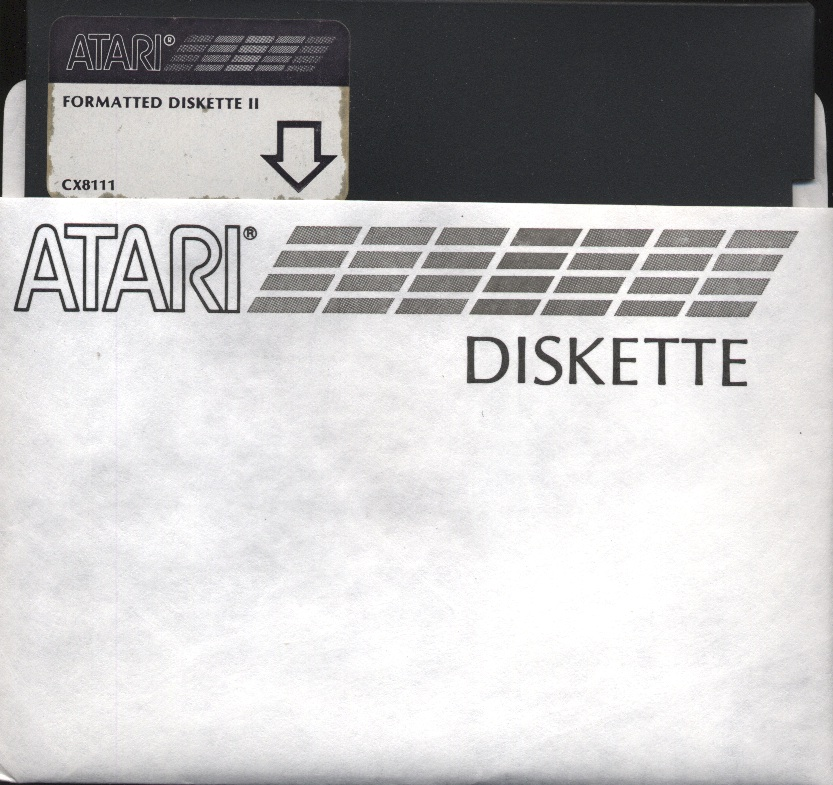
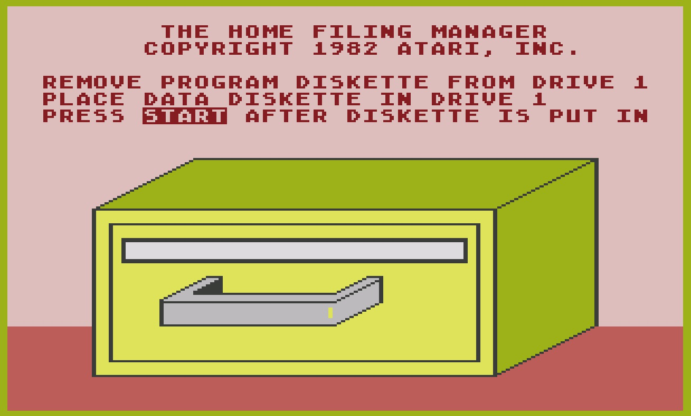

# Atari The Home Filing Manager (CX8129)

The Home Filing Manager is a database program Atari provided in 1982

## ATR Images
- [The_Home_Filing_Manager-Basic.atr](attachments/The_Home_Filing_Manager-Basic.atr) ; thanks to [Atari Preservation Project!](http://a8preservation.com/#/home) ; please use with Basic Cartridge
- [The_Home_Filing_ManagerSide_BUser_Guide.atr](attachments/The_Home_Filing_Manager-Side_B-User_Guide.atr) ; backside of the master diskette with user guide
- [Formatted_Diskette_II-CX8111.atr](attachments/Formatted_Diskette_II-CX8111.atr) ; thanks to FloppyDoc and BigBen for creating!
- [The_Home_Filing_Manager-Autorun.atr](attachments/The_Home_Filing_Manager-Autorun.atr) ; The Home Filing Manager as AUTORUN.SYS on a DOS II 2.0 diskette
- [The_Home_Filing_Manager-COM_File.atr](attachments/The_Home_Filing_Manager-COM_File.atr) ;The Home Filing Manager as COM file on a DOS II 2.0 diskette
- [Home_Filing_Manager_Print_Utility.atr](attachments/Home_Filing_Manager_Print_Utility.atr) ; The Home Filing Manager Print Utilities
- [Atari_Home_Filing_Manager_Converter_1.0_1994_MTG.atr](attachments/Atari_Home_Filing_Manager_Converter_1.0_1994_MTG.atr) ; Home Filing Manager to delimited DOS files converter
- [The_Home_Filing_Manager-Games_Data-Disk.atr](attachments/The_Home_Filing_Manager-Games_Data-Disk.atr) ; The Home Filing Manager - Data Disk example
- [The_Home_Filing_Manager-Games_Data-Cheats.atr](attachments/The_Home_Filing_Manager-Games_Data-Cheats.atr) ; The Home Filing Manager - Data Disk example for Cheats

## ATX Images
- [The_Home_Filing_Manager-CX8129.atx](attachments/The_Home_Filing_Manager-CX8129.atx) ; made with a SCP
- [The_Home_Filing_Manager-Data_Disk_CX8129.atx](attachments/The_Home_Filing_Manager-Data_Disk_CX8129.atx) ; made with a SCP
- [Atari_Formatted_Diskette_II.atx](attachments/Atari_Formatted_Diskette_II.atx); made with a SCP

## XEX file
- [HFM.xex](attachments/HFM.xex) ; The Home Filing Manager as XEX file

## Manual
- [The Home Filing Manager-Users Guide](../../../../media/The_Home_Filing_Manager/attachments/Atari_Home_Filing_Manager.pdf) ; size: 12 MB ; thanks to Atarimania for providing! :-)

## References
- [Inverseatascii analysis on the The Home Filing Manager](https://inverseatascii.info/2015/11/10/s2e04-atari-home-filing-manager/) ; highly recommended! Thank you Wade Ripkowski! As always, a great job!

## Images:

The Home Filing Manager CX8129, front of the box; thanks to Atarimania for providing!

The Home Filing Manager CX8129, back of the box; thanks to Atarimania for providing!

The Home Filing Manager CX8129, different boxes, same program

The Home Filing Manager CX8129, content of the box

The Home Filing Manager, Program Diskette CX8129

The Home Filing Manager, Formatted Diskette II-CX8111

The Home Filing Manager CX8129, startscreen
