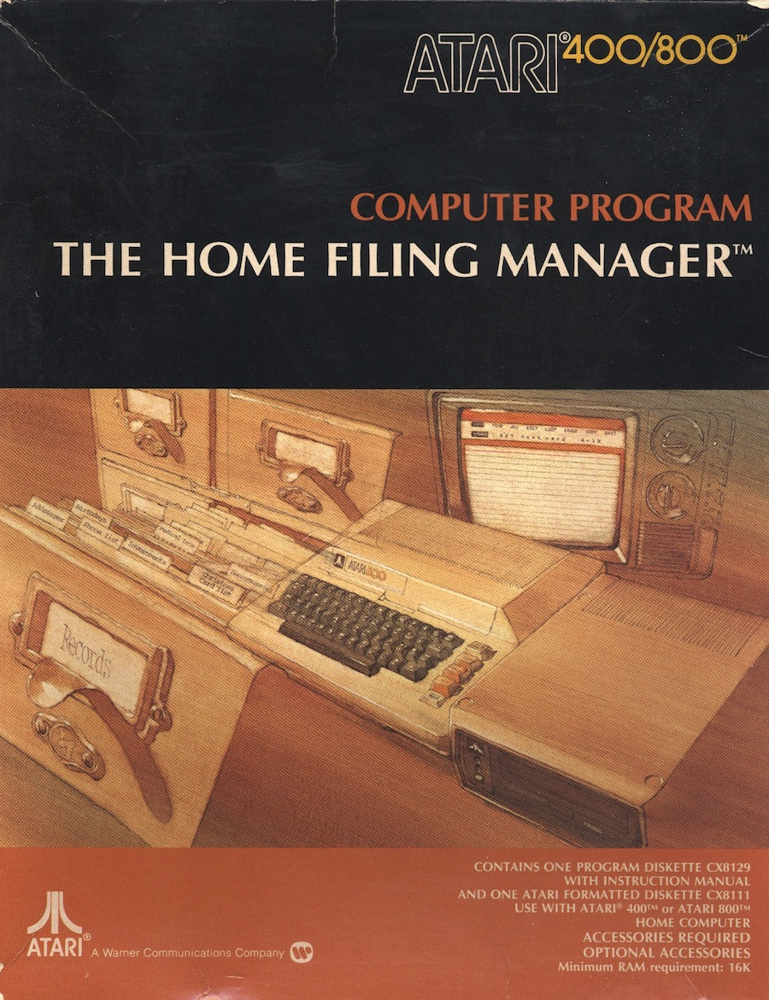
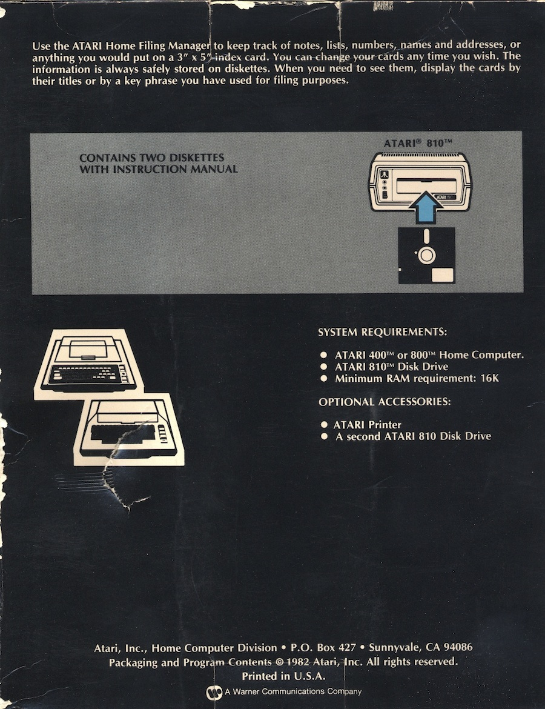
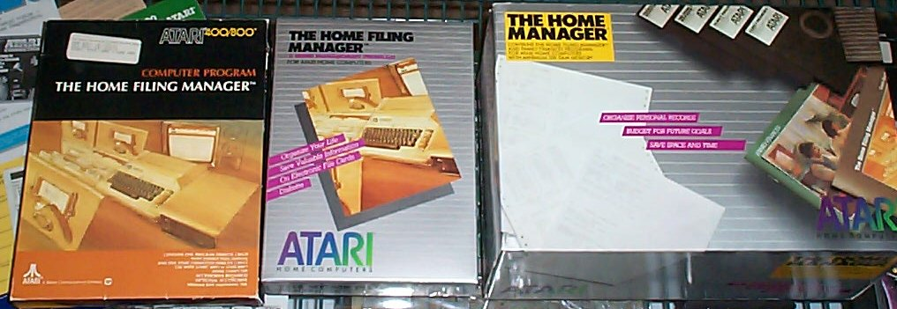
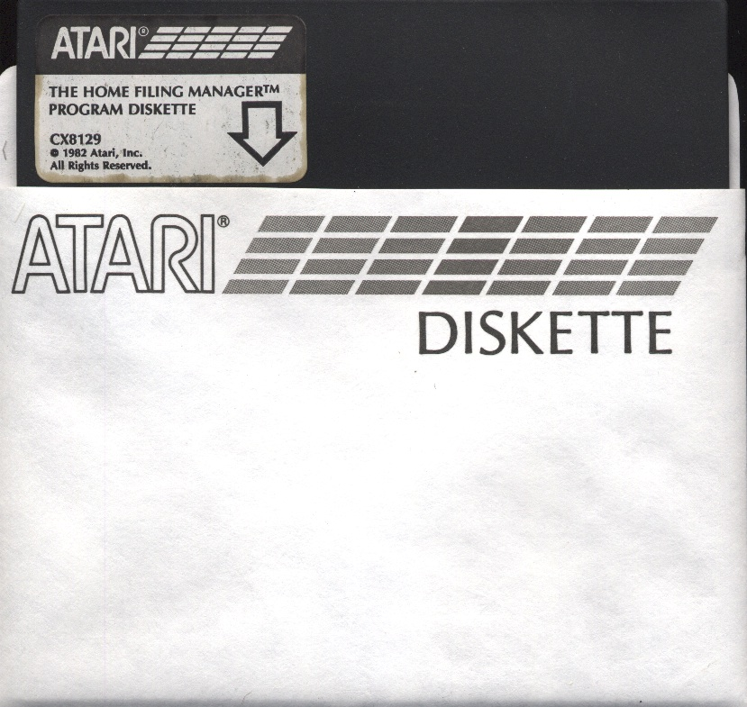
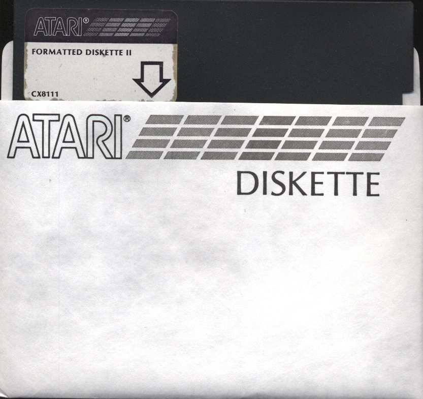
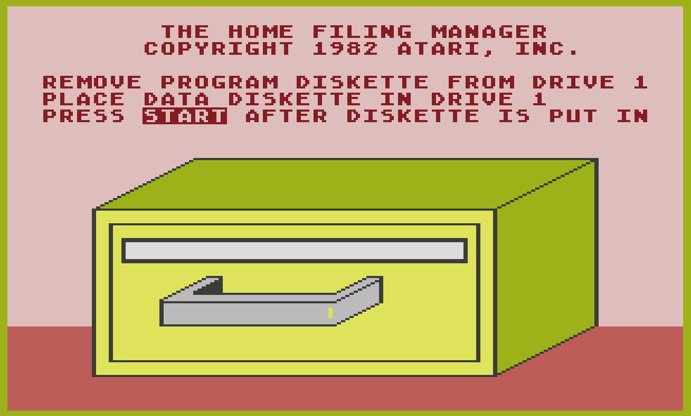

# Atari The Home Filing Manager (CX8129)

The Home Filing Manager is a database program Atari provided in 1982

## ATR Images

- [The\_Home\_Filing\_Manager-Basic.atr](attachments/The_Home_Filing_Manager-Basic.atr) ; thanks to [Atari Preservation Project!](http://a8preservation.com/#/home) ; please use with Basic Cartridge
- [The\_Home\_Filing\_ManagerSide\_BUser\_Guide.atr](attachments/The_Home_Filing_Manager-Side_B-User_Guide.atr) ; backside of the master diskette with user guide
- [Formatted\_Diskette\_II-CX8111.atr](attachments/Formatted_Diskette_II-CX8111.atr) ; thanks to FloppyDoc and BigBen for creating!
- [The\_Home\_Filing\_Manager-Autorun.atr](attachments/The_Home_Filing_Manager-Autorun.atr) ; The Home Filing Manager as AUTORUN.SYS on a DOS II 2.0 diskette
- [The\_Home\_Filing\_Manager-COM\_File.atr](attachments/The_Home_Filing_Manager-COM_File.atr) ;The Home Filing Manager as COM file on a DOS II 2.0 diskette
- [Home\_Filing\_Manager\_Print\_Utility.atr](attachments/Home_Filing_Manager_Print_Utility.atr) ; The Home Filing Manager Print Utilities
- [Atari\_Home\_Filing\_Manager\_Converter\_1.0\_1994\_MTG.atr](attachments/Atari_Home_Filing_Manager_Converter_1.0_1994_MTG.atr) ; Home Filing Manager to delimited DOS files converter
- [The\_Home\_Filing\_Manager-Games\_Data-Disk.atr](attachments/The_Home_Filing_Manager-Games_Data-Disk.atr) ; The Home Filing Manager - Data Disk example
- [The\_Home\_Filing\_Manager-Games\_Data-Cheats.atr](attachments/The_Home_Filing_Manager-Games_Data-Cheats.atr) ; The Home Filing Manager - Data Disk example for Cheats

## ATX Images

- [The\_Home\_Filing\_Manager-CX8129.atx](attachments/The_Home_Filing_Manager-CX8129.atx) ; made with a SCP
- [The\_Home\_Filing\_Manager-Data\_Disk\_CX8129.atx](attachments/The_Home_Filing_Manager-Data_Disk_CX8129.atx) ; made with a SCP
- [Atari\_Formatted\_Diskette\_II.atx](attachments/Atari_Formatted_Diskette_II.atx); made with a SCP

## XEX file

- [HFM.xex](attachments/HFM.xex) ; The Home Filing Manager as XEX file

## Manual

- [The Home Filing Manager-Users Guide](../../../../media/Companies/Atari/The_Home_Filing_Manager/attachments/Atari_Home_Filing_Manager.pdf) ; size: 12 MB ; thanks to Atarimania for providing! :-)

## References

- [Inverseatascii analysis on the The Home Filing Manager](https://inverseatascii.info/2015/11/10/s2e04-atari-home-filing-manager/) ; highly recommended! Thank you Wade Ripkowski! As always, a great job!

## Images

- The Home Filing Manager CX8129, front of the box; thanks to Atarimania for providing! 

- The Home Filing Manager CX8129, back of the box; thanks to Atarimania for providing! 

- The Home Filing Manager CX8129, different boxes, same program 

- The Home Filing Manager CX8129, content of the box 

- The Home Filing Manager, Program Diskette CX8129 

- The Home Filing Manager, Formatted Diskette II-CX8111 

- The Home Filing Manager CX8129, startscreen 
