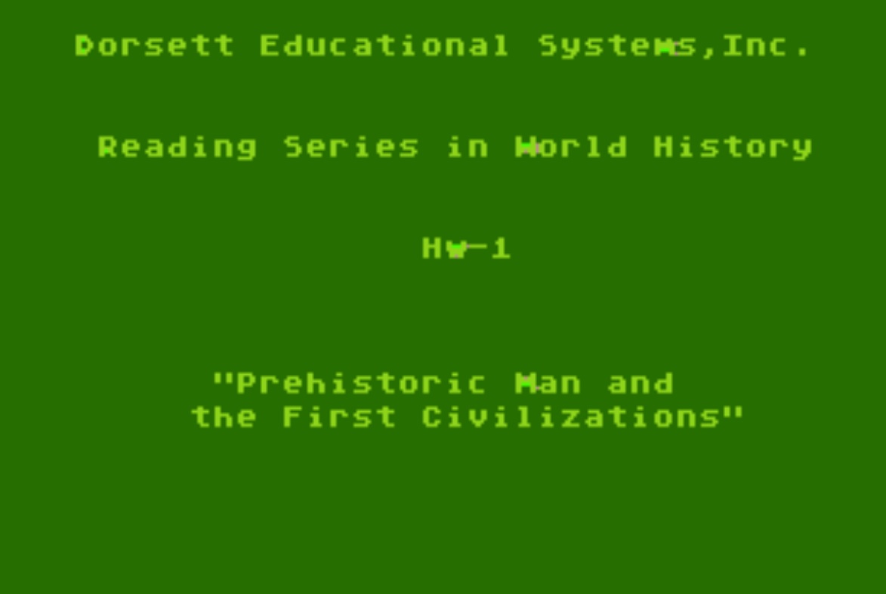
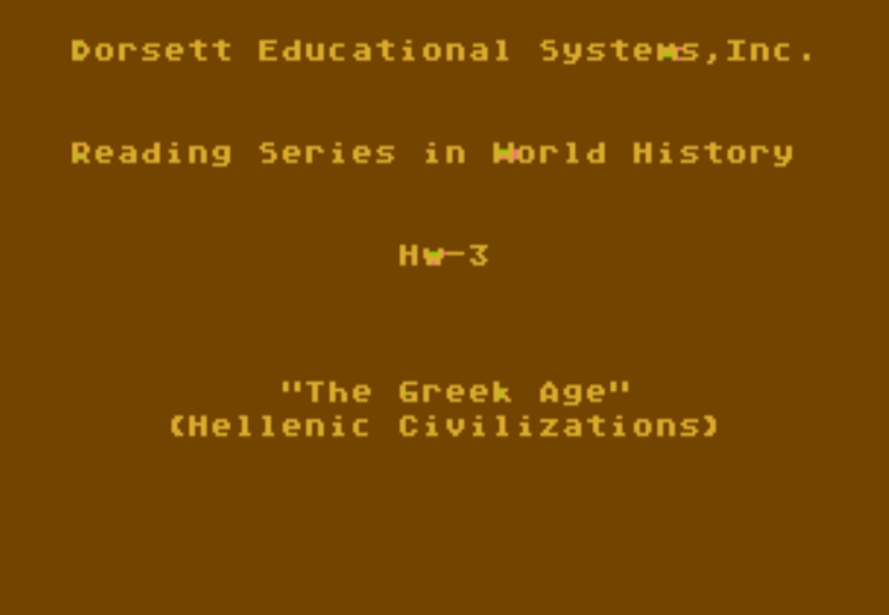

# World History (Western) (CX6004)

## Content

- Content of World History (Western) CX6004 

## Cassette-Images in FLAC-format

- [http://data.atariwiki.org/FLAC/WHW/World\_History\_(Western)\_CX6004-Cassette\_A-Side\_1.flac](<http://data.atariwiki.org/FLAC/WHW/World_History_(Western)_CX6004-Cassette_A-Side_1.flac>) ; size: 151.2 MB

- [http://data.atariwiki.org/FLAC/WHW/World\_History\_(Western)\_CX6004-Cassette\_A-Side\_2.flac](<http://data.atariwiki.org/FLAC/WHW/World_History_(Western)_CX6004-Cassette_A-Side_2.flac>) ; size: 156.3 MB

- [http://data.atariwiki.org/FLAC/WHW/World\_History\_(Western)\_CX6004-Cassette\_B-Side\_1.flac](<http://data.atariwiki.org/FLAC/WHW/World_History_(Western)_CX6004-Cassette_B-Side_1.flac>) ; size: 154.7 MB

- [http://data.atariwiki.org/FLAC/WHW/World\_History\_(Western)\_CX6004-Cassette\_B-Side\_2.flac](<http://data.atariwiki.org/FLAC/WHW/World_History_(Western)_CX6004-Cassette_B-Side_2.flac>) ; size: 145.6 MB

- [http://data.atariwiki.org/FLAC/WHW/World\_History\_(Western)\_CX6004-Cassette\_C-Side\_1.flac](<http://data.atariwiki.org/FLAC/WHW/World_History_(Western)_CX6004-Cassette_C-Side_1.flac>) ; size: 146.1 MB

- [http://data.atariwiki.org/FLAC/WHW/World\_History\_(Western)\_CX6004-Cassette\_C-Side\_2.flac](<http://data.atariwiki.org/FLAC/WHW/World_History_(Western)_CX6004-Cassette_C-Side_2.flac>) ; size: 156.0 MB

- [http://data.atariwiki.org/FLAC/WHW/World\_History\_(Western)\_CX6004-Cassette\_D-Side\_1.flac](<http://data.atariwiki.org/FLAC/WHW/World_History_(Western)_CX6004-Cassette_D-Side_1.flac>) ; size: 166.0 MB

- [http://data.atariwiki.org/FLAC/WHW/World\_History\_(Western)\_CX6004-Cassette\_D-Side\_2.flac](<http://data.atariwiki.org/FLAC/WHW/World_History_(Western)_CX6004-Cassette_D-Side_2.flac>) ; size: 173.5 MB

## Images

- World History (Western) CX6004 - figure 1 

- World History (Western) CX6004 - figure 2 

- World History (Western) CX6004 - figure 3 
