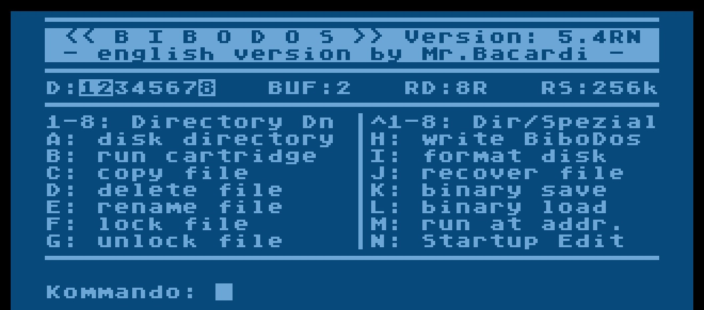
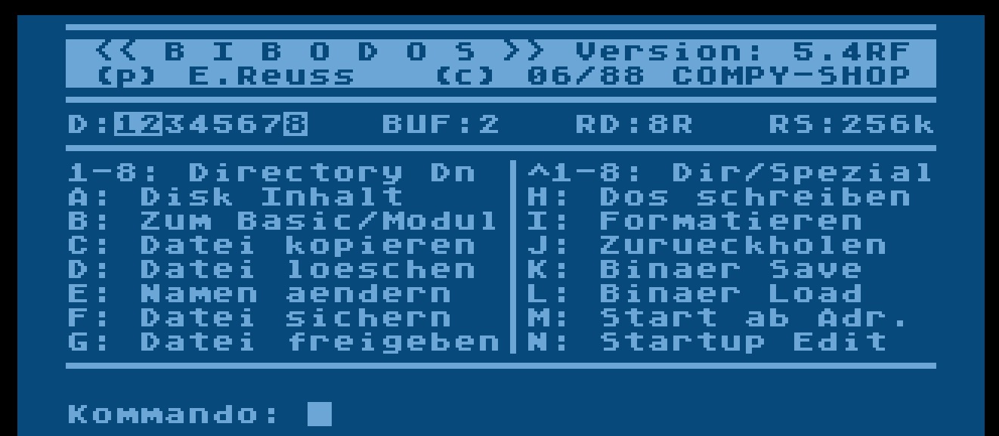
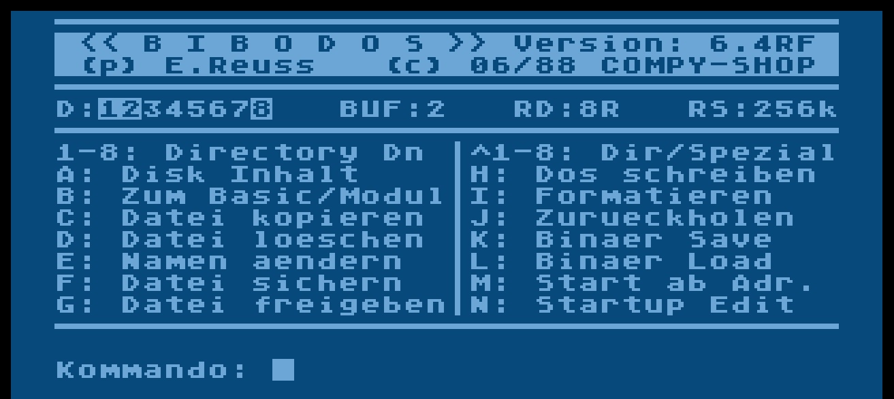
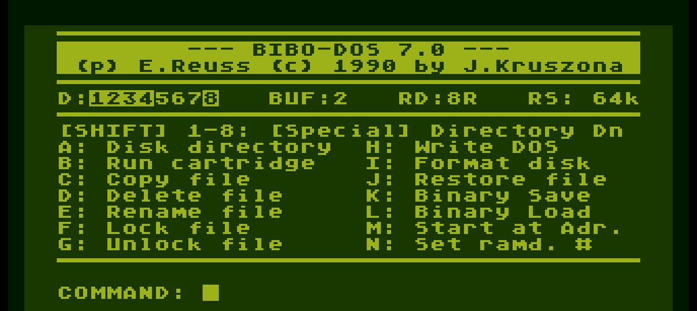

# BIBO-DOS

Copyright (C) 1988 Compy-Shop, Erwin Reuß \& J. Kruszona

## ATR images

- [BiboDos\_5.4RN\_en.atr](attachments/BiboDos_5.4RN_en.atr) ; SD format
- [BiboDos\_5.4RF\_de.atr](attachments/BiboDos_5.4RF_de.atr) ; SD format
- [BiboDos\_6.4RF\_C\_1988\_Compy-Shop\_DE.atr](attachments/BiboDos_6.4RF_C_1988_Compy-Shop_DE.atr) ; DD format
- [BiboDos\_7.0.atr](attachments/BiboDos_7.0.atr) ; DD format

## Manual

- [Bibo-DOS.pdf](attachments/Bibo-DOS.pdf) ; size: 1.8 MB ; German language

### Images

- BIBO-DOS 5.4RF - startscreen English 

- BIBO-DOS 5.4RF - startscreen German 

- BIBO-DOS 6.4RF - startscreen 

- BIBO-DOS 7.0 - startscreen 

## References

- [http://www.atarimania.com/utility-atari-400-800-xl-xe-bibo-dos\_17498.html](http://www.atarimania.com/utility-atari-400-800-xl-xe-bibo-dos_17498.html)
  Thanks to Atarimania for scanning the manual
