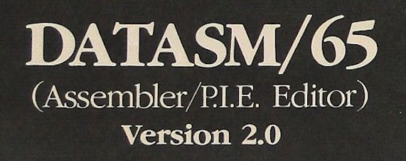
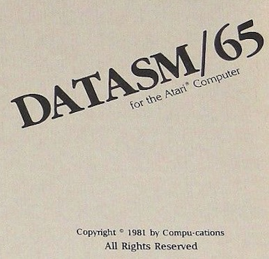
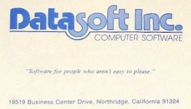
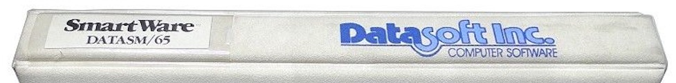
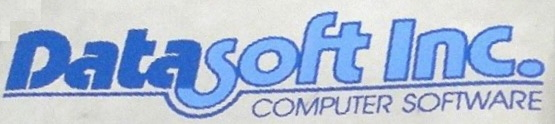

# DataSoft Datasm-65 2.0

Copyright (C) 1981 DataSoft Inc.

assembler, editor, menu, manual ; DATASM/65 2.0 for Atari 400, 800, XL, XE und XEGS

Two pass 6502 assembler

__Still misising - who can help us?__

## Pictures

DataSoft Datasm/65 - picture 1 ; courtesy from [videogames-orbit](https://www.ebay.de/usr/videogames-orbit?_trksid=p2047675.l2559); thank you so much for bringing this artifact out of dark into the light, we realy appreciate your help! Please go ahead. :-)

DataSoft Datasm/65 - picture 2 ; courtesy from [videogames-orbit](https://www.ebay.de/usr/videogames-orbit?_trksid=p2047675.l2559); thank you so much for bringing this artifact out of dark into the light, we realy appreciate your help! Please go ahead. :-)

DataSoft Datasm/65 - picture 3 ; courtesy from [videogames-orbit](https://www.ebay.de/usr/videogames-orbit?_trksid=p2047675.l2559); thank you so much for bringing this artifact out of dark into the light, we realy appreciate your help! Please go ahead. :-)

DataSoft Datasm/65 - picture 4 ; courtesy from [videogames-orbit](https://www.ebay.de/usr/videogames-orbit?_trksid=p2047675.l2559); thank you so much for bringing this artifact out of dark into the light, we realy appreciate your help! Please go ahead. :-)

DataSoft Datasm/65 - picture 5 ; courtesy from [videogames-orbit](https://www.ebay.de/usr/videogames-orbit?_trksid=p2047675.l2559); thank you so much for bringing this artifact out of dark into the light, we realy appreciate your help! Please go ahead. :-)
