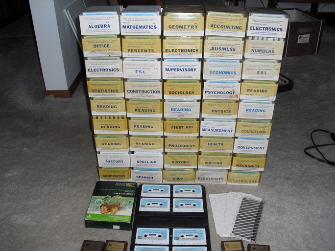
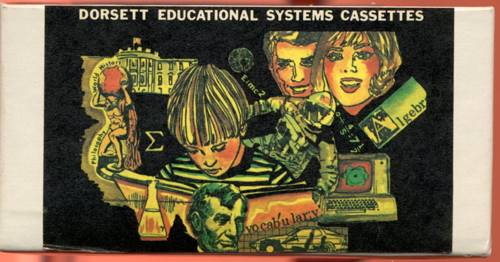
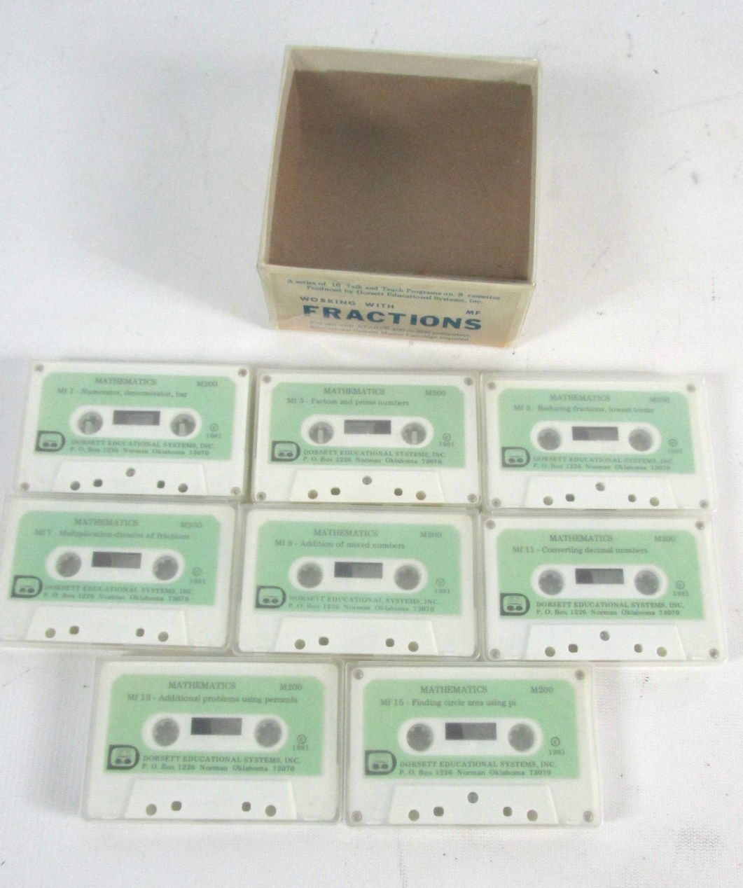

# Dorsett Educational System Lesson Cassettes

Lloyd G. Dorsett (Dorsett Educational Systems) produced a lot of Educational System cassettes. Besides the 16 packages from Atari [Atari Educational System Lesson Cassettes](../../Atari/Atari_Educational_System/Atari_Educational_System_Lesson_Cassettes/README.md), Lloyd G. Dorsett offered the 46 packages below, too. Each course has 16 programs on 8 cassettes.
Thanks to Michael Current, Thomas Cherryhomes, and Kay Savetz, it was possible to save these courses for generations to come. We can't thank you enough!
## Image

The 'remaining' ones from the Dorsett Educational System program for the Atari. The NeverEnding Story is a fantasy film, but The NeverEnding: "Thank you Kay Savetz" is for real! Kay, if there is an Atari walk of fame, be sure, you deserve a star under the top 10 there!

Dorsett Educational Systems - Graphic - thanks Kay for scanning
## Courses
### 1st column
- [Basic_Algebra_MA](../Basic_Algebra_MA/README.md)
- [Office_Careers_OF](../../../Office_Careers_OF/README.md)
- [Industrial_Solid-State_Electronics_PL](../Industrial_Solid-State_Electronics_PL/README.md)
- [Statistics_ST](../../../Statistics_ST/README.md)
- [Reading-Development_U](../Reading-Development_U/README.md)
- [Comprehension-Reading_AB](../Comprehension-Reading_AB/README.md)
- [Dorsett Atari Reading-Development (Reading Comprehension) T ; Copyright (C) 1983 Dorsett Educational Systems, Inc.](../Reading-Development_T/README.md)
- [U.S._History_HS](../Construction_OC/U.S._History_HS/README.md)
- [Dorsett Atari Carpentry KC ; Copyright (C) 1983 Dorsett Educational Systems, Inc.](../Carpentry_KC/README.md)
### 2nd column
- [Reading-Mathematics_MR](Reading-Mathematics_MR/README.md)
- [Decimals_and_Percents_MP](../Decimals_and_Percents_MP/README.md)
- [English_as_a_second_language_ESL_1-16](../English_as_a_second_language_ESL_1-16/README.md)
- [Construction_OC](../Construction_OC/README.md)
- [Comprehension-Reading_CD](../Comprehension-Reading_CD/README.md)
- [Reading-Development_V](../Reading-Development_V/README.md)
- [Reading-Development_X](../Reading-Development_X/README.md)
- [Spelling_SP](../../../Spelling_SP/README.md)
- [Spanish_U-ES](../../../Spanish_U-ES/README.md)
### 3rd column
- [Dorsett Atari Mathematics (Geometry) MG ; Copyright (C) 1983 Dorsett Educational Systems, Inc.](../Geometry_MG/README.md)
- [Digital_Electronics_PD](../Digital_Electronics_PD/README.md)
- [Supervisory_Practices_SU](../../../Supervisory_Practices_SU/README.md)
- [Dorsett Atari Basic Sociology (SO)](../Basic_Sociology_SO/README.md)
- [Reading-Development_Y](../Reading-Development_Y/README.md)
- [First_Aid_and_Safety_FA](../First_Aid_and_Safety_FA/README.md)
- [Philosophy_PY](../Philosophy_PY/README.md)
- [World_History_HW](../../../World_History_HW/README.md)
- [General_Shop_OA](../General_Shop_OA/README.md)
### 4th column
- [Principles_of_Accounting_PA](../Principles_of_Accounting_PA/README.md)
- [Business_Communications_BC](../Business_Communications_BC/README.md)
- [Economics_EC](../Economics_EC/README.md)
- [Dorsett Atari Basic Psychology (PS)](../Basic_Psychology_PS/README.md)
- [Physics_PH](../Physics_PH/README.md)
- [Problems_about_Measurement_MM](../Problems_about_Measurement_MM/README.md)
- [Health_Services_Career_HC](../Health_Services_Career_HC/README.md)
- [Effective_Writing_EW](../Effective_Writing_EW/README.md)
- [Dorsett Atari Basic Electricity (PE)](../Basic_Electricity_PE/README.md)
### 5th column
- [Mathematics_for_Electronics_ME](../Mathematics_for_Electronics_ME/README.md)
- [Working_with_Numbers_MN](../../../Working_with_Numbers_MN/README.md)
- [English_as_a_second_Language_ESL_17-32](../English_as_a_second_Language_ESL_17-32/README.md)
- [Reading-Development_Z](../Reading-Development_Z/README.md)
- [Reading-Development_W](../Reading-Development_W/README.md)
- [Counseling_Co](../Counseling_Co/README.md)
- [U.S._Government_Gv](../Construction_OC/U.S._Government_Gv/README.md)
- [Auto_Mechanics_KA](../Auto_Mechanics_KA/README.md)
- [Vocational_Vocabulary_VZ](../Vocational_Vocabulary_VZ/README.md)

### bottom
- [Comprehension-Reading_AB](../Comprehension-Reading_AB/README.md)

## Desperate call for help on missing Dorsett tapes

Some tapes had severe damage and therefore couldn't be digitized. If anyone is in the possession of the following tapes, please give us a message or a post [here](http://atariage.com/forums/topic/251713-desperate-call-for-help-on-missing-dorsett-tapes/). We really need your help and appreciate just any hint on the programs, who seem to be lost in time, like tears in rain.

The left ones to digitize are as follows:

__- General Shop Practices:__

__Oa1  Tool Identification Lesson, Part 1  (B)__
__Oa7  Discussion of a Two-Cycle Engine    (X)__
__Oa8  Use of Micrometers and Calipers     (X)__

(B) Indicates a bad data track
(X) Indicates the tapes were unarchivable due to degauss

__- Health Services Career:__

__Hc5	Medical History    (X)__
__Hc6	Extended Care      (X)__

(X) This lesson is not included - the cassette that we have was blank (probably accidentally erased sometime after it was duplicated.)

__- Physics:__

__Ph16	Theory of Relativity__

Ph16 does seem to be truncated, and probably should be reconstructed from the Atari cassettes.

Well, concerning Physics, we may can restore Ph16 from the Atari-Version of that course, Physics CX6008?

Just loud thinking...
## New found in 2018 from Kay Savetz
### WORKING WITH FRACTIONS MF

Sadly, we lost on ebay and are not able to offer it. :-(
