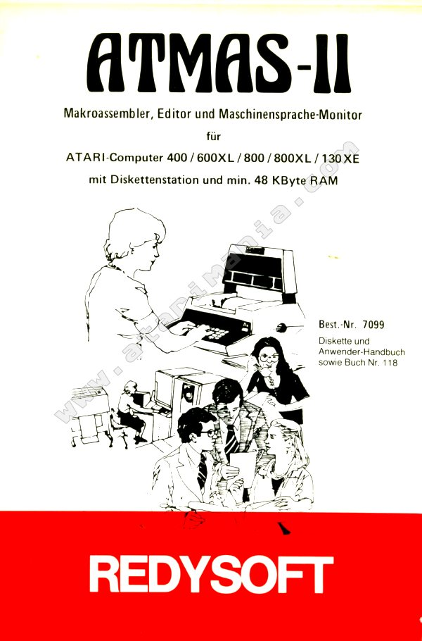
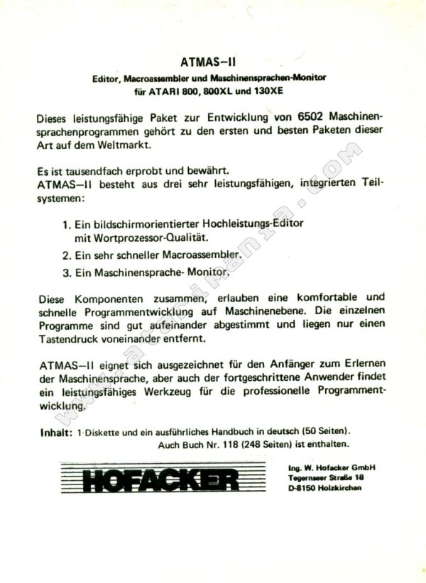
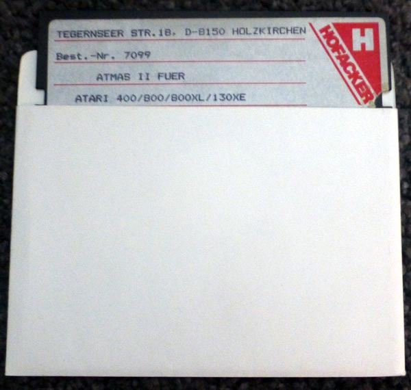
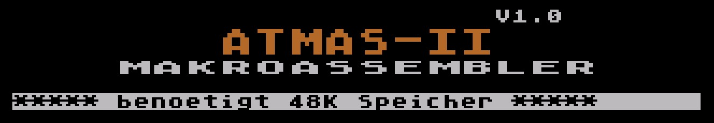
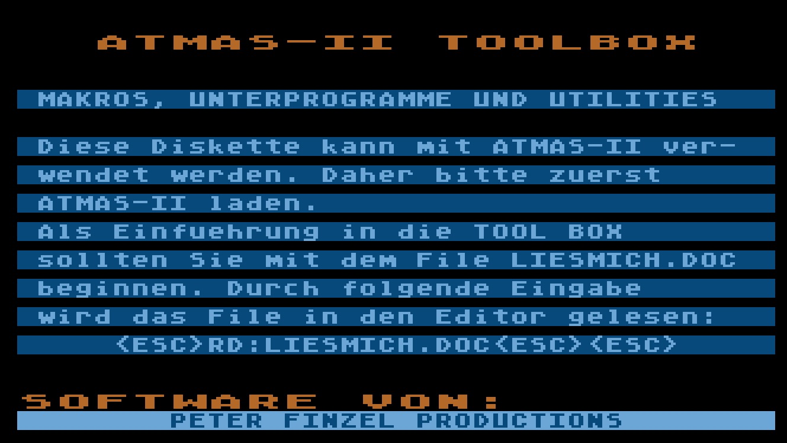

# ATMAS-II Makroassembler, Editor und Maschinensprache-Monitor

Copyright (C) by Peter Finzel

## ATR-Images

- [atmas2a.atr](attachments/atmas2a.atr) ; ATMAS-II Diskette - Teil A
- [atmas2b.atr](attachments/atmas2b.atr) ; ATMAS-II Diskette - Teil B
- [atmas2tb.atr](attachments/atmas2tb.atr) ; ATMAS-II Toolbox

## Handbuch

- [ATMAS2-Referenzkarte.pdf](attachments/ATMAS2-Referenzkarte.pdf)
- [Atmas2\_Handbuch.pdf](attachments/Atmas2_Handbuch.pdf)
- [ATMAS\_II\_Makroassembler\_Handbuch.rtf](attachments/ATMAS_II_Makroassembler_Handbuch.rtf) ; Handbuch für den ATMAS II Makroassembler als Textdatei. Fast alle OCR-Fehler behoben.

## Bilder

- ATMAS II Box - Vorderseite - danke an Atarimania! :-) 

- ATMAS II Box - Rückseite - danke an Atarimania! :-) 

- ATMAS II Diskette - danke an Atarimania! :-) 

- ATMAS II Startbildschirm bei zuwenig RAM 

- ATMAS-II-Toolbox - Startbildschirm 
