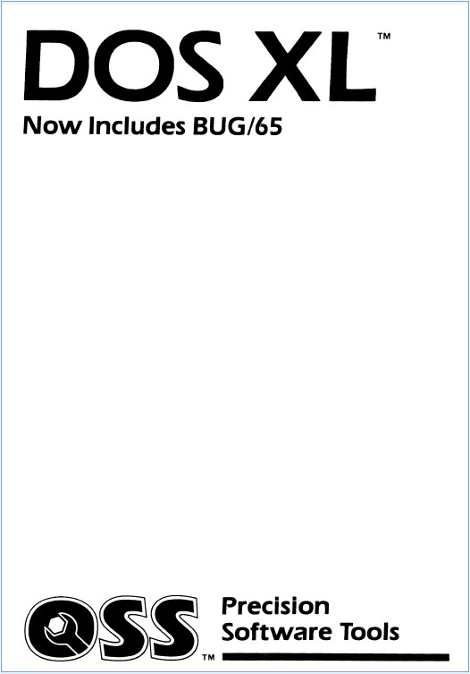

# DOS XL  
 
Copyright (C) 1981-1984 Optimized Systems Software, OSS, Inc.

DOS XL is a Disk Operating System (DOS) written by Paul Laughton, Mark Rose, Bill Wilkinson and Mike Peters and produced by Optimized Systems Software (OSS) for Atari 8-bit microcomputers. It was designed to be compatible with Atari DOS, which came shipped with Atari's disk drives.  
  
DOS XL from OSS is the successor of OS/A+, also known as DOS II+. It is a command-line DOS and was delivered together with the Indus GT Drive and many OSS Language Products.  
  
## Image  
  
DOS XL manual cover  
  
## Manuals  
- [DOS XL 2.20 with OCR and navigation](attachments/DOS_XL_2.20_OSS-OCR.pdf) ; size: 2.2 MB ; OCR; navigation menu; thanks to Allan Bushman for scanning in that incredible good quality. :-)  
- [DOS XL 2.30 and Bug/65 2.0 manual-printer optimized](http://data.atariwiki.org/DOC/OSS_DOS_XL_2.30_and_Bug-65_2.0-Manual-Print.pdf) ; original DOS XL version 2.30 from 12/1983; User's Guide and Reference Manual; printer optimized; size: 88.2 MB ; mega-thanks to Allan Bushman and Mr.Fish from AtariAge for providing us with that incredible good quality! We owe you very much!  
- [DOS XL 2.30 and Bug/65 2.0 manual-screen optimized](http://data.atariwiki.org/DOC/OSS_DOS_XL_2.30_and_Bug-65_2.0-Manual-Screen.pdf) ; original DOS XL version 2.30 from 12/1983; User's Guide and Reference Manual; screen optimized; size: 12.7 MB; mega-thanks to Allan Bushman and Mr.Fish from AtariAge for providing us with that incredible good quality! We owe you very much!  
- [DOS XL 2.30 Handbuch (German)](../../../media/OSS/DOS_XL/attachments/DOS_XL_2.30-Manual-German.pdf) ; German PDF-version, size: 7.5 MB  
- [DOS XL 2.30 Handbuch (German)](attachments/DOS_XL_2.30_Manual-German.djvu) ; German DJVU-version, size: 2.3 MB  
  
## ATR-Images  
- [DOS_XL_v2.30p_1983OSSUSSide_ADouble_Density.atr](attachments/DOS_XL_2.30p_1983OSSUSSide_ADouble_Density.atr) ; Original Masterdisk from OSS with double density ; many thanks to the preservation project for providing us with reliable software!  
- [DOS_XL_v2.30p_1983OSSUSSide_BSingle_Density.atr](attachments/DOS_XL_2.30p_1983OSSUSSide_BSingle_Density.atr) ; Original Masterdisk from OSS with single density ; many thanks to the preservation project for providing us with reliable software!  
- [DOS_XL_2.30p_Masterdisk_SD.atr](attachments/DOS_XL_2.30p_Masterdisk_SD.atr) ; Masterdisk for SD diskettes; usable for everything, but without further options, please see the manual below; Indus GT files are included; CONFIG.BAS, GTRPM.COM, GTSYNC.COM, SMALL.HLP, HELP.POK and a different STARTUP.EXC are included  
- [DOS_XL_2.30p_Masterdisk_DD.atr](attachments/DOS_XL_2.30p_Masterdisk_DD.atr) ; same as above for DD diskettes  
  
DOS XL 2.30p   
- [DOS_XL_2.30p_Masterdisk_SD_XL-XE_OSS_carts_only.atr](attachments/DOS_XL_2.30p_Masterdisk_SD_XL-XE_OSS_carts_only.atr) ; Masterdisk for SD diskettes; usable for XL- and XE-machines with OSS Supercarts only, takes advantage of the special carts while using less ram and offering further options, please see the manual below  
- [DOS_XL_2.30p_Masterdisk_DD_XL-XE_OSS_carts_only.atr](attachments/DOS_XL_2.30p_Masterdisk_DD_XL-XE_OSS_carts_only.atr) ; same as above for DD diskettes  
  
DOS XL 2.30C   
- [DOS_XL_2.30p_Masterdisk_SD_XL-XE_non_OSS_carts.atr](attachments/DOS_XL_2.30p_Masterdisk_SD_XL-XE_non_OSS_carts.atr) ; Masterdisk for SD diskettes; usable for XL- and XE-machines with NON-OSS Supercarts only, takes advantage of further options, but uses more ram, please see the manual below  
- [DOS_XL_2.30p_Masterdisk_DD_XL-XE_non_OSS_carts.atr](attachments/DOS_XL_2.30p_Masterdisk_DD_XL-XE_non_OSS_carts.atr) ; same as above for DD diskettes  
  
DOS XL 2.30X   
- [DOS_XL_2.30p_SD.atr](attachments/DOS_XL_2.30p_SD.atr) ; SD format ; plain version, just DOS XL  
- [DOS_XL_2.30p_ED.atr](attachments/DOS_XL_2.30p_ED.atr) ; ED format ; plain version, just DOS XL  
- [DOS_XL_2.30p_DD.atr](attachments/DOS_XL_2.30p_DD.atr) ; DD format ; plain version, just DOS XL  
- [DOS_XL_2.30p_Color.atr](attachments/DOS_XL_2.30p_Color.atr) ; SD format ; plain version, just DOS with color option adaptable to the user's wishes  
  
## Patches
- [DOS XL 2.30 Patch](DOS_XL_2.30_Patch/README.md) ; patch from version 2.30 to the latest 2.30p version; already done in the above atr-images  

## Tools
- [Toggle BASIC On/Off from the OS/A and DOS X Command-Line](../Toggle_BASIC_On-Off_from_the_OS_APlus_and_DOS_XL_Command-Line/README.md)  
  
## References
- [DOS XL Article in Wikipedia](http://en.wikipedia.org/wiki/DOS_XL)  
