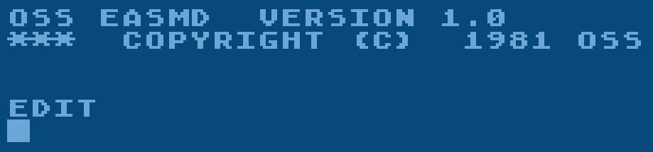
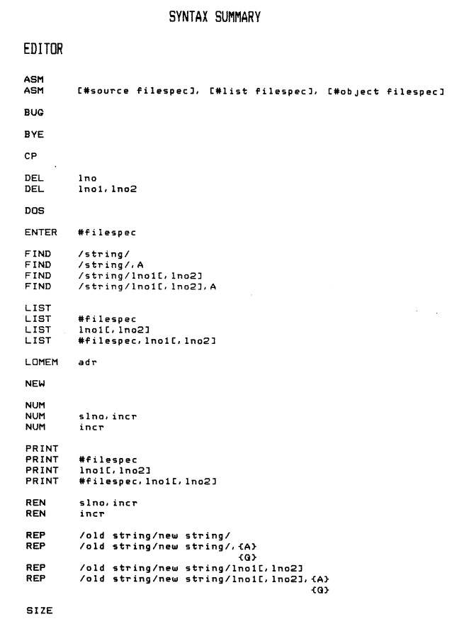
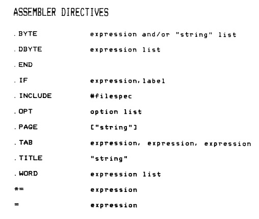
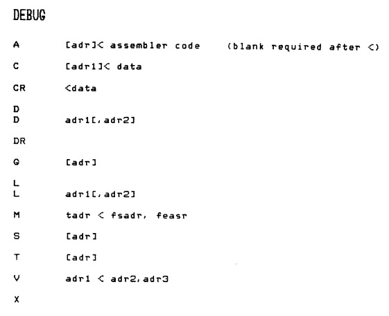

# OSS EASMD Version 1.0

Copyright (C) 1981 OSS, Inc.

EASMD is an Editor, Assembler, and Debugger from OSS provided on diskette.

Thank you so much, Allan Bushman, for providing us with this rare-to-find program and manual! :-)

## ATR-Images

- [OSS EASMD 1.0 with DOS XL 2.30p](attachments/EASMD_1.0_and_OSS_DOS_XL_2.30p_Color.atr) OSS EASMD with the latest patched DOS XL 2.30p
- [OSS EASMD 1.0 with OS/A+ 1.2e](attachments/OSS_EASMD_1.0_1981.atr) OSS EASMD with the original delivered OS/A+ version 1.2e (C) 1981 OSS, Inc.

## CAS-Image

- [OSS\_EASMD\_1.0\_1981.cas](attachments/OSS_EASMD_1.0_1981.cas)

## Manual

\*[OSS\_EASMD\_version\_1.1.pdf](attachments/OSS_EASMD_version_1.1.pdf) OSS EASMD manual version 1.1 ; size: 1.3 MB ; Copyright (C) 1981 OSS, Inc.

## Images

- Startscreen of OSS EASMD version 1.0 

- Command summary of the Editor from OSS EASMD version 1.0 

- Command summary of the Assembler from OSS EASMD version 1.0 

- Command summary of the Debugger from OSS EASMD version 1.0 
