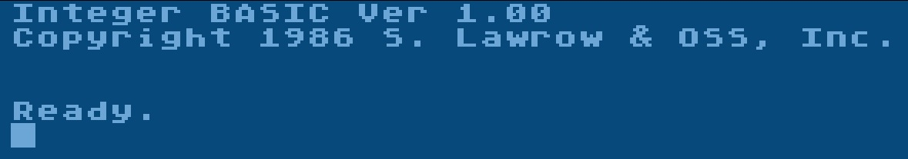

# Integer BASIC

Copyright (C) 1983-1986 by Stephen D. Lawrow & OSS, Inc.

From Tomasz 'Kr0tki' Krasuski from AtariAge:

I've used MAC/65 1.02 to assemble it to a cartridge. It requires changing lines 130 and 150 in D1:MASTER of the source code, to change PROM to 0 and _CART to 1. Then assemble from disk, resulting in a binary file that loads at $3000-$6fff, bank order "3M04". Retrieve this data in an appropriate order to create a ROM image.

So, Integer BASIC appears to contain the same features as BASIC XE, but with integer arithmetic. And it's blazing fast.
## Integer BASIC source code
- [int-BASIC-master-03oct86.atr](attachments/int-BASIC-master-03oct86.atr)
- [int-BASIC-slave-03oct86.atr](attachments/int-BASIC-slave-03oct86.atr)

Enabling the building of a M091 Integer BASIC is less straightforward, because there is no single value that controls it, unlike in BASIC XE. To build it, one has to change bank addresses in D1:EQUATE.INC. Edit lines 310 and 320 to set BANK.2 to $D509 and BANK.3 to $D501. Then assemble the object file as usual. This gives us an "1M09" object file, as with BASIC XE. Retrieving the bank data in the correct order results in an M091 ROM image.

Thank you so much, Tomasz 'Kr0tki' Krasuski, for the info on building the runtime; we owe you so much. :-)))

## CAR-Image
- [Integer_BASIC_v1.00_C_1986-11-19OSSUS034M.car](attachments/Integer_BASIC_v1.00_C_1986-11-19OSSUS034M.car) ; thank you so much Tomasz 'Kr0tki' Krasuski for building the 1st cartridge, we owe you so much. :-)))

## BIN-Images
- [Integer_BASIC_v1.00_C_1986-11-19OSSUS034M.bin](attachments/Integer_BASIC_v1.00_C_1986-11-19OSSUS034M.bin) ; thank you so much Tomasz 'Kr0tki' Krasuski for building the 1st binary, we owe you so much. :-)))
- [Integer_BASIC_v1.00_C_1986-11-19OSSUS043M.bin](attachments/Integer_BASIC_v1.00_C_1986-11-19OSSUS043M.bin) ; just runs in Altirra with OSS '043M' ; thank you so much Tomasz 'Kr0tki' Krasuski for building the 1st binary, we owe you so much. :-)))
- [Integer_BASIC_v1.00_C_1986-11-19OSSLawrow_Stephen_D.USM091.bin](attachments/Integer_BASIC_v1.00_C_1986-11-19OSSLawrow_Stephen_D.USM091.bin) ; thank you so much, Tomasz 'Kr0tki' Krasuski, for building the binary; we owe you so much. :-)))

## ATR-Image
- [Integer_BASIC_1.00_with_DOS_2.5_MD.atr](attachments/Integer_BASIC_1.00_with_DOS_2.5_MD.atr) ; just the file version

## Manuals
Who is making a manual for OSS Integer BASIC?

## Picture

OSS Integer BASIC - start screen
