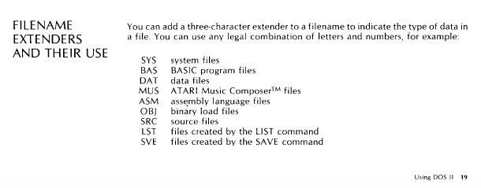

# File Extensions of Atari disk files

File extensions taken from the Atari Disk Operating System II-Reference Manual, page 19

|Extension|Description|
|---------|-----------|
|.ACT | "Action!" source code file.
|.AP2 | "APAC-2" image. (80x192x256 non-compressed).
|.APC | "APAC" image. (80x96x256 non-compressed).
|.AR? | (AR0 through AR9) An "autorun" file loaded by MyDOS during boot, renamed from "EXE", "COM" or "OBJ."
|.ARC | "ARC" archive. A set of files compressed into one file. Typical Atari 8-bit compression format.
|.ASC | "ASCII" text file.
|.ASM | Assembly language source code file.
|.ATA | "AtASCII" (Atari ASCII) text file.
|.ATR | An Atari disk image used by Atari computer and disk drive emulators. (Like PC Xformer, Rainbow, Atari800, XL-It!, SIO2PC and APE.)
|.BAS | "Atari BASIC" tokenized source code file. Laod with "LOAD" from within BASIC.
|.BAT | A (Sparta)DOS batch file
|.BAT | "Batch" file - list of commands to be executed by a DOS (i.e. SpartaDOS).
|.BLU | ".blurb" file (description of another file). C -T- "C" source code file.
|.BXE | An OSS BASIC XE SAVEd program
|.BXL | An OSS BASIC XL SAVEd program
|.CFG | A preferences (configuration) file used by some program
|.CNF | A preferences (configuration) file used by some program.
|.COM | Binary executable (a program / application). A composite file with one or more segments.
|.CTB | Compiled Turbo-BASIC XL program. Load with Turbo-BASIC XL "Runtime."
|.DAT | A data file
|.DC3 | "Disk Communicator" disk image (disk data saved as a file).
|.DCM | "Disk Communicator" disk image (disk data saved as a file).
|.DGS | "Degas" image. (??x??x??).
|.DIG | "Parrot" digital audio file.
|.DOC | Text file (ASCII or ATASCII).
|.DOS | A disk-based version SD
|.DSK | "Disk Communicator" disk image (disk data saved as a file).
|.EXE | Binary executable (a program / application).
|.FNT | Atari screen font file.
|.FON | Atari screen font file.
|.FRM | "Frame" animation file.
|.FTH | "Forth" source code file.
|.G15 | "Graphics 15" image. (160x192x4 non-compressed).
|.GIF | A "GIF"(tm) graphics file. (??x??x2-256 compressed).
|.GR7 | "Graphics 7" image. (160x96x4 non-compressed).
|.GR8 | "Graphics 8" image. (320x192x2 non-compressed).
|.GR9 | "Graphics 9" image. (80x192x16 non-compressed).
|.GRA | "APAC" image. (80x96x256 non-compressed).
|.HIP | "Hard Interlaced Picture" image. (160x240x30).
|.HLP | Text or other file used as a help file by some program.
|.ILC | "APAC Interlaced" image. (80x192x256 non-compressed).
|.LHA | "LHA" archive. A set of files compressed into one file. Typical Atari ST and Amiga compression format.
|.LST | An Atari BASIC source file. Load with "ENTER" from within BASIC.
|.M65 | An OSS "Mac65" tokenized source code file.
|.NLQ | Daisy Dot III "Near Letter Quality" font file.
|.OBJ | A binary object code file
|.OBJ | Binary executable (a program / application) or an "object" file.
|.PIC | An image file. Usually "Koala" style (160x192x4 compressed).
|.PRF | A preferences file used by some program
|.PRN | A listing to be printed
|.PRO | An "APE" disk image which contains copy protection information.
|.PZM | "Pryzm" image. (80x192x256 non-compressed).
|.QIK | "Quick" source code file.
|.RLE | "Run-Length-Encoded" image. (??x??x?? compressed).
|.SFX | Self-Extracting archive. (A program which decompresses itself into a set of smaller programs - you only load this once.)
|.SND | Mac System 7 or NeXT digital audio file.
|.SYS | A (Sparta)DOS system file or driver
|.SYS | A system file, usually used by a DOS.
|.TBS | Turbo-BASIC XL tokenized source code file. Load with "LOAD" from within Turbo-BASIC XL.
|.TUR | Turbo-BASIC XL tokenized source code file. Load with "LOAD" from within Turbo-BASIC XL.
|.TXT | An ASCII or ATASCII text file
|.UUE | "UUencoded" binary file (converted to text-only format.)
|.WAV | "WAVE" digital audio file.
|.XMO | ??? Some binary file. (Bad naming convention by CompuServe.)
|.ZIP | "ZIP" archive. A set of files compressed into one file.