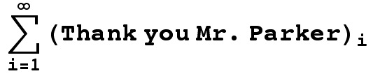
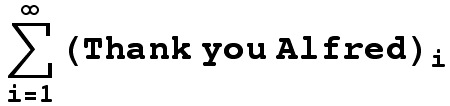
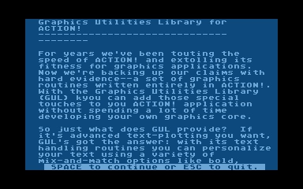
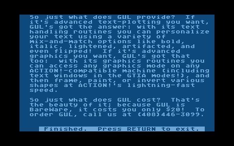
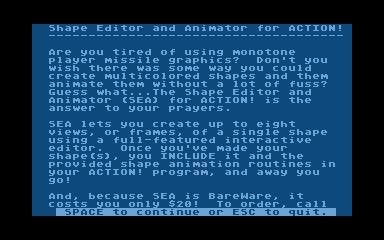
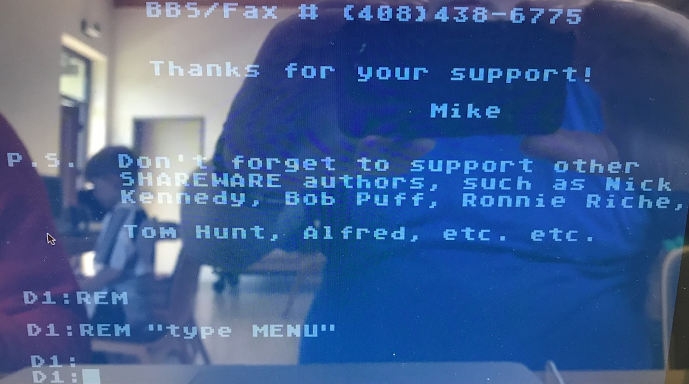
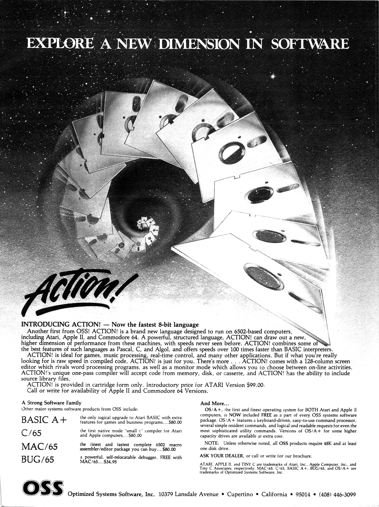

# Action

## Information

### Background
Action (also Action!) is an Atari-specific programming language written by Clinton Parker and sold by Optimized Systems Software (OSS) in ROM cartridge form starting in August 1983. It is the only language other than [BASIC](../../BASIC/README.md) and [Assembler](../../Assembler/README.md) that had real popularity on the platform and saw any significant coverage in the Atari press; type-in programs and various technical articles were found in most magazines. In comparison, languages like [Forth](../../Forth/README.md) and [Atari LOGO](../../Logo/README.md) saw much less use and almost no press coverage.

Reviewers at the time gushed about the system. They noted that practically every aspect was superior to anything available at the time; compiling was almost instantaneous, the resulting code ran almost as fast as hand-coded assembler, the full-screen editor was universally loved, and the entire system took up only 8k due to clever memory management. The only complaint, also universal, was the poor quality of the original manual set.

Action uses a greatly cut-down version of the ALGOL syntax, and thus bears strong similarities with [Pascal for the Atari](../../Pascal/README.md) and [C](../../C/README.md), which were also derived from ALGOL. Like those languages, Action is procedural, with programs essentially consisting of a large collection of functions that call each other. It lacked encapsulation or data hiding, but that is not a serious concern in the limited program sizes available on an 8-bit machine. Syntactically it looks very similar to Pascal, with the exception that it uses ALGOL 68 DO/OD style bracketing rather than Pascal's BEGIN/END.

Action included a number of features to allow it to run as fast as possible. Notably, it's main data types were BYTE, INT and CARD, 8-bit and 16-bit signed and unsigned values, respectively. These map directly onto the basic 6502-types. The language also included a syntax to directly refer to these objects in memory so they could be mapped into hardware registers. For instance, one could set a variable to {{BYTE RTCLOK=20}} which defined the 8-bit value at memory location 20 to be the value of the real-time clock. The user could then read or write to that register using the name {{RTCLOK}}.

These design details helped increase performance, but the primary reason Action was much faster than other languages of the era was due to its memory management model. In languages like C and Pascal, procedure calls use a stack of records known as "activation records" that record the values of variables when the procedure was called. This allows a procedure to call itself, as each call can have its own values, and it is this feature that allows recursion. This concept requires the manipulation of a stack, which in the 6502 was a non-trivial prospect given the CPU stack was only 256 bytes.

Action solved this problem by simply not implementing activation records. Instead, the storage space for variables was allocated at compile time (not dissimilar to Atari BASIC's model). This meant Action could not support recursion, but also eliminated the necessity to build and manipulate a complex stack. This dramatically lowers the overhead of procedure calls, and in a language that organizes a program as a series of procedure calls, this represents a significant amount of time.

Action had a number of limitations, none of them very serious. Curiously, Action did not include support for floating-point types, although such support is built into the machine's OS ROM (see [Atari BASIC](../../BASIC/Atari_BASIC/README.md) for details) and available to any programming language. This is a significant limitation in some roles, although perhaps not for its target market. It also lacked most string handling routines, but made up for this somewhat with a series of PRINT commands that made formatted output easy.

Generally, Action programs had performance on-par with reasonable-quality [Assembler](../../Assembler/README.md), while being much easier to program. In one review, it ran Byte's Sieve of Eratosthenes 219 times faster than Atari BASIC, while its source was only a few lines longer. In comparison, the assembler version's source ran on for several pages. Such performance, combined with terse code and library functions to access much of the platform's hardware, made it suitable for action games while still having a simple source format suitable for type-in programs. It deserved to be much more popular, and may have been had it been released earlier, or by Atari itself.

Action inspired several similar languages that differ largely in syntax and various features that they do or do not support. Examples include [PL65](../../PL65/README.md) and [QUICK](../../QUICK/README.md).


### Hello World

```
; Hello world in Action programming language for the Atari 8-Bit computers
PROC Hello()
   PrintE("Hello World!")
RETURN
```

The {{;}} is a comment marker, which was a commonly used as the comment marker in assembler as well. The {{PROC}} is the start of a PROCedure, which ends (perhaps oddly) with {{RETURN}}. In Action, the last {{PROC}} in the program is the one that runs first, in this case "Hello". This is something of a mix between Pascal where the "global code" defines the program entry point, and C, where the function called "Main" is the entry point. The only line of code in this example is {{PrintE}}, which simply prints a string, while the more common {{PrintF}} is a formatted print similar to {{printf}} in C.

Like assembler, it was common for variables to be specified at a particular address that mapped onto one of the Atari's "shadow registers" that were used to communicate between the hardware and user programs. Here is a simple variation on Hello World that demonstrates this concept, as well as a basic loop:
```
; Hello world in a loop
PROC Hello()
BYTE RTCLOK=20,       ; decimal address of system timer
     CONSOL=$D01F     ; hex address of the key-pressed register
CARD TIME
     
    RTCLOK=0 ; reset the clock
    WHILE CONSOL>6 ; did the user press a key?
    DO
        PRINTE("Hello World!")
    OD
    TIME = RTCLOK
    PRINTF("Ran for %E %U jiffies",TIME)
RETURN
```
Note that the definitions of {{RTCLOK}} and {{CONSOL}} are not setting the values, but stating that they are at those memory locations. The syntax changes when those variables are accessed; the {{RTCLOK=0}} ''does'' set the value of that location. Also notice the syntax of loops, which work similarly to Pascal's {{BEGIN/END}} but use {{DO/OD}}.

There is a clever trick in this code. Note that {{RTCLOK}} is defined as a {{BYTE}} but {{TIME}} is defined as a {{CARD}}, a 16-bit value. This is because the clock value is stored in three bytes, 18, 19 and 20. By defining {{TIME}} as a {{CARD}}, when that value is read it automatically reads two bytes, thereby getting a value from both 20 and 19. This solution ignores the third byte, but since the value is from 0 to 65535 jiffies, about 36 minutes, this can safely be ignored for a program that is likely to run for a few seconds. This solution avoids the need to read two bytes and manipulate them into a 16-bit value, something that is commonly found in BASIC programs.

### Manuals and Docs
- [Action Manual](https://sourceforge.net/p/atari-action/code/ci/master/tree/JAC/doc/action-manual.pdf?format=raw) - The complete latest version of the manual in English. Created and updated by GoodByteXL. There is no better version worldwide! Thank you so much GoodByteXL. We are deep in your debt! :-)))
- [Action Handbuch](https://sourceforge.net/p/atari-action/code/ci/master/tree/JAC/doc/action-manual-de.pdf?format=raw) - Das komplette, vollständige, restaurierte und überarbeitete Action Handbuch in Deutsch! Der totale Hammer, inkl. Editor, Monitor, Language, Compiler, Library, Run Time, Toolkit. Vollständig überarbeitete Version von GoodByteXL. So müssen PDF-Dateien aussehen, es gibt weltweit nichts vergleichbares. AtariWiki empfiehlt die PDF-Datei auf das Wärmste! Wer diese nicht lädt, ist selber schuld. Wir bedanken uns an dieser Stelle sehr, sehr herzlich bei GoodByteXL für seine lange andauernde und intensive Arbeit an diesem Werk, dass er hiermit der Atari-Gemeinschaft zur Verfügung stellt. GoodByteXL mega-Danke für Deine Arbeit, die Gemeinschaft steht tief in Deiner Schuld. :-)))
- [The_ACTION!_Toolkit](../The_ACTION!_Toolkit/README.md)
- [The Action! Run Time Package](../The_ACTION_Run_Time_Package/README.md)
- [ACTION! Reference Card](../ACTION_Reference_Card/README.md)
- [ACTION! error codes](../ACTION_error_codes/README.md)
- [Aktion mit Action!](../Articles/Aktion_mit_ACTION/README.md) - Report about the ACTION! Programming Language from the German Magazin "Happy Computer"
- [Action!_Bugsheet_3](../Action_Bugsheet_3/README.md)
- [Fix_for_the_Bugs_in_divide_in_ACTION!](../Fix_for_the_Bugs_in_divide_in_ACTION!/README.md)
- [Fix for PrintF Routine](../Fix_for_Bug_in_PrintF/README.md)
- [Optimized Systems Software, Inc. - SOFTWARE LICENSE AGREEMENT](attachments/Optimized_Systems_Software_Software_License_Agreement.pdf) ; thanks to Atarimania

### Tutorials
- [Step-by-Step_Tutorial_-_How_to_create_a_stand-alone_ACTION!_Program](../Step-by-Step_Tutorial_-_How_to_create_a_stand-alone_ACTION!_Program/README.md)
- [Action!_and_BBS_Express!_PRO_Tutorial](../Action!_and_BBS_Express!_PRO_Tutorial/README.md)
- [Larry's Action! Tutorial](../Articles/Larrys_Action_Tutorial/README.md)
- [How_to_setup_an_ACTION!_Development_Disk](../How_to_setup_an_ACTION!_Development_Disk/README.md)
- [Action! Programming for Atari 8-bit Computers](https://www.youtube.com/watch?v=yQ8ABW8rY40&list=PL5FYYzC9Hpgog9GPsJRtshMP0wpHrxb2J) video tutorial series
- [Learning Atari Action!](http://atariaction.tumblr.com/) blog

### Workshops

- [Action! Workshop 1](../Action_Workshop/Action_Workshop_1/README.md) - 24. October 2010 "Unperfekthaus" in Essen
- [Action! Workshop 2 October 2011](../Action_Workshop/Action_Workshop_2/README.md) - 02. October 2011 "Unperfekthaus" in Essen
- [Action! Workshop October 2012](../Action_Workshop/Action_Workshop_3/README.md) - 28. October 2012 "Unperfekthaus" in Essen

## Versions

### Latest Versions
- [Action! Programming Language](https://sourceforge.net/projects/atari-action/) - The latest [sources](https://sourceforge.net/p/atari-action/code/ci/master/tree/) and [binaries](https://sourceforge.net/projects/atari-action/files/action.zip/download) for Action
- Includes CAR-Images for OSS cartridges and for standard 16K cartridges
- Includes executable language and editor "ACTION.COM" on ATR-Images for different DOS versions
- Includes executable standalone editor "ACTIONED.COM" on ATR-Images for different DOS versions
You can use it under SpartaDOS and DosXL with "D1:ACTIONED MYSRC.ACT" to direct load the "MYSRC.ACT" file into the editor. Further, this editor can even be used for BASIC, PASCAL, FORTH etc.

### Cross Compiler
- [https://gury.atari8.info/effectus/](https://gury.atari8.info/effectus/) - Thank you soooo much Gury! That is totally incredible, we now can use high end editors, eclipse and have the results in a flash! We are deep in your debt! Thank you so much, really. :-)

### Original CAR-Images
- [ACTION_Version_3.6_C_1983_ACS_034M.car](attachments/ACTION_Version_3.6_C_1983_ACS_034M.car)
- [ACTION_Version_3.6_C_1983_ACS_M091.car](attachments/ACTION_Version_3.6_C_1983_ACS_M091.car)

### Original ROM-Images
- [ACTION_Version_3.6_C_1983_ACS_034M.rom](attachments/ACTION_Version_3.6_C_1983_ACS_034M.rom)
- [ACTION_Version_3.6_C_1983_ACS_M091.rom](attachments/ACTION_Version_3.6_C_1983_ACS_M091.rom)

### Original ATR-Images
- [OSS_ACTION_Programmers_Aid_Disk_100.atr](attachments/OSS_ACTION_Programmers_Aid_Disk_100.atr) - Rebuild from damaged discs and files around the world
- [The_ACTION!_Toolkit.atr](attachments/The_ACTION!_Toolkit.atr)
- [The_Action_RunTime_Disk-Original.atr](attachments/The_Action_RunTime_Disk-Original.atr) - Protected image copy of the original disk from a good soul from AtariAge
- [The_ACTION!_RunTime_Disk.atr](attachments/The_ACTION!_RunTime_Disk.atr) - Unprotected copy of the original disk from a good soul from AtariAge
- [Original_Action!_System_Runtime_Source](../Original_Action!_System_Runtime_Source/README.md)
- [Alternative_Action!_Runtime_Source](../Alternative_Action!_Runtime_Source/README.md)
- [ACTION!_Runtime_von_Jeff_Reister](../ACTION!_Runtime_von_Jeff_Reister/README.md)
- [OSS_ACTION_3.6_and_REAL_files_with_DOS_XL_2.30p_Color.atr](attachments/OSS_ACTION_3.6_and_REAL_files_with_DOS_XL_2.30p_Color.atr)
- [TURBO-DOS_XE_with_ACTION_Disk_1.atr](attachments/TURBO-DOS_XE_with_ACTION_Disk_1.atr)
- [TURBO-DOS_XE_with_ACTION_Disk_2.atr](attachments/TURBO-DOS_XE_with_ACTION_Disk_2.atr)

## Source Code

### Action Language and Editor

at this point AtariWiki must give the highest award possible:

- [Action!_Source_Code](../Action_Source_Code/README.md)
Thank you so much Mr. Parker, we can't thank you enough for what you have done for us.


Thank you so much Mr. Parker

- [Action! Editor Source Code](https://sourceforge.net/p/atari-action/code/ci/master/tree/ALFRED/EDITOR/)
Thank you Alfred from AtariAge for extracting the editor source code for generations to come. We are deep in your debt.


Thank you Alfred

### Functions
- [Misc_useful_ACTION!_Functions](../Misc_useful_ACTION!_Functions/README.md) - (DIVERS.ACT)
- [Chartest](../Examples/Chartest/README.md) - a group of routines which perform various functions and tests on characters.
- [Fast Screen IO](../../../Fast_Screen_IO/README.md)
- [Player Missile Module](../../../Player_Missile/README.md)
- [String Library](../Examples/String_Library_PSC/README.md) - (STRING.ACT)

### Mini-Runtime LIBs
- [_Intro](../Articles/_Intro/README.md) (Eine kleine Einführung zu den Mini-LIBs)
- [Simple PRINT Runtime!](../Articles/_Intro/Simple_PRINT_Runtime/README.md) (Mini-LIB)
- [ZERO_and_SETBLOCK](../Articles/_Intro/ZERO_and_SETBLOCK/README.md) (RT Part)


### Examples

- [A_pseudo_Assembler_in_Action!](../A_pseudo_Assembler_in_Action!/README.md)
- [ACTION!_Logo](../ACTION!_Logo/README.md) ACS
- [ATARI Rainbow Effect](../../../ATARI_Rainbow_effect/README.md)
- [Access Sparta DOSCommand Line Parameters](../../../Access_SpartaDOS_commandline_parameters/README.md)
- [Atari_Fuji_Logo_in_ACTION!](../Atari_Fuji_Logo_in_ACTION!/README.md)
- [Atari Picture Mirror Tool](../Examples/Atari_Picture_Mirror_Tool/README.md)
- [Atari_ST_Mouse_Driver_for_ACTION!](../Atari_ST_Mouse_Driver_for_ACTION!/README.md)
- [BASIC_USR_Machine_Language_Call_Simulation_for_ACTION!](../BASIC_USR_Machine_Language_Call_Simulation_for_ACTION!/README.md)
- [Backtrack_in_ACTION!](../Backtrack_in_ACTION!/README.md)
- [Big_Symbol_Table_for_ACTION!](../Big_Symbol_Table_for_ACTION!/README.md) ACS
- [Binary_File_Load_in_ACTION!](../Binary_File_Load_in_ACTION!/README.md)
- [Butterfly Demo](../Examples/Butterfly_Demo/README.md)
- [C Style Strings](../Articles/C_Style_Strings/README.md)
- [COM File Segment Dump](../Examples/COM_File_Segment_Dump/README.md)
- [Catch and Throw Error Handling](../Examples/Catch_and_Throw_Error_Handling/README.md) ACS
- [Catepill](../../../People/Carsten_Strotmann/Catepill/README.md) unfinished Game with Level editor in ACTION!
- [Compile_to_Disk](../Articles/Compile_to_Disk/README.md) ACS
- [DLI_in_ACTION!](../DLI_in_ACTION!/README.md)
- [DOS Setup](../../../DOS_Setup/README.md) - A small tool to copy some files from disk to ramdisk. can be configured by a textfile.
- [Data Entry Routines](../Examples/Data_Entry_Routines/README.md)
- [Date Routines](../Examples/Date_Routines/README.md) - Library of routines supporting the input, storage and manipulation of dates.
- [Delete EOL Char in Textfiles](../Examples/Delete_EOL_Char_in_Textfiles/README.md)
- [Displaylist_in_ACTION!](../Displaylist_in_ACTION!/README.md)
- [End Procedure](../Examples/END_Procedure/README.md) - Call procedure to leave an Action Program
- [ERROR!](../Examples/ERROR/README.md) (Converts SpartaDOS, BeWeDOS and RealDOS error # to readable text)
- [Fast Graphics 15 Routines](../Examples/Fast_Graphics_15_Routines/README.md)
- [Fast Graphics 8 Routines](../Examples/Fast_Graphics_8_Routines/README.md)
- [File Compare in ACTION!](../Examples/File_Compare/README.md)
- [File-IO Routines](../Examples/File_IO_Routines/README.md)
- [File Select Box](../Examples/File_Select_Box/README.md)
- [File Select Shell](../Examples/File_Select_Shell/README.md)
- [Game_AMAZING_in_ACTION!](../Game_AMAZING_in_ACTION!/README.md)
- [Grep for Sparta DOS](../Examples/Grep_for_Sparta_DOS/README.md)
- [Dump - Print the contents of binary files in hexadecimal and ATASCII](../Examples/HexDump/README.md) - Dump - Print the contents of binary files in hexadecimal and ATASCII
- [Jump to DOS DUP](../Jump_to_DOS_DUP/README.md)
- [Kermit_in_ACTION!](../Kermit_in_ACTION!/README.md)
- [Load APL Display-List Files](../Load_APL_Display-List_Files/README.md)
- [Load_Font_Files_in_ACTION!](../Load_Font_Files_in_ACTION!/README.md)
- [Load Koala Pictures](../../Assembler/Examples/Load_Koala_Pictures/README.md)
- [MiniDOS](../Examples/MiniDOS/README.md)
- [Multi Player Animation](../Examples/Multi_Player_Animation/README.md)
- [OS Vectors](../../../OS_Vectors/README.md)
- [Percom Block](../../../PERCOM_Block_Manipulation/README.md)
- [Percom Service](../../../PERCOM_Service/README.md) -- Disk Format Configuration
- [Printing Routine for Epson Printer](../../../Printing_Routine_for_Epson_Printer/README.md)
- [Query Console Keys](../../../Query_Console_Keys/README.md)
- [SIO CIO Routine](../../../SIO_CIO_Routine/README.md)
- [ACTION! Source code disk](../SourceCodeDisk1/README.md) ; SpartaDOS X disk image with Action source code
- [Starburst in ACTION!](../Examples/Starburst/README.md)
- [Symbol Table Lister for ACTION!](../Articles/Symbol_table_lister/README.md) ACS
- [ACTION! Timer Programming](../Articles/Timer_Programming/README.md)
- [Atari Trackball](../../../Trackball/README.md)
- [Using the RAM Under the OS ROM on XL and XE Computers](../../../Using_the_RAM_Under_the_OS_ROM_on_XL_and_XE_Computers/README.md)
- [VT52 Terminal Emulator](../Articles/VT52_Terminal_Emulator/README.md)
- [VTEmulator](../Articles/VTEmulator/README.md)
- [Windowing Routines](../Articles/Windowing_Routines/README.md)
- [XFD Transfer](../../../XFD_Disk_Transfer_tool/README.md) XFormer Filetransfere
- [XModem Filetransfer](../Examples/XModem_Filetransfer/README.md)

### Tools

- [Action! Source Code Formatter](../Action_Source_Code_Formatter/README.md)
- [Infoline for BASIC and ACTION!](../Examples/Infoline/README.md) for ACTION! and BASIC
- [ACTION OBJECT CODE RELOCATION PROGRAM](../ACTION_OBJECT_CODE_RELOCATION_PROGRAM/README.md) ; Thank you so much Alfred from AtariAge, we all really appreciate your help here again.
- [ACTION! Relocator](../../../Relocator/README.md) for Action; relocates Action code to run independent from the code location
- [acsterm.txt](attachments/acsterm.txt) ; ACSTERM is a terminal emulator for the Atari 800, 800XL, 1200XL and 130XE
- [How to find the revision number of ACTION!](../How_to_find_the_revision_number_of_ACTION/README.md)

### Missing Tools: Graphics Utilities Library and Shape Editor

__As of 2020, just these two programs are still missing. They were published via OSS-BBS only! The number was: +1 (408) 438 - 6775. Any hint, any help is welcome at any time. We would really appreciate your help in that case.__


Graphics Utilities Library for ACTION! screen 1


Graphics Utilities Library for ACTION! screen 2


Shape Editor and Animator for ACTION!


OSS-BBS with the number: +1 (408) 438 - 6775 where the two missing programs were published only!

## Articles in Magazines

### Advertisements

First Action ad in Compute July, 1983 ; please take into account: 128-column screen and for Apple II & Commodore 64. Thanks to GoodByteXL!

### Analog
||Title||Issue||Language||Comment
|[Action Review](../Review_Action/README.md)|#16 (02/ 84)|en|Review
|[An Introduction to ACTION](../Articles/An_Introduction_to_ACTION/README.md) |#17 + #18 (03+ 04/ 84)|en|Tutorial
|[Stars 3-D](../../../Stars_in_3D/README.md)|#20 (07/ 84)|en|Demo
|[Bounce_in_ACTION!](../Bounce_in_ACTION!/README.md)|#20 (07/ 84)|en|Game
|[Pulse_in_ACTION!](../Pulse_in_ACTION!/README.md)|#26 (01/ 85)|en|Demo
|[More Fun with Bounce](../Examples/More_Fun_with_Bounce/README.md)|#27 (02/ 85)|en|Game
|[Demon Birds](../Examples/Demon_Birds/README.md)|#28 (03/ 85)|en|Game
|[R.O.T.O.](../../../Roto/README.md)|#31 (06/ 85)|en|Game
|[Color the shapes](../Examples/Color_the_shapes/README.md)|#32 (07/ 85)|en|game
|[Getting_in_on_the_Action!_1](../Getting_in_on_the_Actio_1/README.md)|#32 (07/ 85)|en|Tutorial
|[Getting in on the Action! - Part 2](../Articles/Getting_in_on_the_Action_2/README.md)|#35 (10/ 85)|en|Tutorial
|[Sneak Attack](../Sneak_attack/README.md)|#36 (11/ 85)|en|Game
|[Air Hockey](../Examples/Air_hockey/README.md)|#38 (01/ 86)|en|Game
|[D:Check in ACTION!](../Examples/D-Check/README.md)|#44 (07/ 86)|en|Tool
|[Trails](../Articles/Trails/README.md)|#50 (01/ 87)|en|Tool for using the KoalaPad in ACTION!
|[Zero Free in ACTION!](../ACTION_Zero_Free/README.md)|#54 (05/ 87) |en|Tool

### Antic
||Title||Issue||Language||Comment
|[Interrupts in ACTION!](../Examples/Interrupts_in_Action/README.md)|Vol. 3 #3 (07/ 84)|en|
|[Demo: Pretty](../Articles/Demo_Pretty/README.md)|Vol. 3 #7 (11/ 84)|en|Demo from Antic I/O-Board
|[Splash in ACTION](../Examples/SPLASH_in_ACTION/README.md)|Vol. 3 #12 (04/ 85)|en|Demo
|[Game AMAZING in ACTION](../Articles/Game_AMAZING_in_ACTION/README.md)|Vol. 4 #1  (05/ 85)|en|Game
|[View 3D](../Examples/View_3D/README.md)|Vol. 4 #2 (06/ 85)|en|Tool
|[DARK STAR](../Articles/Dark_Star/README.md)|Vol. 4 #3 (07/ 85)|en|Game: Zapping Aliens With Radioactive Waste
|[Display Master](../Examples/Display_Master/README.md)|Vol. 4 #4 (08/ 85)|en|
|[8 QUEENS ACTION!](../Articles/Eight_Queens/README.md)|Vol. 4 #5 (09/ 85)|en|92 chess solutions in 40 seconds
|[Video Stretch - Rubber visuals in ACTION!](../Articles/Video_Stretch/README.md)|Vol. 5 #6 (10/ 86)|en|Tool
|[Killer Chess](../Articles/Killer_Chess/README.md)|Vol. 6 #10 (02/ 88)|en|Game
|[Reardoor](../Articles/Reardoor/README.md)|Vol. 6 #10 (02/ 88)|en|Game
|[Frog from Antic Vol. 6 #10 February 1988](../Articles/Frog/README.md)|Vol. 6 #10 (02/ 88)|en|Game
|[ACTION!_Toolbox](../ACTION!_Toolbox/README.md)|Vol. 7 #6 (10/ 88)|en|Lightning-fast command finder (Wordfind and Matchup)

### ATARI''magazin''
||Title||Issue||Language||Comment
|[Schnelle Vektoren in ACTION!](../Examples/Schnelle_Vektoren_in_Action/README.md)|#1 (1-2/ 87)|de|Tutorial: Action!-Center Teil 1
|[Schnelle Umwege in ACTION!](../Examples/Schnelle_Umwege_in_Action/README.md)|#2 (3-4/ 87)|de|Tutorial: Action!-Center Teil 2
|[Interne_Variablen](../Interne_Variablen/README.md)|#3 (5-6/ 87)|de|Tutorial: Action!-Center Teil 3
|[Was ist dran an Action!?](../Articles/Was_ist_dran_an_Action/README.md)|#4 (7-8/ 87)|de| Tutorial: Action!-Center Teil 4

### Atari Magazine
||Title||Issue||Language||Comment
|[ACTION!_Deel](../ACTION!_Deel/README.md)| |nl|A collection of Action Articles

### CK Computer Kontakt
||Title||Issue||Language||Comment
|[Musik in ACTION!](../Examples/Musik_in_ACTION/README.md) |#10/85|ge| Tutorial
|[ACTION noch schneller](../Articles/ACTION_noch_schneller/README.md) |#6-7/86|ge| Tutorial
