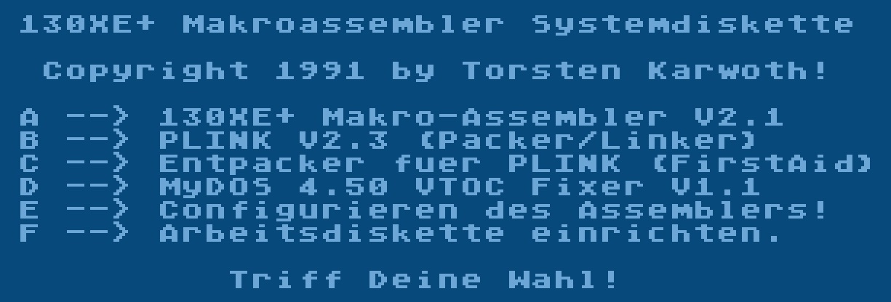

# 130XE+ Makroassembler

Copyright (C) 1991 by Torsten Karwoth

## ATR images

- [130XE\_Makroassembler\_1991Torsten\_KarwothSide\_A.atr](attachments/130XE_Makroassembler_1991Torsten_KarwothSide_A.atr)
- [130XE\_Makroassembler\_1991Torsten\_KarwothSide\_B.atr](attachments/130XE_Makroassembler_1991Torsten_KarwothSide_B.atr)

## Manual

- [MacroAssembler\_Version\_4.3\_128\_KB\_RAM\_und\_RAMDisk\_erforderlich\_C\_1990\_Torsten\_Karwoth.pdf](attachments/MacroAssembler_Version_4.3_128_KB_RAM_und_RAMDisk_erforderlich_C_1990_Torsten_Karwoth.pdf) ; size: 936 KB

## Image

- 130XE+ Makroassembler - Startscreen 

## Thank you

The Atari community deeply thanks Torsten Karwoth for giving his incredible and outstanding macroassembler into public domain. Mega-Thank you Thorsten, this is really great!
