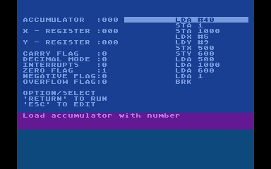
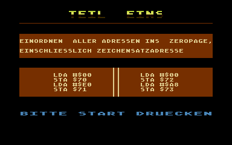

# Interactive Assembler Tutorials  

Attached are two interactive 6502 assembler tutorials for the Atari 8-bit computers.
These tutorials can be run from the disks. They allow to explore assembler programming by combining the lessons with hands-on instructions.  

---
  
## MC Tutor  
  
  
  
Disk: [MCTUTOR.ATR](attachments/MCTUTOR.ATR)  
  
---
  
## Assembler Kurs (German Language)  
  
  
  
Disk: [ASSTUTO2.ATR](attachments/ASSTUTO2.ATR)  
  
