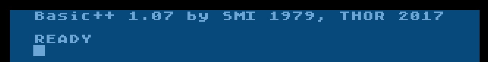

# BASIC++

Copyright (C) by Thomas Richter

BASIC++ with OS++ from Thomas Richter is one of the very, very rare Atari BASICs which calculates reliable! That is not an easy one! Therefore, please give Thomas a try! Thank you.

## BASIC++ suite
- [BASIC_plus_plus.zip](attachments/BASIC_plus_plus.zip) ; Thank you so much Thomas, we really appreciate your help! :-))) Please go ahead.

## References
- BASIC++ at AtariAge](http://atariage.com/forums/topic/263403-basic-os-and-a-couple-of-updates/)

## Picture

BASIC++ start screen
