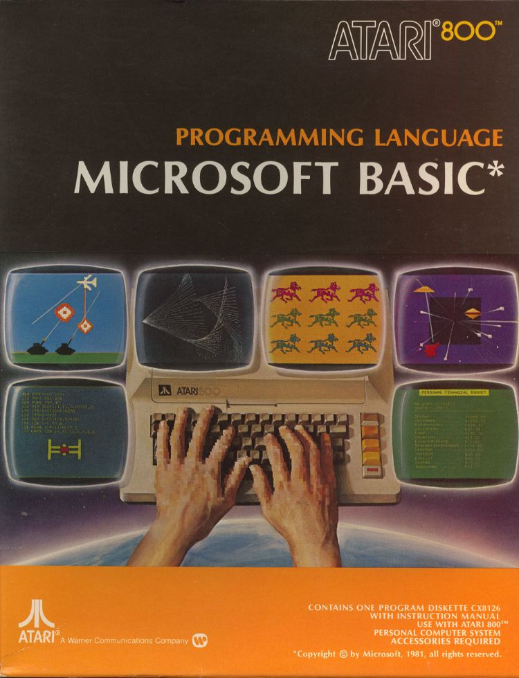
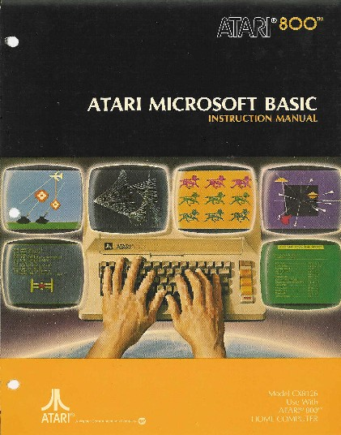

# Microsoft BASIC I  

CX8126 ; Copyright (C) 1981 Microsoft Corporation  
  
### Background  
Atari licensed the Microsoft "9k BASIC" for their new machines, intending to add a number of new commands to it to take advantage of the machine's graphics and sound capabilities. Unfortunately, they had designed the machines to allow only 8k in the ROM cartridges, and in spite of considerable effort, they were never able to get even the original version to fit, let alone any of the extensions. And thus [Atari_BASIC](../Atari_BASIC/README.md), which was written to fit into 8k.  
  
In 1981, Atari released their original extended version of Microsoft BASIC on disk. This version included the various extensions, and as a result was much larger than the cartridge version. It could only run on machines with at least 32k of RAM, and after loading it left little RAM free; on a 48k machine about 20k was left.  
  
In spite of these limitations, MS BASIC had a number of advantages over Atari BASIC. For one, it supported all of the standard MS commands, making it much easier to port BASIC programs from other platforms to the Atari. It also included additional editing commands for renumbering, merging, and deleting blocks of lines. And most importantly, it was much faster; Atari BASIC had a number of well-known performance problems that MS BASIC did not, and this was enough to make most BASIC programs run much faster in MS BASIC.  
  
The disk-based version was later replaced by [Microsoft_BASIC_II](../Microsoft_BASIC_II/README.md), which used a ROM cartridge for the key parts of the language, and put extensions on a separate floppy disk.  
  
## Pictures:  
  
Atari Microsoft BASIC box  
  
  
Atari Microsoft BASIC I Instruction Manual  
  
  
Atari Microsoft BASIC I Diskette CX8126 - image 1  
  
  
Atari Microsoft BASIC I Diskette CX8126 - image 2  
  
  
Atari 800 Microsoft BASIC V1.0 start screen  
  
## Manual:  
- [missing](../missing/README.md)  
  
## Atari Microsoft BASIC Cross-Reference Utility - APX Catalog Number 20125 by Fred Thorlin System Software; Many thanks to bob1200xl from AtariAge for sharing it with us!  
  
## ATR Image:  
- [Atari Microsoft BASIC Cross-Reference Utility](http://www.atarimania.com/utility-atari-400-800-xl-xe-microsoft-BASIC-cross-reference-utility_30054.html)  
  
## Picture  
  
Atari Microsoft BASIC Cross-Reference Utility  
  
## References:  
- [Wikipedia: Microsoft BASIC I](https://en.wikipedia.org/wiki/Microsoft_BASIC)  
- [Wikipedia: Atari Microsoft BASIC I](https://en.wikipedia.org/wiki/Atari_Microsoft_BASIC)  
- [Atari Microsoft BASIC at Atarimania](https://www.atarimania.com/list_utilities_atari_search_77.105.99.114.111.115.111.102.116.32.66.65.83.73.67._8_U.html)  
