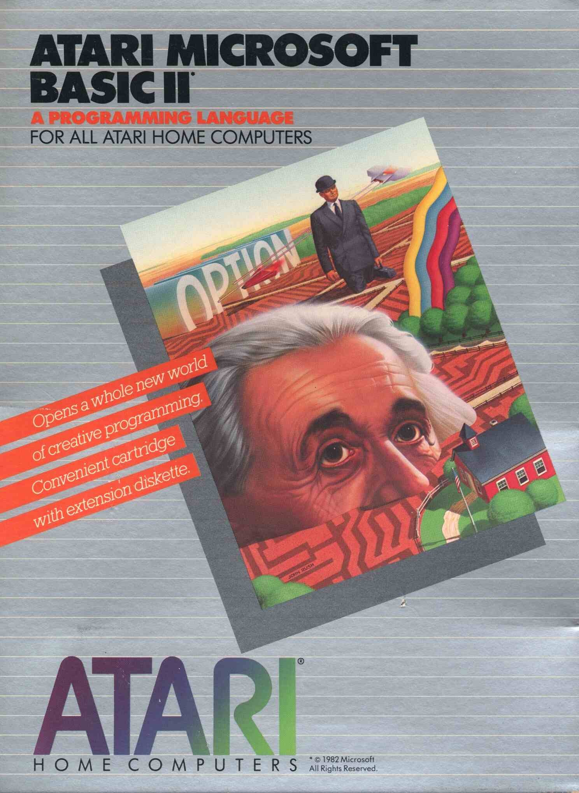
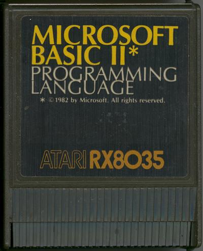
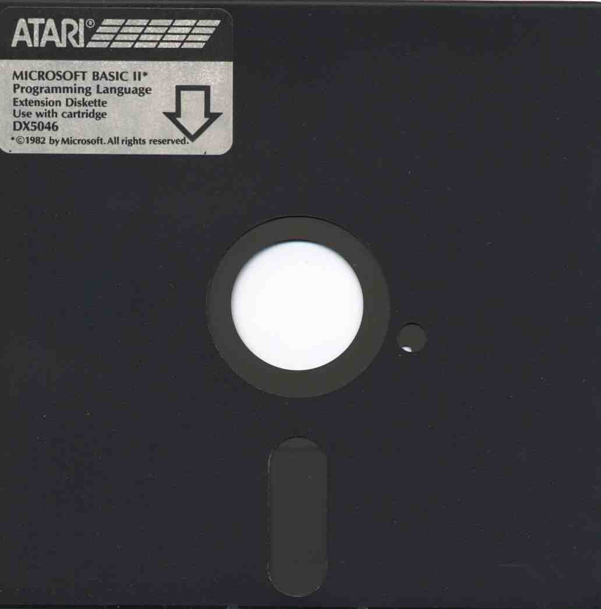
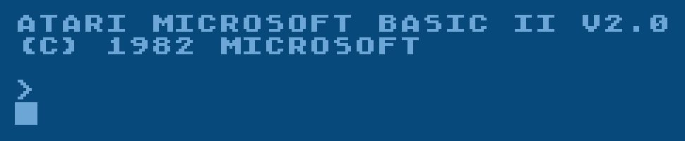
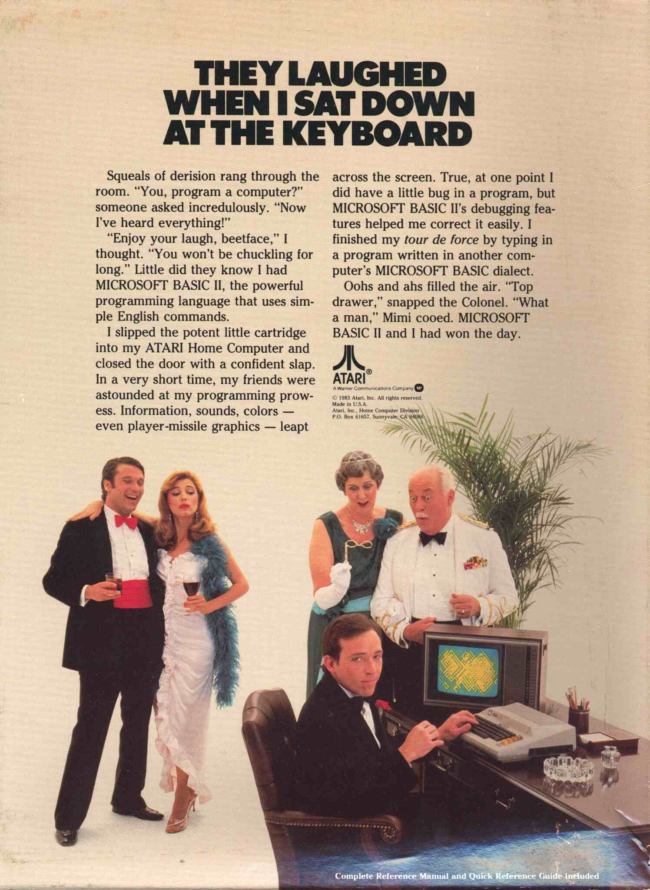

# Microsoft BASIC II (DX5046)
 
Copyright (C) 1982 Microsoft Corporation  
  
### Background  
Atari Microsoft BASIC II is a powerful programming language that uses simple English commands, features and an Atari cartridge with extension diskette for faster loading. Features: revises bugs found in Microsoft BASIC I, will autorun a BASIC program, relaxed handling of strings, one-dimensional strings without telling the computer in advance, allows multidimensional arrays of variables and strings, can enter program line numbers automatically, new commands dealing with DOS files: Kill-Lock-Unlock-and Name, NO Syntax checking is done as you type in programs but only when you Run your programs allowing you to trace errors right to their source with TRON and TROFF commands, floating-pint accuracy to 16 digits, implements math functions more rapidly by utilizing the interpreter rather than the operating system ROM routines and will support 4 disk drives. Atari Microsoft BASIC II contains a 142 page reference manual with sample programs, a 8 page Microsoft BASIC user's guide, a Microsoft BASIC 13 page quick reference guide, a Microsoft cartridge with an extension disk. Minimum memory 16K.  
  
## Pictures  
  
Atari Microsoft BASIC II box cover  
  
  
Atari Microsoft BASIC II cartridge RX8035  
  
  
Atari Microsoft BASIC II Diskette DX5046 - 1  
  
  
Atari Microsoft BASIC II Diskette DX5046 - 2  
  
  
Atari Microsoft BASIC II box - German RXG 7075; please note __Mikrosoft__ instead of __Microsoft__ on some boxes, but the content is unaltered!  
  
  
Atari Microsoft BASIC II V2.0 start screen  
  
  
Atari Microsoft BASIC II ad  
  
## Manual  
- missing
  
## Atari Microsoft BASIC Cross-Reference Utility - APX Catalog Number 20125 by Fred Thorlin System Software; Many thanks to bob1200xl from AtariAge for sharing it with us!  
  
## ATR Image:  
- [Atari Microsoft BASIC Cross-Reference Utility](http://www.atarimania.com/utility-atari-400-800-xl-xe-microsoft-BASIC-cross-reference-utility_30054.html)  

Atari Microsoft BASIC Cross-Reference Utility  
  
## References:  
- [Wikipedia: Microsoft BASIC I](https://en.wikipedia.org/wiki/Microsoft_BASIC)  
- [Wikipedia: Atari Microsoft BASIC I](https://en.wikipedia.org/wiki/Atari_Microsoft_BASIC)  
- [Atari Microsoft BASIC at Atarimania](https://www.atarimania.com/list_utilities_atari_search_77.105.99.114.111.115.111.102.116.32.66.65.83.73.67._8_U.html)  
