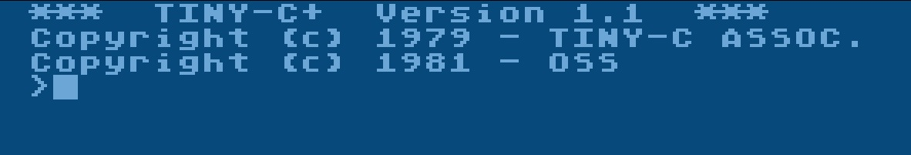
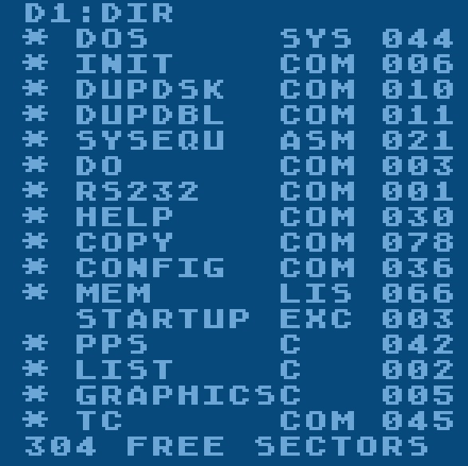
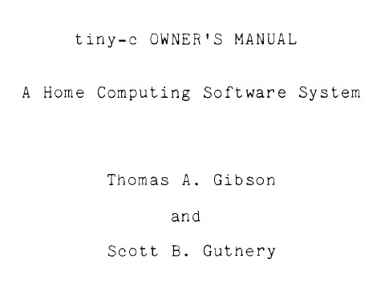
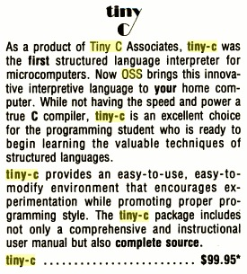
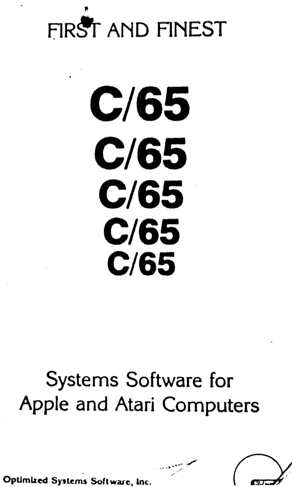

# C

## OSS tiny-c Copyright (C) 1978 tiny c associates, 1982 OSS, Inc., Thomas A. Gibson and Scott B. Guthery

OSS tiny-c was a small C compiler disk.

From Atari FAQ:
First sold C compiler by OSS. This compiler was used to compile itself! First true language "bootstrap" on any 8-bit machine (it was also available for Apple and CP/M machines). Derived from Dr. Dobbs "Small C". Compiles to 6502 code which emulates the 8080 instruction set.

### Manual

- [OSS tiny-c manual](attachments/tiny-c_manual.pdf) ; size: 2.6 MB

### ATR images

- [TINY-C\_program\_disk.atr](attachments/TINY-C_program_disk.atr) ; TINY-C+ Version 1.1 program disk ; Mega-thanks to Kyle22 from AtariAge for giving us the ATR-imgaes, we are deep in your debt!
- [TINY-C\_source\_disk.atr](attachments/TINY-C_source_disk.atr) ; TINY-C+ Version 1.1 **source code** disk with ASM-files ; Mega-thanks to Kyle22 from AtariAge for giving us the ATR-imgaes, we are deep in your debt!

### Pictures

- OSS TINY-C+ Version 1.1 program startscreen 

- OSS TINY-C+ Version 1.1 directory of program disk 

- OSS tiny-c manual cover 

- OSS tiny-c ad 

## OSS C/65 Copyright (C) 1982 OSS, Inc.

C programming language for the Atari. A subset of C, C/65 only generated assembly source code. An assembly compiler (like MAC/65) is needed to generate an executable file. Marketed, not produced by OSS.

### Manuals

- [OSS C-65 Manual.pdf](http://data.atariwiki.org/DATA/OSS_C-65-Manual.pdf) ; size: 40,2 MB; thanks to Serious Computerist
- [OSS\_C-65\_Reference\_Manual-C\_1982\_OSS\_Inc..pdf](attachments/OSS_C-65_Reference_Manual-C_1982_OSS_Inc..pdf) ;full OSS C/65 Reference Manual with OCR; mega-thanks to Fuji-Man from AtariAge!
- [C/65 Manual](C65_Manual/README.md)
- [OSS\_C\_65\_Quick\_Start\_Guide.pdf](attachments/OSS_C_65_Quick_Start_Guide.pdf)

### ATR images

- [OSS\_C-65.atr](attachments/OSS_C-65.atr) OSS C/65
- [OSS\_C-65\_with\_TURBO-DOS\_XE.atr](attachments/OSS_C-65_with_TURBO-DOS_XE.atr) OSS C/65 with TURBO-DOS XE
- [C-65\_A\_-\_C-65\_with\_DOS\_XL\_2.30.atr](attachments/C-65_A_-_C-65_with_DOS_XL_2.30.atr) OSS C/65 with DOS XL 2.30 - Part A with the compiler
- [C-65\_B\_\_-\_MAC-65\_with\_DOS\_XL\_2.30.atr](attachments/C-65_B__-_MAC-65_with_DOS_XL_2.30.atr) OSS C/65 with DOS XL 2.30 and MAC/65 as editor for creating C source files - Part B
- [C-65\_with\_OS-Aplus-1.atr](attachments/C-65_with_OS-Aplus-1.atr) OSS C/65 with OS/A+ Disk 1
- [C-65\_with\_OS-Aplus-2.atr](attachments/C-65_with_OS-Aplus-2.atr) OSS C/65 with OS/A+ Disk 2

### Picture

- OSS C/65 Cover 

## Deep Blue C

### ATR images

- [Deep\_Blue\_C\_A.atr](attachments/Deep_Blue_C_A.atr)
- [Deep\_Blue\_C\_B.atr](attachments/Deep_Blue_C_B.atr)
- [Deep\_Blue\_C\_Compiler\_version\_1.1\_1982.atr](attachments/Deep_Blue_C_Compiler_version_1.1_1982.atr)
- [Cplusplus\_1.2\_A.atr](attachments/Cplusplus_1.2_A.atr)
- [Cplusplus\_1.2\_B.atr](attachments/Cplusplus_1.2_B.atr)
- [Deep\_Blue\_C\_alt\_A.atr](attachments/Deep_Blue_C_alt_A.atr)
- [Deep\_Blue\_C\_alt\_B.atr](attachments/Deep_Blue_C_alt_B.atr)
- [Antic\_Deep\_Blue\_C\_compiler.atr](attachments/Antic_Deep_Blue_C_compiler.atr) ; Compiler version 1.2
- [Antic\_Deep\_Blue\_C\_compiler\_Docs.atr](attachments/Antic_Deep_Blue_C_compiler_Docs.atr) ; Compiler version 1.2 documents

## Lightspeed C 1.15

### Manual

- [Lightspeed\_C.pdf](../../../media/Languages/C/attachments/Lightspeed_C.pdf) Lightspeed C manual

### ATR images

- [Lightspeed\_C\_1.15\_A.atr](attachments/Lightspeed_C_1.15_A.atr)
- [Lightspeed\_C\_1.15\_B.atr](attachments/Lightspeed_C_1.15_B.atr)
- [Lightspeed\_C\_s1.atr](attachments/Lightspeed_C_s1.atr)
- [Lightspeed\_C\_s2.atr](attachments/Lightspeed_C_s2.atr)
- [Lightspeed\_C\_s3.atr](attachments/Lightspeed_C_s3.atr)

## CC65 ; CC65 is an Open Source C cross compiler for Atari 8-bit computers

- [CC65 suite](attachments/CC65_suite.zip) ; size: 4.4 MB ; complete developer package from all over the internet. Working! Thanks to Carnegie Mellon University's School of Computer Science for hosting many files. :-)
- [CC65-Einsteigerkurs](CC65/CC65_Einsteigerkurs/README.md)
- [CC65 Porting Ideas](CC65/CC65_Porting_ideas/README.md)

### Examples

- [3dMaze](C_Examples/3dMaze/README.md) A 3D Maze Program by Stefan Haubenthal
- [Graphics 15+](C_Examples/Graphics_15plus/README.md) - This is a small example on how to use Graphics 15+ with CC65
- [Greed](C_Examples/Greed/README.md) - a Game in CC65
