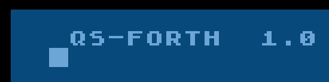

# QS FORTH

More information on QS FORTH is needed; please help us. QS FORTH works with OS B only.

## ATR image
- [QS_Forth.atr](attachments/QS_Forth.atr)

## QS-Forth Screens
- [QS-Forth Screens](Source_Code/README.md)

## Presentation (German)
- [QS-FORTH_20.12.05.pdf](../../../../media/QS_Forth/attachments/OS-FORTH_20.12.05.pdf) ; size: 19.6 MB ; PDF file format
- [QS-FORTH_20.12.05.ppt](../../../../media/QS_Forth/attachments/QS-FORTH_20.12.05.ppt) ; size: 6.9 MB ; Microsoft PowerPoint format

## Picture

QS-FORTH 1.0 start screen

''A variation called Beginner Forth was available (prompt: "BEG Forth 1.0").''
