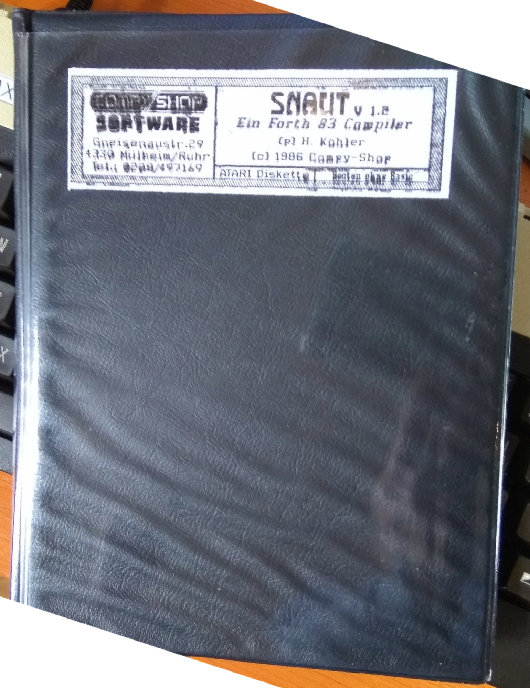
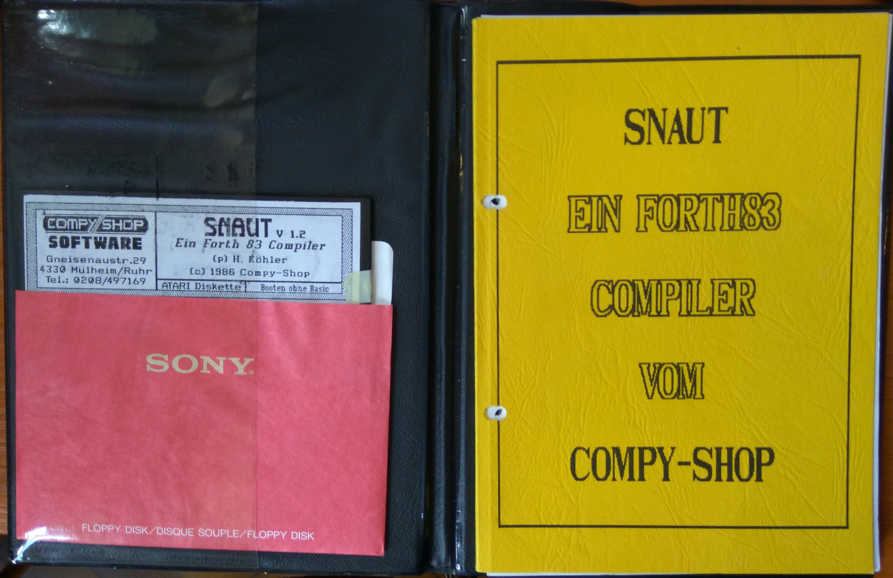
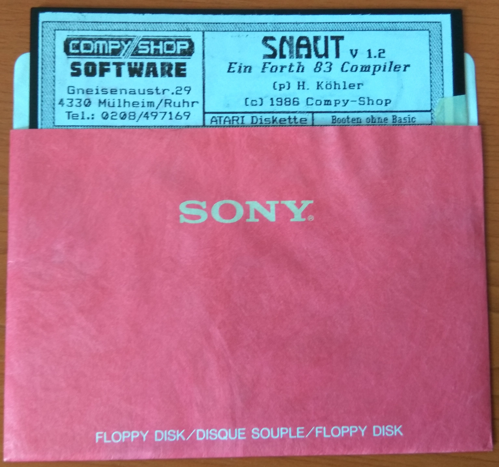
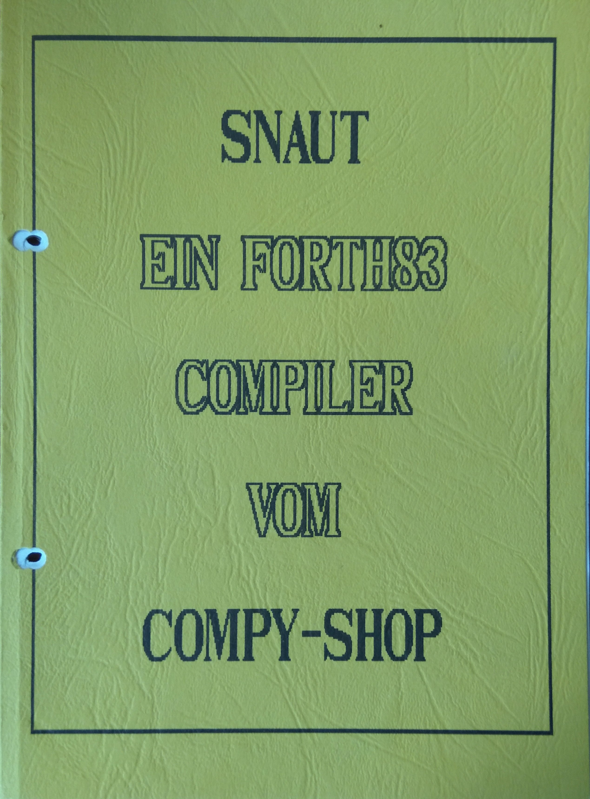
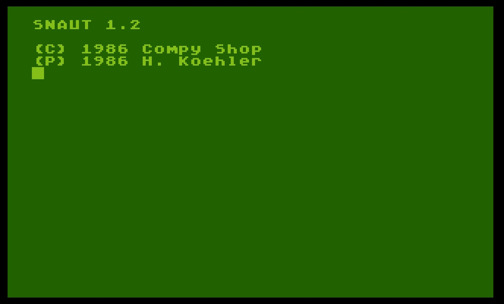
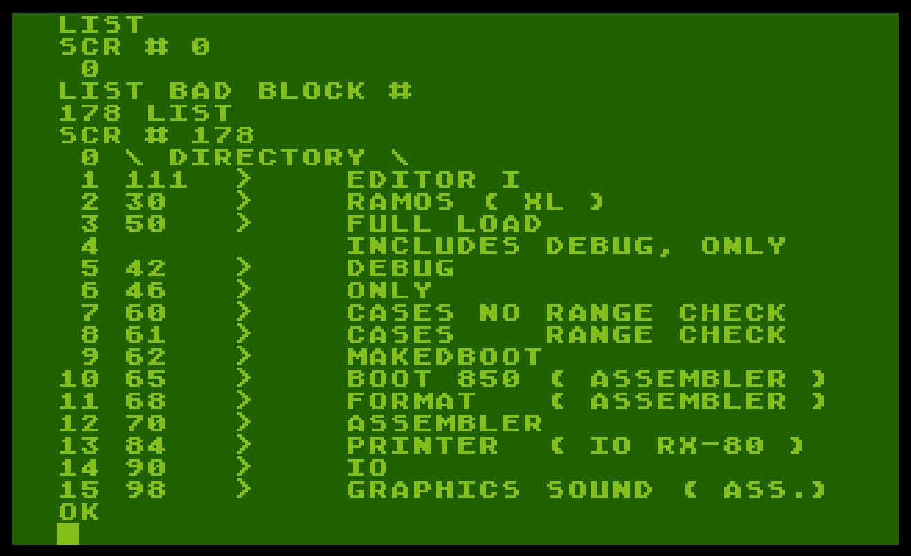
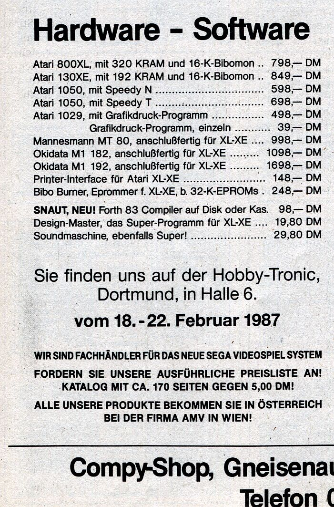

# SNAUT V. 1.2 - Ein FORTH 83 Compiler

Programmed by (P) H. Köhler

Copyright (C) 1986 Compy-Shop

There are those who called it vaporware, but in 2017 Stefan proved once and for all that they were all wrong!
We do not know how Stefan did it, but he really made the dream come true! :-)))
After 31(!) years, we can offer you this part of Atari history, believed to be lost. Therefore, enjoy! :-)))

## ATR image

- [SNAUT.atr](attachments/SNAUT.atr) ; please boot without BASIC

## Manuals

- [SNAUT-Handbuch-Original.pdf](../../../../media/Languages/Forth/SNAUT/attachments/SNAUT-Handbuch-Original.pdf) ; size: 10.7 MB ; thank you so much Stefan for scanning, we really appreciate your help very much! Please go ahead! :-)
- [SNAUT-Handbuch-Print-OCR.pdf](../../../../media/Languages/Forth/SNAUT/attachments/SNAUT-Handbuch-Print-OCR.pdf) ; size: 13.8 MB ; same as above, but with OCR
- [SNAUT-Handbuch-Screen-OCR.pdf](attachments/SNAUT-Handbuch-Screen-OCR.pdf) ; size: 3.2 MB ; same as above, but optimized for screen view only

## Pictures

- SNAUT - folder 

- SNAUT - folder content 

- SNAUT - diskette 

- SNAUT - cover of the manual 

- SNAUT - start screen 

- SNAUT - disk content 

- SNAUT - advertisement from the German magazine Computer Kontakt (CK) from February / March 1987 ; Thanks to Mr. Bacardi for this information! 

## References

- Stefan, who has found this very unique artifact, which was believed to be lost. Thank you so much, Stefan; we are deep in your debt and owe you very much. Please go ahead! :-)
- Mr. Bacardi for the information and the picture of the advertisement! We really appreciate your help very much! Please go ahead! :-)
