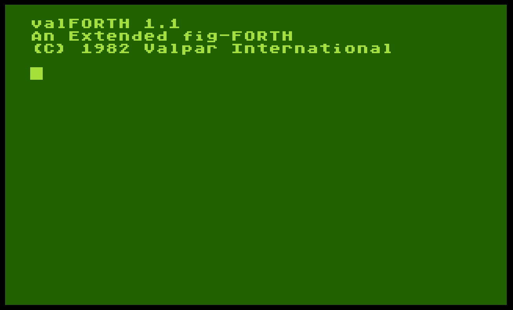
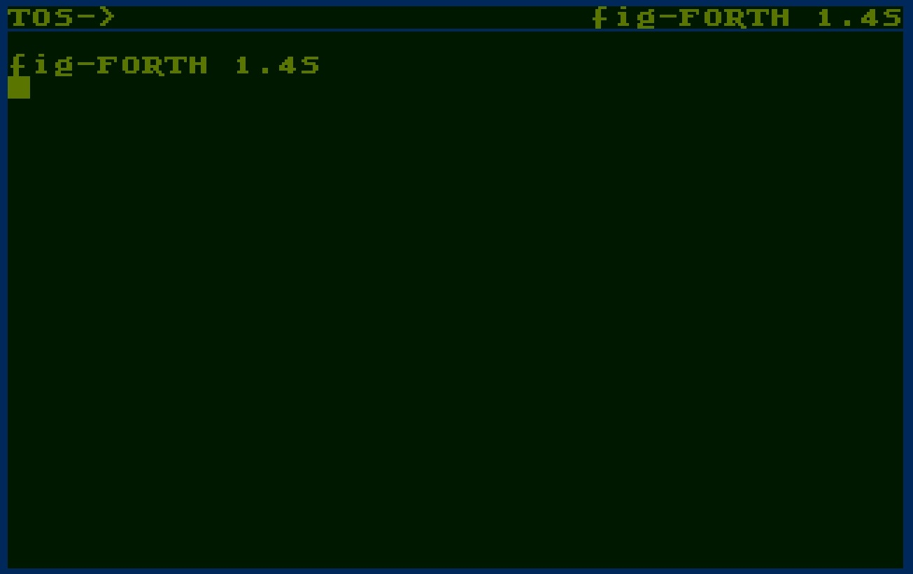

# valFORTH

Copyright (C) 1982 by Valpar International ; AtariWiki is licensed to publish valFORTH in 2016

## ATR-Images

- [valForth1.1Side1.atr](attachments/valForth1.1Side1.atr) ; 1st disk side
- [valForth1.1.atr](attachments/valForth1.1.atr) ;
- [Val\_Graphics\_Editor-S1.atr](attachments/Val_Graphics_Editor-S1.atr) ;
- [valFORTH\_DISPLAY\_FORMATTER\_S1-Possibly\_Bad.atr](attachments/valFORTH_DISPLAY_FORMATTER_S1-Possibly_Bad.atr) ;
- [valFORTH\_GENERAL\_UTILITIES\_AND\_VIDEO\_EDITOR\_S1.atr](attachments/valFORTH_GENERAL_UTILITIES_AND_VIDEO_EDITOR_S1.atr) ;
- [valFORTH\_Player\_Missile\_Graphics\_Character\_Editor\_Sound\_Editor\_S1.atr](attachments/valFORTH_Player_Missile_Graphics_Character_Editor_Sound_Editor_S1.atr) ;
- [valFORTH\_Text\_Compression\_and\_Auto\_Text\_Formatting\_S1-Possibly\_Bad.atr](attachments/valFORTH_Text_Compression_and_Auto_Text_Formatting_S1-Possibly_Bad.atr) ;
- [valFORTH\_Turtle\_and\_valGraphics\_and\_advanced\_floating\_point\_routines\_S1-Possibly\_Bad.atr](attachments/valFORTH_Turtle_and_valGraphics_and_advanced_floating_point_routines_S1-Possibly_Bad.atr) ;

## Updated / Working ATR-Images

Working images tested against Altirra 3.90 - provided by a kind soul on AtariAge forums!

- [ValForth\_1\_1\_Valpar.atr](attachments/ValForth_1_1_Valpar.atr)
- [ValForth\_ValDOS\_1\_Valpar.atr](attachments/ValForth_ValDOS_1_Valpar.atr)
- [ValForth\_ValDOS\_2\_Valpar.atr](attachments/ValForth_ValDOS_2_Valpar.atr)
- [ValForth\_Turtle\_and\_Valgraphics\_Valpar.atr](attachments/ValForth_Turtle_and_Valgraphics_Valpar.atr)
- [ValForth\_Display\_Formatter\_Valpar.atr](attachments/ValForth_Display_Formatter_Valpar.atr)
- [ValForth\_General\_Utilities\_and\_Video\_Editor\_Valpar.atr](attachments/ValForth_General_Utilities_and_Video_Editor_Valpar.atr)
- [ValForth\_Text\_Compression\_Valpar.atr](attachments/ValForth_Text_Compression_Valpar.atr)
- [ValForth\_Player\_Missile\_Graphics\_Valpar.atr](attachments/ValForth_Player_Missile_Graphics_Valpar.atr)

## fig-Forth images

- [Forth\_with\_DOS\_2.5\_SD\_OS-B.atr](attachments/Forth_with_DOS_2.5_SD_OS-B.atr) ; fig-Forth 1.1 and valForth 1.1 with DOS 2.5 color ; OS B required
- [Forth26-S1.atr](attachments/Forth26-S1.atr) ; fig-FORTH 1.4S
- [Forth26-S2.atr](attachments/Forth26-S2.atr) ; fig-FORTH 1.4S

## Manuals

- [valFORTH\_1.1\_manual](http://data.atariwiki.org/DATA/valFORTH_1.1_manual.pdf) ; valFORTH 1.1 manual; size: 9,8 MB ; thank you so much Kay Savetz for scanning the manual. Your help for the community is legendary. Please go ahead with your outstanding work. :-)))

- [valFORTH 1.1 HANDY REFERENCE CARD](http://data.atariwiki.org/DATA/valFORTH_1.1_HANDY_REFERENCE_CARD.pdf) ; reference card of valFORTH 1.1; size: 27.2 MB

More manuals are available on [The Internet Archive](https://archive.org/search.php?query=valforth)

## Video

- [https://www.youtube.com/watch?v=JaNn1cnvBAI](https://www.youtube.com/watch?v=JaNn1cnvBAI) ; Youtube video how fig-Forth works

## Images

- valFORTH start screen<brt>

- fig-FORTH 1.4S startscreen 
