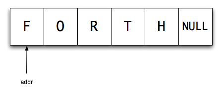

# Chapter 6: Strings (strings) in volksFORTH

Here are the basic routines for string processing. Above all, words were added that allow the handling of those required by some operating systems 0-terminated strings. FORTH has here over C has the disadvantage that FORTH-strings start with a default count byte that contains the length of the string. A final mark (eg a null byte) is therefore unnecessary. If the operating system but was written in C (Atari TOS, MS-DOS), have strings are converted accordingly.

By default FORTH uses counted strings, which are only identified by an address. The byte at that address contains the words, how long the string is. On this "byte count" then the string itself follows a result, the Läunge standard strings in FORTH is limited to 255 characters. The shortest string is a string of length NULL, for its review, the command is __NULLSTRING? __ Available.


This is what the string FORTH at the address addr in memory at FORTH.

- [. "](../../Language/Words/_Dot-string/README.md)
- ["](../../Language/Words/_String/README.md)
- [, "](../../Language/Words/_Compile-string/README.md)
- [Null string?](../../Language/Words/null-string-question/README.md)
- ['Lit](../../Language/Words/_quote-literal/README.md)
- [. (](../../Language/Words/_Dot-comment/README.md)
- [(](../../Language/Words/_Comment/README.md)
- [)](../../Language/Words/_End-comment/README.md) - this is not a Forth word, but a stop sign

# String manipulation

Here in the glossary, the following comment Stack (string -) the address of a counted string, len against (addr -) to characterize the start address of the string and its length.

No string variable? - Use:
```
: String: Create dup, 0 c, DOES> allot 1 + count;
```

- [Caps](../../Language/Words/Caps/README.md)
- [Capital](../../Language/Words/Capital/README.md)
- [Upper](../../Language/Words/Upper/README.md)
- [Capitalitze](../../Language/Words/Capitalitze/README.md)
- [/ String](../../Language/Words/_cut-string/README.md)
- [-Trailing](../../Language/Words/_minus-trailing/README.md)
- [Scan](../../Language/Words/Scan/README.md)
- [Skip](../../Language/Words/Skip/README.md)
- ["](../../Language/Words/_Question-quote/README.md)
- [Bounds](../../Language/Words/Bounds/README.md)
- [Type](../../Language/Words/Type/README.md)
- [> Type](../../Language/Words/_to-type/README.md)
- [Place](../../Language/Words/Place/README.md)
- [Attach](../../Language/Words/Attach/README.md)
- [] Append
- [Detract](../../Language/Words/Detract/README.md)
- [] Match
- [Search](../../Language/Words/Search/README.md)

## The Dictionary

- [(Find](../../Language/Words/_paren-find/README.md)
- [] Find

### 0-terminated strings

There is another form of representation for strings, which is suitable, for example, for MS-DOS. These strings are indeed also characterized by an address, this address does not include a byte count. Instead, these strings are terminated with a null byte.



- [asciz](../../Language/Words/asciz/README.md)
- [>asciz](../../Language/Words/to-asciz/README.md)
- [counted](../../Language/Words/counted/README.md)

## Conversions: Strings - Numbers

### String to convert numbers

- [Digit?](../../Language/Words/_Digit-question/README.md)
- [Accumulate](../../Language/Words/Accumulate/README.md)
- [Convert](../../Language/Words/Convert/README.md)
- [Number?](../../Language/Words/Number-question/README.md)
- [Number](../../Language/Words/Number/README.md)
- [Dpl](../../Language/Words/Dpl/README.md)

FORTH in the input of numbers is often realized with the general text and the commands for converting strings to numbers. In the literature it is often the solution with __QUERY__ available:

```
: In # (string - d n tf tf addr ff)
   query bl word number? ;
```

This solution is unfavorable because __QUERY__ clears the __TIB__. At the same time, the definition of __NUMBER? __ An unhappy place in the people-FORTH dar. It is in Laxen & Perry F83-word the same name, the very different (better deals!), With the parameters. Here is the definition of the F83-NUMBER?, Based on the state-FORTH __NUMBER? __:

```
: F83-NUMBER? (String - d f)
  number? ? IF dup 0 <IF true THEN extend exit THEN
  drop false 0 0;
```

This represents the word __INPUT # __ an inexpensive option for entering numbers 16/32Bit-Zahlen:

```
\ Input #
: Input # (string - d f)
  pad c / l 1 -> expect \ get a maximum of 63 char
  F83-pad number? ; \ Convert string-> number
```

So the user can evaluate the given flag and use the double-exact number as he sees fit to make in the simplest case of dropping a Single precision number.

### Convert numbers to strings

- [#](../../Language/Words/_Number/README.md)
- [# S](../../Language/Words/-s_number/README.md)
- [Hold](../../Language/Words/Hold/README.md)
- [Sign](../../Language/Words/Sign/README.md)
- [#>](../../Language/Words/_Number-greater/README.md)
