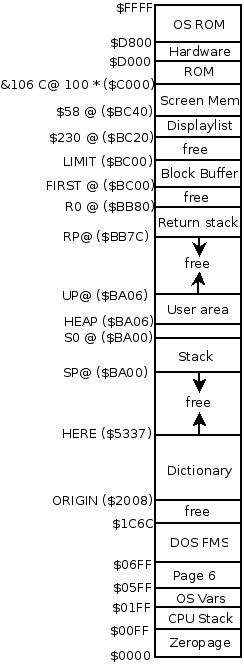

# Atari 8bit VolksForth Memory Map 
 
The default memory map for VolksForth for the Atari maximizes the usable memory for the Forth directory. The screen memory is sized for a Graphics 0 screen. To use other graphic modes, either a manual display list with manually specified screen memory must be used, or the upper half of the VolksForth memory must be relocated (LIMIT - SP@). See [Relocating_VolksForth](../../Tutorial/Relocating/README.md). The hexadecimal numbers in parentheses show the memory location values for VolksForth 3.80.3 loaded on Atari DOS 2.5.

 
 
