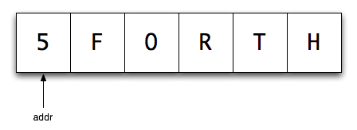
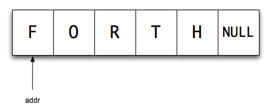

# Kapitel 6: Zeichenketten (Strings) in volksFORTH

Hier befinden sich grundlegende Routinen zur Stringverarbeitung. Vor allem wurden auch Worte aufgenommen, die den Umgang mit den von manchen Betriebssystemen geforderten 0-terminated Strings ermöglichen. FORTH hat hier gegenüber C den Nachteil, daß FORTH-Strings standardmäßig mit einem Count-Byte beginnen, das die Länge des Strings enthält. Ein abschließendes Zeichen (z.B. ein Null-Byte) ist daher unnötig. Wenn das Betriebssystem aber in C geschrieben wurde (Atari TOS, MS-DOS), müssen Strings entsprechend umgewandelt werden.

Standardmäßig arbeitet FORTH mit counted Strings, die lediglich durch eine Adresse gekennzeichnet werden. Das Byte an dieser Adresse enthält die Angabe, wie lang die Zeichenkette ist. Auf dieses "count byte" folgt dann die Zeichenkette selbst. Dadurch ist die Läunge eines Standard-Strings in FORTH auf 255 Zeichen begrenzt. Die kürzeste Zeichenkette ist ein String der Länge NULL, für dessen Überprüfung der Befehl **NULLSTRING?** zur Verfügung steht.



So sieht der String FORTH an der Adresse addr im Speicher unter FORTH aus.

- [."](../../volksFORTH_Language/Words/dot-string/README.md)
- ["](../../volksFORTH_Language/Words/string/README.md)
- [,"](../../volksFORTH_Language/Words/compile-string/README.md)
- [nullstring?](../../volksFORTH_Language/Words/null-string-question/README.md)
- ["lit](../../volksFORTH_Language/Words/quote-literal/README.md)
- [.(](../../volksFORTH_Language/Words/dot-comment/README.md)
- [(](../../volksFORTH_Language/Words/comment/README.md)
- [)](../../volksFORTH_Language/Words/end-comment/README.md) - dies ist kein Forth Wort, sondern ein Stoppzeichen

## String-Manipulationen

Hier im Glossar bezeichnet der Stackkommentar ( string -- ) die Adresse eines counted Strings, dagegen ( addr len -- ) die Charakterisierung durch die Anfangsadresse der Zeichenkette und ihre Länge.

Keine Stringvariable? - Benutze:

```
: String:  Create dup , 0 c, allot DOES> 1+ count ;
```

- [caps](../../volksFORTH_Language/Words/Caps/README.md)
- [capital](../../volksFORTH_Language/Words/Capital/README.md)
- [upper](../../volksFORTH_Language/Words/Upper/README.md)
- [capitalitze](../../volksFORTH_Language/Words/Capitalitze/README.md)
- [/string](../../volksFORTH_Language/Words/cut-string/README.md)
- [-trailing](../../volksFORTH_Language/Words/minus-trailing/README.md)
- [scan](../../volksFORTH_Language/Words/Scan/README.md)
- [skip](../../volksFORTH_Language/Words/Skip/README.md)
- [?"](../../volksFORTH_Language/Words/question-quote/README.md)
- [bounds](../../volksFORTH_Language/Words/Bounds/README.md)
- [type](../../volksFORTH_Language/Words/Type/README.md)
- [\>type](../../volksFORTH_Language/Words/to-type/README.md)
- [place](../../volksFORTH_Language/Words/Place/README.md)
- [attach](../../volksFORTH_Language/Words/Attach/README.md)
- [append](../../volksFORTH_Language/Words/append/README.md)
- [detract](../../volksFORTH_Language/Words/Detract/README.md)
- [match](../../volksFORTH_Language/Words/match/README.md)
- [search](../../volksFORTH_Language/Words/Search/README.md)

## Im Dictionary

- [(find](../../volksFORTH_Language/Words/paren-find/README.md)
- [find](../../volksFORTH_Language/Words/find/README.md)

## 0-terminated Strings

Es gibt noch eine weitere Darstellungsform für Strings, die beispielsweise für MS-DOS geeignet ist. Diese Strings werden zwar ebenfalls durch eine Adresse gekennzeichnet; diese Adresse enthält aber kein count byte. Stattdessen werden diese Zeichenketten mit einem Nullbyte abgeschlossen.



- [asciz](../../volksFORTH_Language/Words/asciz/README.md)
- [\>asciz](../../volksFORTH_Language/Words/to-asciz/README.md)
- [counted](../../volksFORTH_Language/Words/counted/README.md)

## Konvertierungen: Strings -- Zahlen

### String in Zahlen wandeln

- [digit?](../../volksFORTH_Language/Words/digit-question/README.md)
- [accumulate](../../volksFORTH_Language/Words/Accumulate/README.md)
- [convert](../../volksFORTH_Language/Words/Convert/README.md)
- [number?](../../volksFORTH_Language/Words/number-question/README.md)
- [number](../../volksFORTH_Language/Words/Number/README.md)
- [dpl](../../volksFORTH_Language/Words/Dpl/README.md)

Ein Beispiel der Umwandlung von Zeichen in Zahlen:

In FORTH wird die Eingabe von Zahlen oft mit der allgemeinen Texteingabe und über die Befehle zur Umwandlung von Strings in Zahlen realisiert. In der Literatur wird dazu oft diese Lösung mit **QUERY** angeboten:

```
: in#  ( string -- d tf  n tf  addr ff )
   query bl word  number? ;
```

Diese Lösung ist ungünstig, da **QUERY** den **TIB** löscht. Zugleich stellt die Definition von **NUMBER?** eine unglückliche Stelle im volksFORTH dar. Es gibt im Laxen \& Perry-F83 ein Wort mit demselben Namen, das ganz anders (besser!) mit den Parametern umgeht. Hier folgt die Definition des F83-NUMBER?, das auf dem volksFORTH **NUMBER?** aufbaut:

```
: F83-NUMBER?  ( string -- d f )
  number?  ?dup IF 0< IF extend THEN true exit THEN
  drop 0 0 false ;
```

Damit stellt das Wort **INPUT#** eine wenig aufwendige Zahleneingabemöglichkeit für 16/32Bit-Zahlen dar:

```
\ input#
: input#  ( string -- d f )
  pad c/l  1- >expect     \ get 63 char maximal
  pad F83-number? ;       \ convert string->number
```

So kann der Anwender das übergebene Flag auswerten und die doppelt genaue Zahl entsprechend seinen Vorstellungen einsetzen, im einfachsten Fall mit DROP zu einer einfachgenauen Zahl machen.

### Zahlen in Strings wandeln

- [#](../../volksFORTH_Language/Words/Number/README.md)
- [#s](../../volksFORTH_Language/Words/number-s/README.md)
- [hold](../../volksFORTH_Language/Words/Hold/README.md)
- [sign](../../volksFORTH_Language/Words/Sign/README.md)
- [#\>](../../volksFORTH_Language/Words/number-greater/README.md)
