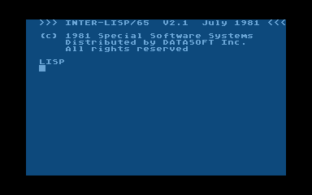

# Inter-LISP
 
Copyright (C) 1981 Special System Software.

  
Inter-LISP/65 V2.1 for Atari 8-bit computers. 
  
## Manuals
- [Inter-LISP.pdf](attachments/Inter-LISP.pdf) Inter-LISP for the Atari Computer  
- [LISP-Patrick_Henry_Winston-Berthold_Klaus_Paul_Horn.pdf](../attachments/LISP-Patrick_Henry_Winston-Berthold_Klaus_Paul_Horn.pdf)  
  
## ATR-Images
- [Inter-LISP/65 V2.1](attachments/lisp.atr)  
- [Inter-LISP/65 V2.5-side A](attachments/lispside1.atr)  
- [Inter-LISP/65 V2.5-side B](attachments/lispside2.atr)  
  
## Descriptions
- [CLISP Macros](CLISP_Macros/README.md) for InterLisp/65  
- [InterLISP Commands](InterLIST-Commands/README.md) Commands collected and documented by UNIXcoffee928  
- [Lisp Editor](Lisp_Editor/README.md) for InterLisp/65  
- [Lisp Calculator](Lisp_Calculator/README.md) A simple Calculator in LISP  
- [Lisp Macros](Lisp_Macros/README.md)  
- [Lisp Utility Package](Lisp_Utility_Package/README.md)  

# Examples
- [Towers of Hanoi](Examples/Towers_of_Hanoi/README.md)  
  
  
