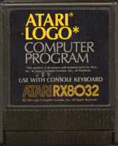
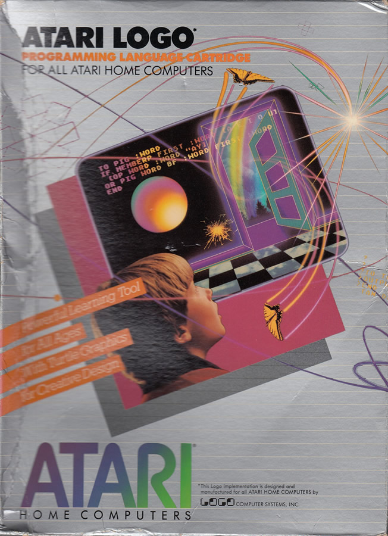
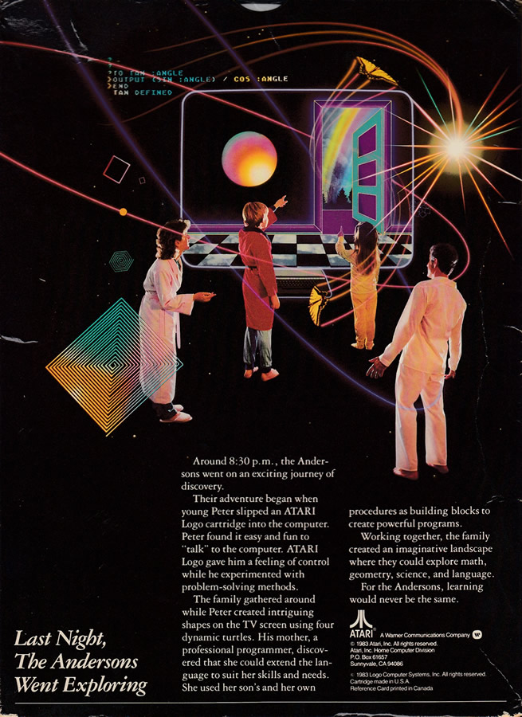

# Atari LOGO

## Start Screen

Atari LOGO (C) 1983 LCSI

## ROM-Images

Atari LOGO RX8032 (C) 1983 Logo Computer Systems, Inc. (LCSI), All Rights Reserved
- [Atari_LOGO.rom](attachments/Atari_LOGO.rom)

## CAR-Images
- [Atari_LOGO_1983_LCSI.car](attachments/Atari_LOGO_1983_LCSI.car)

## BIN-Images
- [Atari_LOGO_1983_LCSI.bin](attachments/Atari_LOGO_1983_LCSI.bin) ;
This is a patched image with copy protection disabled.
9C6B: 20 AF 88          JSR $88AF
88AF: EE 6B 9C          INC $9C6B ; This is replaced by three NOPs

## ATR-Images
- [Atari_LOGO_1983_LCSI.atr](attachments/Atari_LOGO_1983_LCSI.atr)

## CAS-Images
- [Atari_LOGO.cas](attachments/Atari_LOGO.cas)

## Manuals
- [Atari_LOGO Introduction to Programing Through Turtle_Graphics - 1-sided.pdf](../../../media/Companies/Atari/Atari_LOGO/attachments/Atari_LOGO-Introduction_To_Programing_Through_Turtle_Graphics-1-sided.pdf)
- [Atari_LOGO Introduction to Programing Through Turtle_Graphics - 2-sided.pdf](attachments/Atari_LOGO-Introduction_to_Programing_Through_Turtle_Graphics-2-sided.pdf)
- [Atari LOGO Quick Reference Guide - 1-sided](attachments/Atari_LOGO-Quick_Reference_Guide-1-sided.pdf)
- [Atari_LOGO Quick Reference Guide - 2-sided.pdf](attachments/Atari_LOGO-Quick_Reference_Guide-2-sided.pdf)
- [Atari LOGO Reference Manual](../../../media/Companies/Atari/Atari_LOGO/attachments/Atari_LOGO-Reference_Manual.pdf) (1-sided)
- [Atari LOGO German](attachments/Atari_LOGO-German.pdf) ; Größe: 1.9 MB ; German script for Atari LOGO. Thanks to Atarifriend :-)

## Book

- [Computer Science Logo Style](https://people.eecs.berkeley.edu/~bh/) by Brian Harvey (free PDF books, highly recommended)

## Box Pictures

Box Atari LOGO front

Box Atari LOGO back
