# QUICK

Copyright (C) 1989 RAINDORF SOFT & Andreas Binner and Harald Schönfeld

### Background
QUICK is a simple programming language designed for writing high-performance code. It is similar to [Action!](../Action/README.md) in basic concept, and differs primarily in its syntax. Like Action!, QUICK is based on an ALGOL-like (and thus C- and Pascal-like) program structure, and, like Action!, it allows variables to be assigned to specific memory locations, making it easy to interact with hardware registers. One might think of QUICK as a public version of Action! in the same way one might consider [Turbo-BASIC XL](../BASIC/Turbo-BASIC_XL/README.md) to be a (greatly improved) public version of [Atari BASIC](../BASIC/Atari_BASIC/README.md).

AtariWiki deeply thanks [CharlieChaplin from AtariAge](https://forums.atariage.com/topic/157358-quick-programming-language/#findComment-1931224), so we can offer the following info:

'
QUICK had been released as a type-in listing in the German Atari Magazin in 1989 by Raindorf-Soft (Harald Schoenfeld and Andreas Binner). It consists of three program files, the language, a compiler, and a runtime (just like TURBO-Basic XL). The listing was version 1.6, but there were also updates available (e. g. via QUICKmagazines 1-15) for version 2.0 and 2.1. Alas, the versions are not fully compatible; thus, code used in version 1.6 does not necessarily run in version 2.0 or 2.1 (or vice versa)...

There were also commercially available versions: 2.0 and 2.1, with a printed manual and some programming examples. While Atari Magazin was German, its publisher made a deal in the 90s with Dean Garaghty in Scotland, so some programs (like QUICK, Screen Aided Management, and others) are also available in English and/or with English instructions. [dgs](http://www.dgs.clara.net/) still sells these English versions commercially...

Last but not least, Abbuc once got permission from the copyright holder (Werner Raetz) to release QUICK as an Abbuc Sondermagazin (special issue), but alas, the version released by Abbuc was the oldest one, 1.6. Nevertheless, since the QUICK Magazines are in PD right now, it is easy to use them to update version 1.6 to 2.0 and then to 2.1...

'
All German versions can be published here, except the English versions of 2.1 and 2.2.. These two versions must be obtained from [dgs](http://www.dgs.clara.net/). Please see below. On the other hand, AtariWiki is free to publish the English version of 1.6, and there is a type-in listing for the version to upgrade legally to 2.1.

## ATR Images
- [QUICKV16.ATR](attachments/QUICKV16.atr) ; QUICK version 1.6 with Editor, Compiler, Runtime and DOS II Version 2.75
- [QIK_SHEL.atr](attachments/QIK_SHEL.atr) ; QUICK-Shell V1.1, includes QUICK-Editor V1.3 and QUICK-Compiler V1.6 in English
- [QIK_001.atr](attachments/QIK_001.atr) ; QUICKmagazin Ausgabe 1 in German language
- [QIK_002.atr](attachments/QIK_002.atr) ; QUICKmagazin Ausgabe 2 in German language
- [QIK_003.atr](attachments/QIK_003.atr) ; QUICKmagazin Ausgabe 3 in German language

We are sorry, but we can't offer the ATR images for versions 2.1 and 2.2 in English for free. However, the right holder, [dgs](http://www.dgs.clara.net/), offers them at a low price. QUICK version 2.2 English currently costs US$5 on its own, or US$7 when included in the full DGS commercial software pack. Both are delivered as a ZIP file containing ATR files for the disks (including two support disks) and a PDF of the English manual.

## Manual
- [QUICK_V2.0-Manual-German.pdf](attachments/QUICK_V2.0-Manual-German.pdf) ; size: 563 KB ; German QUICK manual ; Thank you so much, Mr. Barcardi, for your help with this; we really appreciate it. :-)

## Articles
- [Quick Articles from the German ATARImagazin](ATARImagazin/README.md)

## QUICK Programs

- [TIF2PIC](Examples/TIF2PIC/README.md) TIF2PIC converter by Ralf Patschke (pps)
- [Abbuc Magazin 73 Gametro](Examples/Abbuc_Magazin_73_Gametro/README.md) by Ralf Patschke (pps)
- [Koung](Examples/Koung/README.md) ; A simple PONG like game written in QUICK
- [QUICK Demo Disks](Examples/QUICK_Demo_Disks/README.md)

## QUICKmagazin

See [QUICKmagazin](QUICKmagazin/README.md).

## Pictures
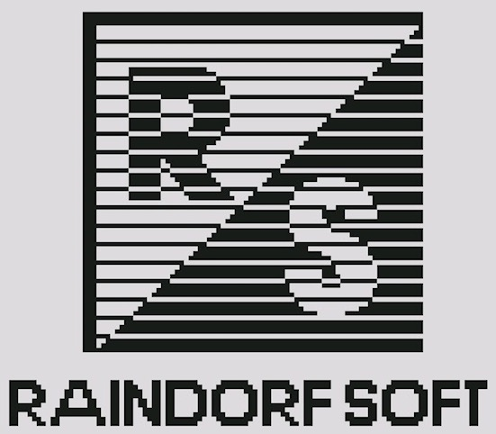
RAINDORF SOFT Logo

QUICK Logo

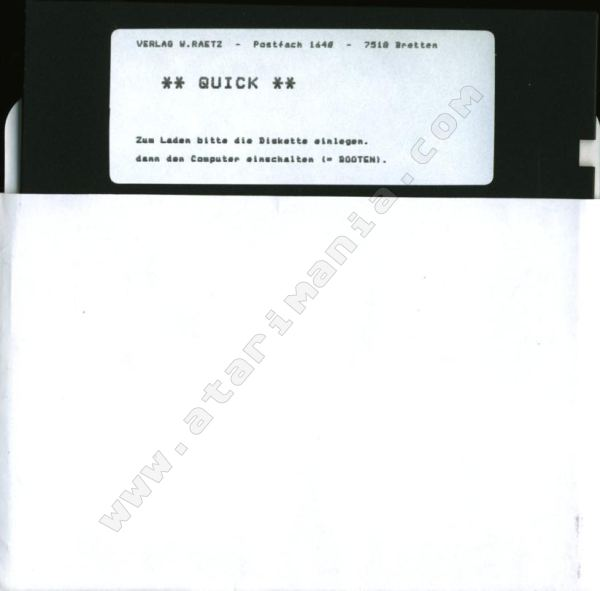
QUICK Disk ; Verlag W. Raetz oder Rätz, Postfach 1640, 7510 (alte PLZ) Bretten , 75015 (neue PLZ) Bretten ; thank you Atarimania! :-)

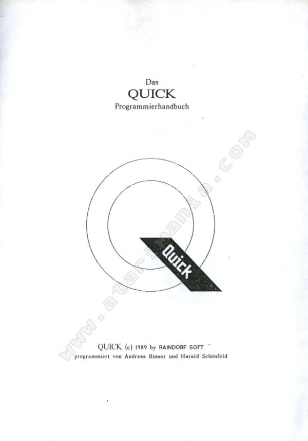
QUICK Handbuch ; thank you Atarimania! :-)

QUICK-Shell V1.1

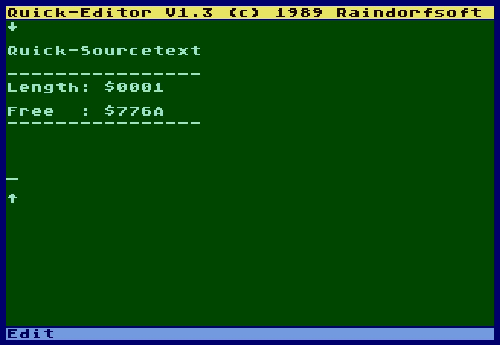
QUICK Editor V1.3

QUICK-Compiler V1.6

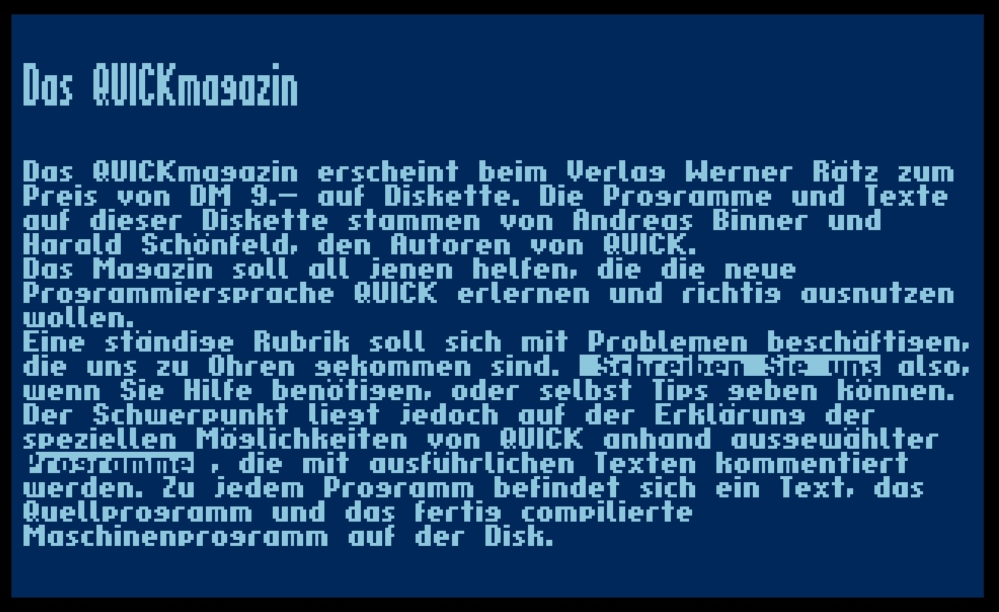
Das QUICKmagazin

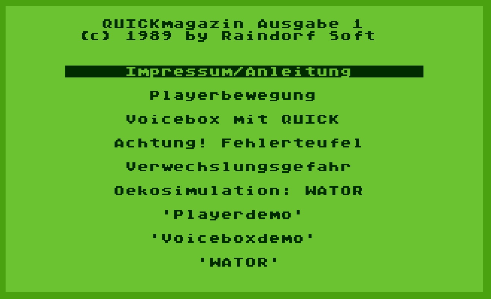
QUICKmagazin Ausgabe 1

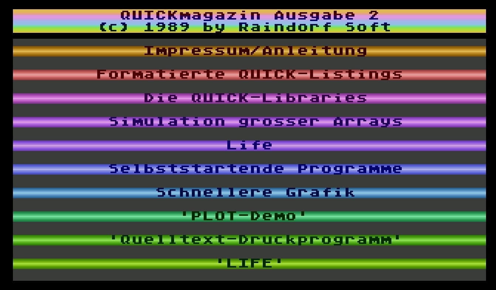
QUICKmagazin Ausgabe 2

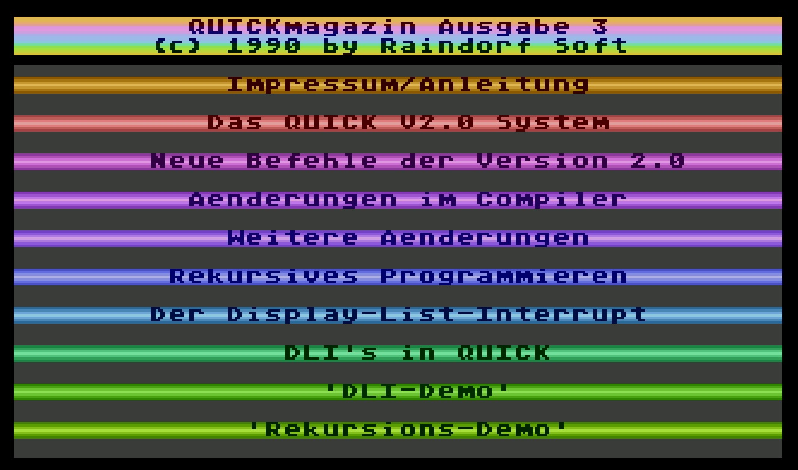
QUICKmagazin Ausgabe 3

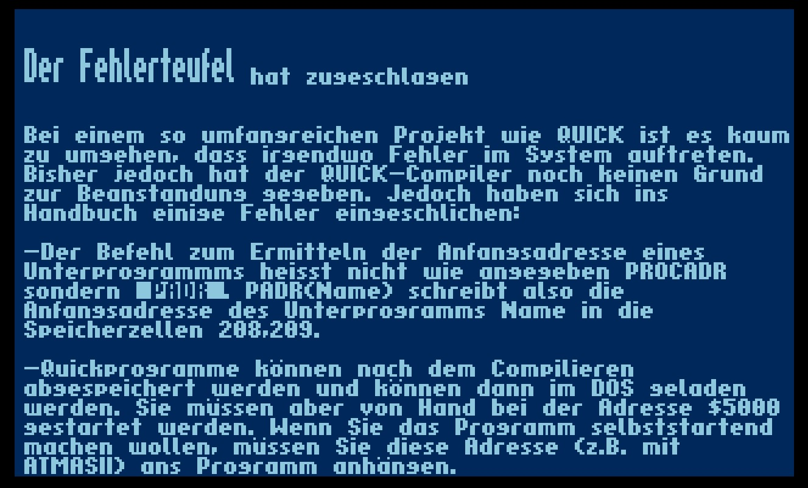
QUICKmagazin Fehlerteufel

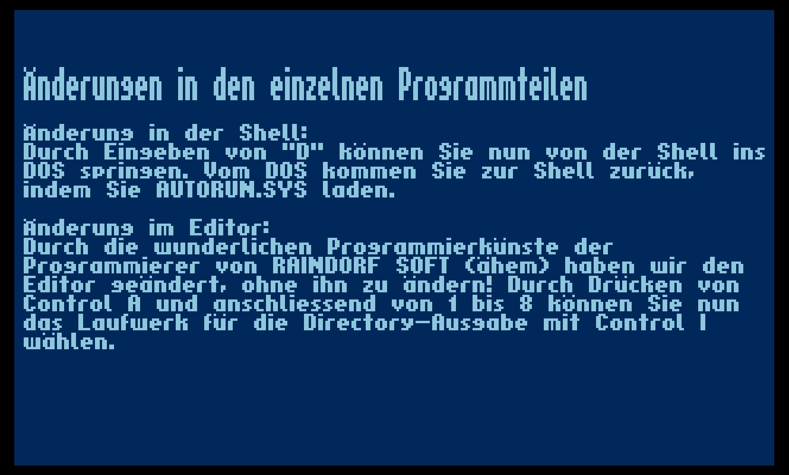
QUICKmagazin - program changes

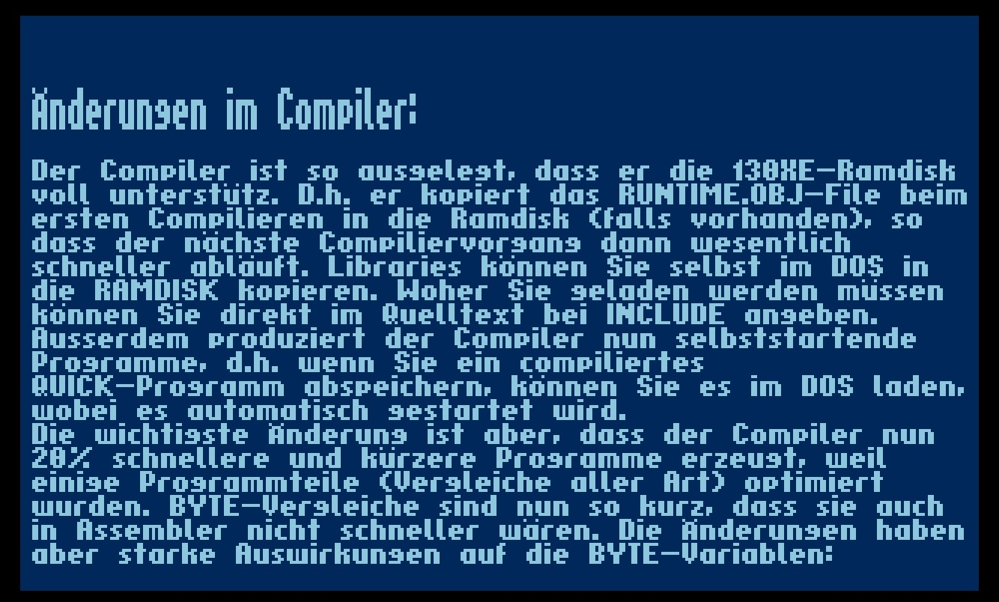
QUICKmagazin - compiler changes

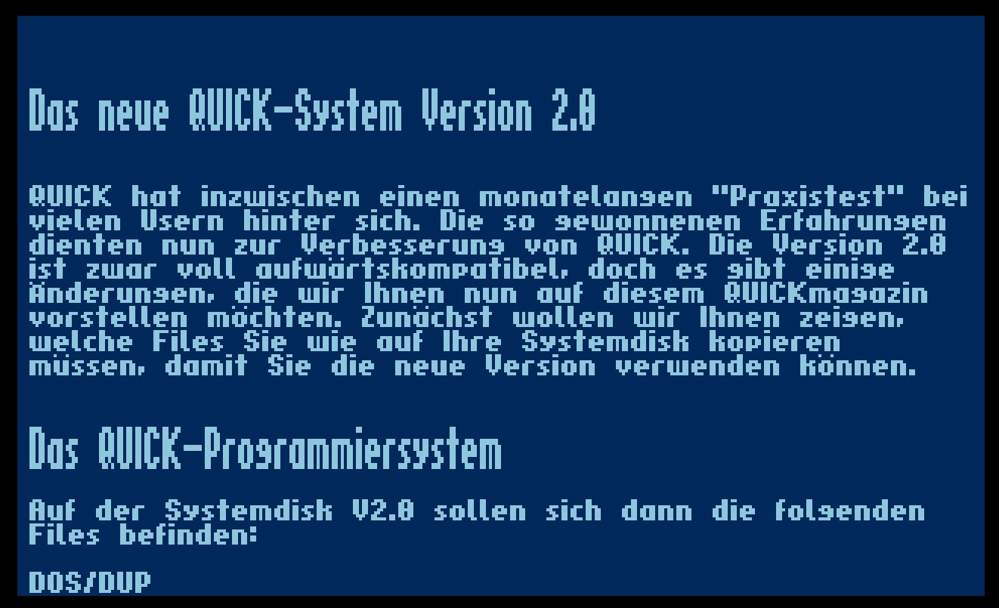
The new QUICK-System Version 2.0

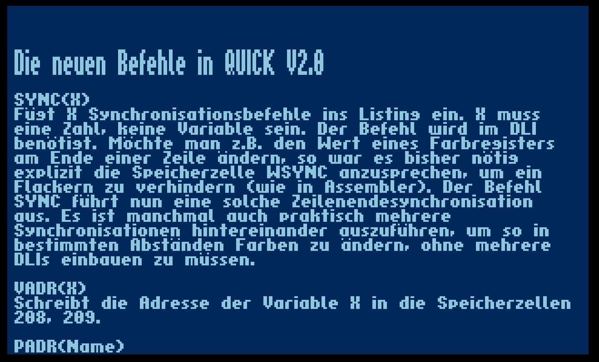
The new commands in QUICK V2.0

## Ads

We thank Fred Meijer from [Atarimuseum in the Netherlands](http://www.atarimuseum.nl) for this donation

- [QUICK flyers](attachments/QUICK_flyers.pdf) ; size: 963 KB

QUICK ad Christmas 1991
