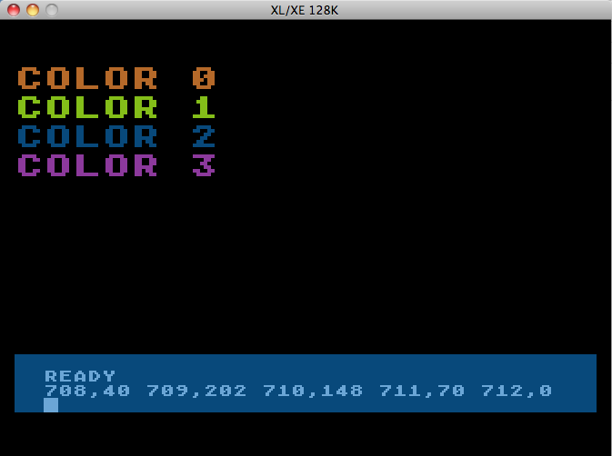

# Standard color values  
||SETCOLOR||Color||Luminance||Color name||Address||Name||Address||Name||Default Value dec||Default Value hex||in GR.0||in GR.1/2||GR.3,5,7  
|0,2,8|	2|	8|	Orange|	708|	[COLOR0](../COLOR0/README.md)|	53270|	[COLPF0](../COLPF0/README.md)|40|$28|n.a.|Uppercase|COLOR 1  
|1,12,10|12|	10|	Green|	709|	[COLOR1](../COLOR1/README.md)|	53271|	[COLPF1](../COLPF1/README.md)|202|$CA|Text (only Luminance)|Lowercase|COLOR 2 and Textwindow LUM  
|2,9,4|	9|	4|	Blue|	710|	[COLOR2](../COLOR2/README.md)|	53272|	[COLPF2](../COLPF2/README.md)|148|$94|Screen|Inverse|COLOR 3 and Textwindow Background  
|3,4,6|	4|	6|	Pink|    711|	[COLOR3](../COLOR3/README.md)|	53273|	[COLPF3](../COLPF3/README.md)|70|$46|n.a.|Inverse Lowercase|n.a.  
|4,0,0|	0|	0|	Black|712|	[COLOR4](../COLOR4/README.md)|	53274|	[COLBK](../COLBK/README.md)|0|$00|Border|n/a|Background and Border (COLOR 0)  
  
  
  
  
  
  
see also: [Color topics](../Color_topics/README.md)  
