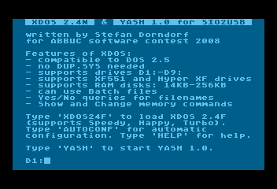
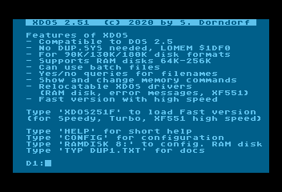

# XDOS

|Autor          |Stefan Dorndorf|
|---------------|----------------|
|Current Version|2.51 vom 2020  |

A small, fast command-line [DOS](../../../DOS/README.md), that does not require a DUP.SYS menu. It can be seen as the successor of [Happy-Computer DOS II+/D](../Happy-Computer_DOS_II_D/README.md). It was voted application/user program in the ABBUC software contest 2008.

## Documentation

- [XDOS 2.43 Documentation (German)](attachments/XDOS_2.43.pdf)

## ATR Images

- [XDOSYASH.atr](attachments/XDOSYASH.atr) XDOS 2.4N and YASH 1.0 for SIO2USB\]
- [XDOS251.atr](attachments/XDOS251.atr) XDOS 2.51

## Pictures

- XDOS 2.4N and YASH 1.0 for SIO2USB 
- XDOS 2.51 
