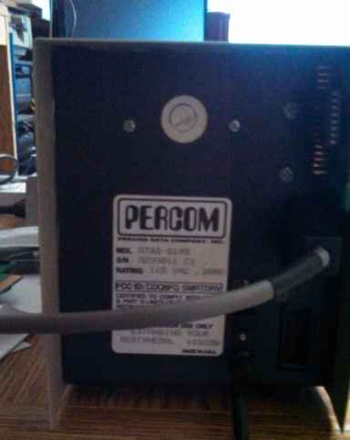

# Percom AT-88

PERCOM DATA CORP.  was an early manufacturer of Floppy drives for Computer Systems in the late 70s and early 80s. Most notably, the TRS-80 and Atari 8-bit computers.  
  
## Moel AT-88-S1PD  
  
### Manual
[Percom_AT88-S1PD.pdf](../../media/Percom_AT-88/attachments/Percom_AT88-S1PD.pdf); 12 MB
  
### Pictures  
   
