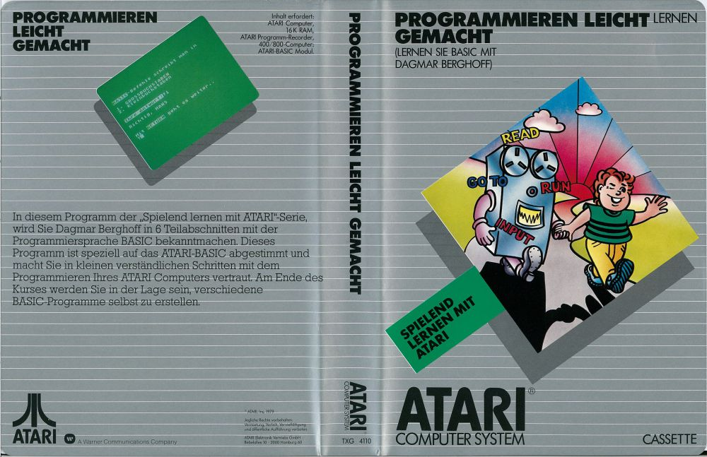
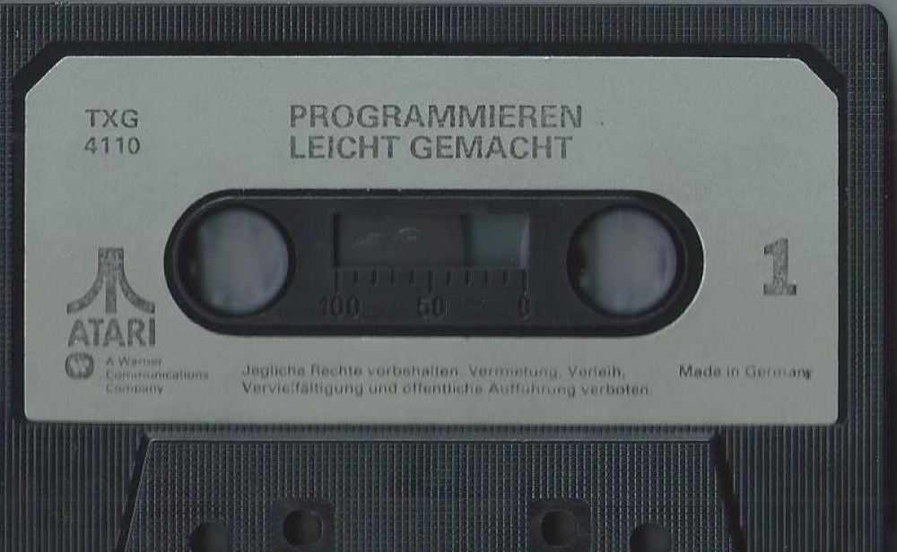
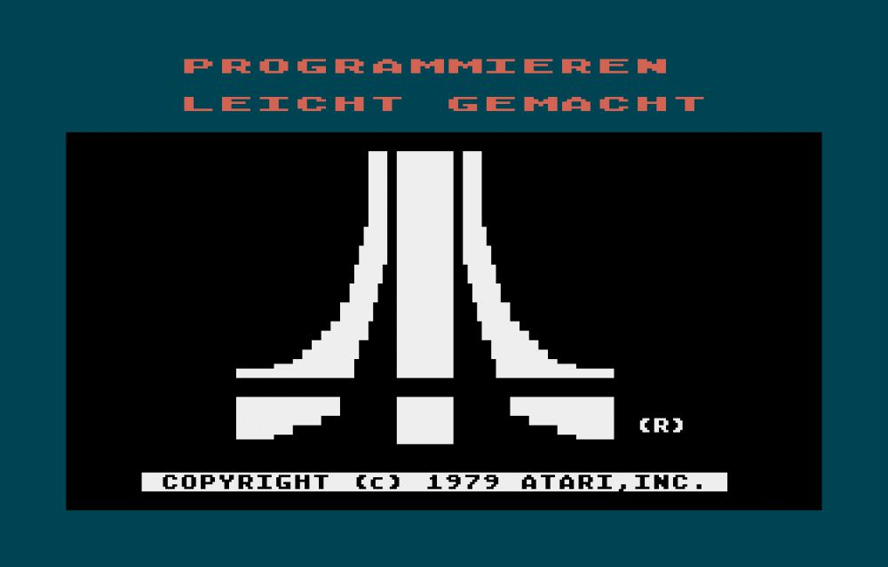
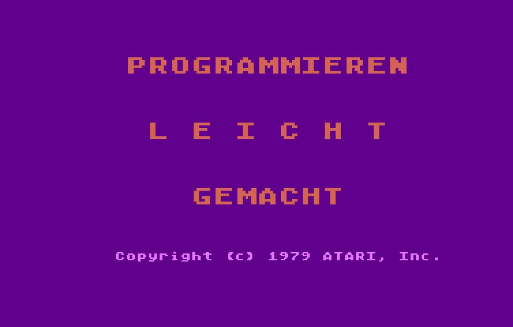
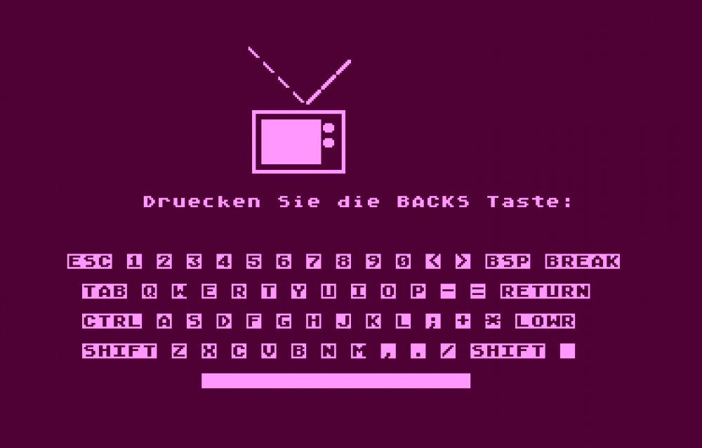

#Programmieren leicht gemacht TXG4110

# Programmieren leicht gemacht - Lernen Sie BASIC mit [Dagmar Berghoff](https://de.wikipedia.org/wiki/Dagmar_Berghoff) - TXG4110  

Die nachstehende Software wurde ursprünglich auf Kassette vertrieben und enthielt neben den Programmen auch die Stimme der damaligen Tagesschau-Sprecherin [Dagmar Berghoff](https://de.wikipedia.org/wiki/Dagmar_Berghoff), um den Atari Usern die Sprache BASIC näher zu bringen.  
  
In diesem Programm der „Spielend lernen mit ATARI“-Serie, wird Sie [Dagmar Berghoff](https://de.wikipedia.org/wiki/Dagmar_Berghoff) in 6 Teilabschnitten mit der Programmiersprache BASIC bekanntmachen. Dieses Programm ist speziell auf das ATARI-BASIC abgestimmt und macht Sie in kleinen, verständlichen Schritten mit dem Programmieren Ihres ATARI Computers vertraut. Am Ende des Kurses werden Sie in der Lage sein, verschiedene BASIC-Programme selbst zu erstellen.  
  
Ein Beispiel der Tagesschau mit der wundervollen Dagmar Berghoff finden Sie weiter unten im Abschnitt Filme. In diesem Kursus wurde ferner die Musik von Barry White & The Love Unlimited Orchestra verwendet. Es wird der instrumentale Titel: "Love's theme" verwendet. Den vollständigen Titel finden Sie ebenfalls im Abschnitt Filme weiter unten. Vielen lieben Dank an: Marsupilami von Atariage [Atarinside](https://atarinside.dyndns.org/blog/index.php/atari-deutschland/) für das Auffinden und Zusammenstellen der Clips, wir sind Dir sehr dankbar!  
  
## ATR-Images  
- [Programmieren_leicht_gemacht_TXG4110_Basic.atr](attachments/Programmieren_leicht_gemacht_TXG4110_Basic.atr) ; Programmieren leicht gemacht - Lernen Sie BASIC mit [Dagmar Berghoff](https://de.wikipedia.org/wiki/Dagmar_Berghoff) - TXG4110 ; Ex­trak­ti­on der einzelnen Kursteile von der Kassette als Basic-Programme auf einer einzelnen Diskette zum schnellerem Einladen.  
  
## CAS-Images  
- [Programmieren_leicht_gemacht_TXG4110.cas](attachments/Programmieren_leicht_gemacht_TXG4110.cas) ; Programmieren leicht gemacht - Lernen Sie BASIC mit [Dagmar Berghoff](https://de.wikipedia.org/wiki/Dagmar_Berghoff) - TXG4110 ; der komplette Kurs in einer CAS-Datei beinhaltet beide Seiten der Kassette, d. h. sowohl die Seite 1, als auch die Seite 2.  
  
## FLAC-Images  
- [Programmieren_leicht_gemacht_TXG4110-Seite_A-deutsch.flac](../../media/Programmieren_leicht_gemacht_TXG4110/attachments/Programmieren_leicht_gemacht_TXG4110-Seite_A-deutsch.flac) ; Teil 1 von 2 ; Größe: 190 MB  
- [Programmieren_leicht_gemacht_TXG4110-Seite_B-deutsch.flac](../../media/Programmieren_leicht_gemacht_TXG4110/attachments/Programmieren_leicht_gemacht_TXG4110-Seite_B-deutsch.flac) ; Teil 2 von 2 ; Größe: 144 MB  
- [Programmieren leicht gemacht -  Seite 1 Teil 1.flac](https://data.atariwiki.org/FLAC/Programmieren leicht gemacht -  Seite 1 Teil 1.flac) ; Größe: 180,8 MB ; Vielen lieben Dank an Dirk Tröger für die Neudigitalisierung in besserer Qualität! Wir stehen tief in Deiner Schuld!  
- [Programmieren leicht gemacht -  Seite 1 Teil 2.flac](https://data.atariwiki.org/FLAC/Programmieren leicht gemacht -  Seite 1 Teil 2.flac); Größe: 87,1 MB ; Vielen lieben Dank an Dirk Tröger für die Neudigitalisierung in besserer Qualität! Wir stehen tief in Deiner Schuld!  
- [Programmieren leicht gemacht -  Seite 1 Teil 3.flac](https://data.atariwiki.org/FLAC/Programmieren leicht gemacht -  Seite 1 Teil 3.flac); Größe: 63,9 MB ; Vielen lieben Dank an Dirk Tröger für die Neudigitalisierung in besserer Qualität! Wir stehen tief in Deiner Schuld!  
- [Programmieren leicht gemacht -  Seite 2 Teil 1.flac](https://data.atariwiki.org/FLAC/Programmieren leicht gemacht -  Seite 2 Teil 1.flac); Größe: 118,5 MB ; Vielen lieben Dank an Dirk Tröger für die Neudigitalisierung in besserer Qualität! Wir stehen tief in Deiner Schuld!  
- [Programmieren leicht gemacht -  Seite 2 Teil 2.flac](https://data.atariwiki.org/FLAC/Programmieren leicht gemacht -  Seite 2 Teil 2.flac); Größe: 113,2 MB ; Vielen lieben Dank an Dirk Tröger für die Neudigitalisierung in besserer Qualität! Wir stehen tief in Deiner Schuld!  
  
## Handbuch  
- [Programmieren leicht gemacht-Programmanleitung-RXG 4110](attachments/Programmieren_leicht_gemacht-Programmanleitung-RXG_4110.pdf) ; Größe: 1,8 MB; AtariWiki dankt ganz besonders [Atarinside](https://atarinside.dyndns.org/blog/index.php/atari-deutschland/) für die große Hilfe aus Frankreich und Dirk Tröger für die Neudigitalisierung in besserer Qualität! Deutschland steht tief in eurer Schuld! Vielen lieben Dank! :-)  
  
## Quelltexte  
- [Quelltexte des Kurses - Ausdrucke ohne Sonderzeichen als Textdateien](attachments/Quelltexte.zip) ; Größe: 25 KB  
  
## Bilder  
  
Programmieren leicht gemacht - TXG 4110 - Box-Cover, Vorder- und Rückseite ; Vielen lieben Dank an: Marsupilami von Atariage [Atarinside](https://atarinside.dyndns.org/blog/index.php/atari-deutschland/)  
  
  
Programmieren leicht gemacht - TXG 4110 - Kassetten-Oberseite; Vielen lieben Dank an: Marsupilami von Atariage [Atarinside](https://atarinside.dyndns.org/blog/index.php/atari-deutschland/)  
  
  
Programmieren leicht gemacht - TXG 4110 - Startbildschirm; Vielen lieben Dank an: Marsupilami von Atariage [Atarinside](https://atarinside.dyndns.org/blog/index.php/atari-deutschland/)  
  
  
Programmieren leicht gemacht - TXG 4110 - Eröffnungsbild; Vielen lieben Dank an: Marsupilami von Atariage [Atarinside](https://atarinside.dyndns.org/blog/index.php/atari-deutschland/)  
  
  
Programmieren leicht gemacht - TXG 4110 - Beispielbild; Vielen lieben Dank an: Marsupilami von Atariage [Atarinside](https://atarinside.dyndns.org/blog/index.php/atari-deutschland/)  
  
## Filme  
- [Der komplette Kurs der Seite 1 der Kassette als Video](https://www.dailymotion.com/video/x4tmtmp) ; Vielen lieben Dank an: Marsupilami von Atariage [Atarinside](https://atarinside.dyndns.org/blog/index.php/atari-deutschland/)  
- [Der komplette Kurs der Seite 2 der Kassette als Video](https://www.youtube.com/watch?time_continue=6&v=z8iZCYltsNY&feature=emb_logo) ; Vielen lieben Dank an: Marsupilami von Atariage [Atarinside](https://atarinside.dyndns.org/blog/index.php/atari-deutschland/)  
- [ARD Tagesschau mit Dagmar Berghoff: Spätausgabe vom 15.01.1983](https://www.youtube.com/watch?time_continue=4&v=K0Gvq9vvODc&feature=emb_logo) ; vielen lieben Dank an Marsupilami von Atariage [Atarinside](https://atarinside.dyndns.org/blog/index.php/atari-deutschland/)  
- [Barry White & Love Unlimited Orchestra - Love's theme (video/audio edited & remastered) HQ](https://www.youtube.com/watch?time_continue=1&v=Fz1eXWUzcRU&feature=emb_logo) ; vielen lieben Dank an Marsupilami von Atariage [Atarinside](https://atarinside.dyndns.org/blog/index.php/atari-deutschland/)  
  
## MP4s  
- [Programmieren leicht gemacht - TXG 4110 - Seite 1.mp4](https://data.atariwiki.org/VIDEO/Programmieren leicht gemacht - TXG 4110 - Seite 1.mp4)  
- [Programmieren leicht gemacht - TXG 4110 - Seite 2.mp4](https://data.atariwiki.org/VIDEO/Programmieren leicht gemacht - TXG 4110 - Seite 2.mp4)  
- [ARD Tagesschau mit Dagmar Berghoff-Spätausgabe vom 15.01.1983.mp4](https://data.atariwiki.org/VIDEO/ARD Tagesschau mit Dagmar Berghoff-Spätausgabe vom 15.01.1983.mp4)  
  
## MP3s  
- [Programmieren leicht gemacht TXG4110-Seite 1-deutsch.mp3](https://data.atariwiki.org/MP3/Programmieren leicht gemacht TXG4110-Seite A-deutsch.mp3) ; MP3-Datei der Seite 1 der Kassette mit der bezaubernden Stimme von [Dagmar Berghoff](https://de.wikipedia.org/wiki/Dagmar_Berghoff) mit stark bis ganz unterdrückter Datenspur  
- [Programmieren leicht gemacht TXG4110-Seite 2-deutsch.mp3](https://data.atariwiki.org/MP3/Programmieren leicht gemacht TXG4110-Seite B-deutsch.mp3) ; MP3-Datei der Seite 2 der Kassette mit der bezaubernden Stimme von [Dagmar Berghoff](https://de.wikipedia.org/wiki/Dagmar_Berghoff) mit stark bis ganz unterdrückter Datenspur  
  
## Autor  
  
PDI: PROGRAM DESIGN, INC.  
  
John Victor, President  
Program Design, Inc.  
11 Idar Court  
Greenwich, CT 06830  
  
Alle Rechte der deutschen Bearbeitung: ATARI ELEKTRONIK VERTRIEBS GMBH  
  
## Danksagung  
  
Ohne die folgenden Personen wäre dieses Projekt nicht möglich gewesen, ihnen gilt daher unser Dank:  
  
- Stefan Meyer  
- Mr. Bacardi  
- Marsupilami von Atariage ; [Atarinside](https://atarinside.dyndns.org/blog/index.php/atari-deutschland/)  
- Carsten Strotmann  
