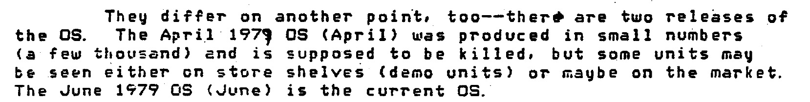
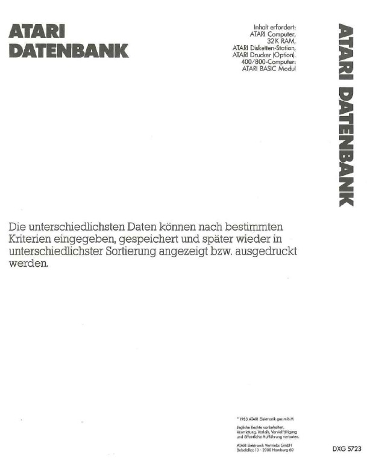
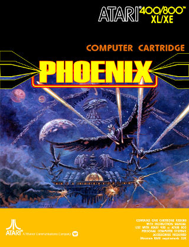
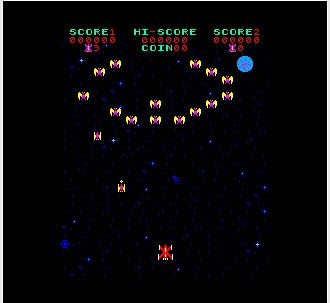
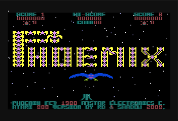
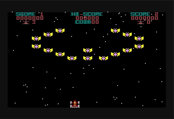
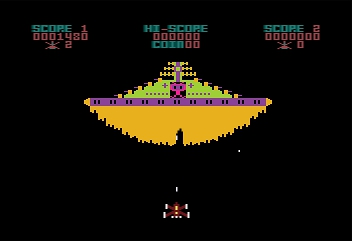
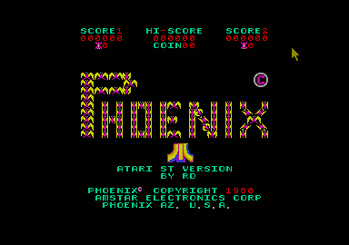

# Rarity 10 and above up to impossible!

This chapter is intended to provide an overview of programs that must exist but seem to be lost over the decades. If you have any hint, idea or whatever else to help us to digitize this for generations to come, please let us know.

Below are the products AtariWiki is looking for. Besides this, the worldwide community is looking for this [list of missing / undumped software on AtariAge](https://forums.atariage.com/topic/252943-list-of-missing-undumped-software), too.

## Missing Atari Operating System Versions

### Atari OS Rev. B (PAL) for the Atari 400/800 from 1981

There are more than rumors about this OS type; please see here:

[Atari\_XL\_Addendum-Atari\_Home\_Computer\_System-Operating\_System\_Manual.pdf](../../media/Todos/OS/Atari_OS/attachments/Atari_XL_Addendum-Atari_Home_Computer_System-Operating_System_Manual.pdf) size: 14.8 MB

Page 31 of the PDF file, or page 28 of the manual itself.

If you own an Atari 400 or 800 in the PAL version, please do us a favor and enter `?PEEK(65528)` in BASIC. If the result is 34, then you own the most expensive Atari in the world, which has an OS we do not have up to today. It is only a little step for you, but would be a giant leap for the Atari community. Everlasting fame is sure for you in that case.

### Atari OS 255 for te  Atari 400/800

Many thanks to kr0tki, who found the trace showing that OS 255 is for real!
On page 8 of:
[All about Cassette Tapes from 1979.pdf](..//Companies/Atari/Atari_Hardware/Voice_and_Data_Cassettes/attachments/All_about_Cassette_Tapes_1979.pdf) ; size: 741 KB
we find:

Page 8 of: 'All about Cassette Tapes from 1979'

## Missing Atari Inc. Software

### Atari Assembler Editor Cartridge Source Code

### Atari Editor (CX8105)

Maybe replaced by the Atari Program Text Editor?

### [Atari FutureMakers - Through the Star Bridge (DX5076)](http://www.atarimania.com/game-atari-400-800-xl-xe-futuremakers-through-the-star-bridge_6419.html)

Copyright (C) 1984 Atari, Inc. Many, many thanks to Hans Reutter for the info, Allan Bushman for the high resolution grab and Atarimania for hosting!

### [Atari FutureMakers - This Is Ground Control (DX5077)](http://www.atarimania.com/game-atari-400-800-xl-xe-futuremakers-this-is-ground-control_6420.html)

Copyright (C) 1984 Atari, Inc. Many, many thanks to Hans Reutter for the info, Allan Bushman for the high resolution grab and Atarimania for hosting!

### [Atari Force - Liberator](<https://www.emuparadise.me/M.A.M.E._-_Multiple_Arcade_Machine_Emulator_ROMs/Liberator_(set_1)/14238>)

Copyright (C) 1982 Atari, Inc.

### [Atari Home Finance](../Companies/Atari/Atari_Home_Finance/README.md)

### [Atari Learning System Software](../Companies/Atari/Atari_Learning_System_Software/README.md)

Completely missing!

### Atari Macro Assembler (AMAC) and Program Text Editor Source Code

### [Atari Pascal (APX-20102)](../Companies/Atari/Atari_Program_Exchange_APX_Software/Atari_Pascal_APX-20102/README.md)

- CXL4017 Pascal (cartridge, planned, but never released)
- CX8109 Pascal (planned, but never released, because 128 KB RAM and 2 disk drives were needed)
- CX8110 Pascal Database (planned, but never released, because 128 KB RAM and 2 disk drives were needed)
- CX8115 Pascal-Native Code (planned, but never released, because 128 KB RAM and 2 disk drives were needed)
- CX8116 Pascal-Linker (planned, but never released, because 128 KB RAM and 2 disk drives were needed)

### Atari Statistics II (CX8112) Disk

Was it ever finished?

### Atari Pole Position II

title by Namco; never shipped, but exists!)

### [The Atari Accountant](../Companies/Atari/The_Atari_Accountant/README.md)

Two parts are missing:

- Accounts Receivable System (CX402), (4 SSDD Diskettes)
- Inventory Control System (CX403), (5 SSDD Diskettes)

### [The Dow Jones Investment Evaluator (CX412)](../Companies/Atari/Atari_The_Dow_Jones_Investment_Evaluator/README.md)

Three parts are missing:

- Atari Dow Jones Investment Evaluator (CX8124)
- Atari Dow Jones Investment Evaluator (CX8125)
- Atari Dow Jones Investment Evaluator (CX8127)

## Missing German Atari Software

### Atari Datenbank (DXG 5723)

Copyright (C) 1983 Atari Elektronik Vertriebs GmbH

Hierzu ist zu sagen, dass bis heute keine Version öffentlich bekannt ist. Ferner ist noch nicht einmal eine Boxenhülle als Bild vorhanden. Es kann sich jedoch um die deutsche Version von SynFile+ handeln, die exklusiv für Atari entwickelt wurde. Das Jahr 1983 stimmt. Ferner wird das Basic-Modul benötigt; auch das stimmt hier. Sollte jemand im Besitz dieser Software sein, würden wir uns über eine Rückmeldung sehr, sehr freuen. :-)

Atari Datenbank (DXG 5723) Copyright (c)) 1983 Atari Elektronik Vertriebs GmbH ; Quelle: Atari ComputerSysteme--Software-Katalog (1983)

### Atari Music Spiele

Hierzu ist zu sagen, dass bis heute keine Version öffentlich bekannt ist. Ferner ist noch nicht einmal eine Boxenhülle als Bild vorhanden. In keinem Katalog, in keiner Preisliste und in keinem Handbuch wurde hierzu eine Spur gefunden! Dennoch stammt die Information aus einer sehr seriösen Quelle, die wir ernst nehmen. Sollte jemand im Besitz dieser Software sein, würden wir uns über eine Rückmeldung sehr, sehr freuen. :-)

### [Atari Super Biorhythmus / Atari Super Biorythme](../Companies/Atari/Atari_Germany/Super_Biorhythmus/README.md)

Wurde es je fertig?

## Missing Dorsett Educational Systems Tapes

Some tapes were severely damaged and therefore couldn't be digitized. If anyone is in possession of the following tapes, please give us a message or a post [here](https://forums.atariage.com/topic/251713-desperate-call-for-help-on-missing-dorsett-tapes/). We really need your help and appreciate just any hint on the programs, who seem to be lost in time, like tears in rain.

The ones left to be digitizde are below.

### General Shop Practices

- Oa1: Tool Identification Lesson, Part 1
- Oa7: Discussion of a Two-Cycle Engine
- Oa8: Use of Micrometers and Calipers

### Health Services Career

- Hc5: Medical History
- Hc6: Extended Care

### Physics

- Ph16: Theory of Relativity

Well, concerning Physics, we may be able to restore Ph16 from the Atari version of that course, Physics CX6008? Just loud thinking...

## Missing OSS Software and Newsletters

### McStuff Co. OSS BUG/65 revision 1.1

### OSS Action! Graphics Utilities Library and Shape Editor for[ACTION](../Companies/OSS/ACTION/README.md)

### OSS BASIC A+ Source Code

### OSS BUG/65 Source Code

### OSS BUGV4FIX.COM

File needed to patch BUG/65 to work with DOS XL 4

### OSS EASMD Source Code

### OSS MAC/65 MACDO.M65

File published by OSS via BBS

### OSS Newsletters

We already have:
OSS Newsletter - Summer 1983
OSS Newsletter - January 1984
OSS Newsletter - Spring 1984
OSS Newsletter - October 1984
OSS Newsletter - Fall 1986
OSS Newsletter - Winter 1987

### OSS Newsletters disks

All are missing

## Missing Synapse Software

### SynMail

was finished according to Steve Hales, but after SynCalc und SynFile+ never sold to the public. So, somewhere out there, it may exists

### SynText

was finished according to Steve Hales, but after SynCalc und SynFile+ never sold to the public. So, somewhere out there, it may exists

## Missing VisiCorp Software

### VisiDex

An information organization and retrieval program which lets the user file and recall any type of information. It prints out lists, notes, and memos; and keeps track of a daily calendar, alerting the user to upcoming events. According to 'The Atari User's Encyclopedia from The Book Company, page 232, this software exists. So, somewhere out there, it may exists...

### VisiFile

A comprehensive electronic filing system that makes it simple to organize, maintain, and effectively use all the information a business needs. It will accurately store, search, sort, retrieve, display, calculate, and print reports, lists, and mailing
lists. According to 'The Atari User's Encyclopedia from The Book Company, page 232, this software exists. So, somewhere out there, it may exists...

## Missing Other Software

### Forth Compiler from Frank Ostrowski

Seems to be lost in time, until a friend of Frank may give it to the community?

### Kyan Pascal

The community with the help of all has made great progress regarding Kyan Pascal. Tom Eckmann, CEO of Kyan Pascal, was so nice to us, by giving Kyan Pascal into PD. To complete Kyan Pascal, we need your help again. The missing list is as follows:

- Kyan Pascal version 1.2
- Programming Utility Toolkit for Kyan Pascal version 1.x
- Advanced Graphics Toolkit for Kyan Pascal version 1.x
- Kyan Pascal version 2.00 and 2.03
- Code Optimizer Toolkit for Kyan Pascal version 2.x ; includes the source code for the Runtime Library

Please take into account: the System Utilities Toolkit for Kyan Pascal version 2.x is labeled as Version 1.00, while the content is 2.x! Therefore, if you have any original diskette from Kyan Pascal, please let us know. Thank you so much in advance. :-)

### [Phoenix for Atari 800](https://ataritools.fr.gd/1-_-PHOENIX-PROJECT.htm)

Phoenix for the Atari box

Phoenix (Original)

Phoenix - fig. 1

Phoenix - fig. 2

Phoenix - fig. 3

Phoenix - fig. 4

### [Pursuit of the Pink Panther](http://www.atarimania.com/game-atari-400-800-xl-xe-pursuit-of-the-pink-panther_4177.html)

Copyright (C) 1983 NAP Consumer Electronics, Licensed from MGM/UA with the music from Henry Mancini!!!

### Success with Math - CBS Software

- Decimals - Addition and Subtraction
- Subtracting Mixed Fractions

### [WWF-Club-Spiel](../Companies/WDR/WWF-Club-Spiel/README.md)

A cartridge used by German Television (WDR, Westdeutscher Rundfunk)in the 80's for a call-in game via telephone - programmer has lived in Hattingen/Germany
