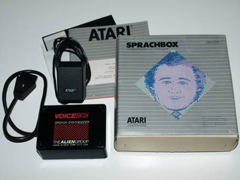

# Sprachbox DXG5721

Die AtariSprachbox ist eine für den Atari angepasste Version der "VoiceBox" von "TheAlienGroup" die es auch für andere Computersysteme gab. Sie wird über ein SIO-Kabel an den Atari angeschlossen und über ein Netzteil mit Strom versorgt.

## ATR-Image
- [Atari Sprachbox DXG5721](attachments/Sprachbox.atr) ; ATR-Image der Atari Sprachbox DXG5721

## Handbücher
- [Handbuch zur Sprachbox DXG5721](attachments/Atari_Sprachbox_DXG5721.pdf) ; Größe: 3,4 MB ; Mega-Danke an Atarimania für die Scans des Handbuches! :-)))
- [Atari_Sprachbox_DXG5721-Print.pdf](../../media/Sprachbox/attachments/Atari_Sprachbox_DXG5721-Print.pdf) ; Größe: 5,7 MB  ; Atari Sprachbox DXG5721-Handbuch ohne rote Seiten in der bestmöglichen Qualität ohne Neueintippen. Wir danken Florian Dingler für das Scannen der Seiten und Joachim Baßmann für das Entfernen der roten Farbe in den Seiten. Vielen lieben Dank an euch beide! :-)
- [Atari_Sprachbox_DXG5721-OCR.pdf](attachments/Atari_Sprachbox_DXG5721-OCR.pdf) ; Größe: 960 KB  ; wie vorstehende Datei, nur mit OCR.

## Bilder

Atari Sprachbox DXG5721 - Boxinhalt
