# Create a theme for editing

In order to find a right theme for editing, please see the below code for making your personal best choice

## ATR-Image

- [Themen.atr](attachments/Themen.atr) ; atr image with the basic program to choose your best matching color

## Pictures

- Theme 01 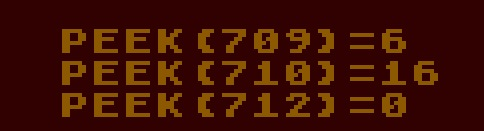

- Theme 02 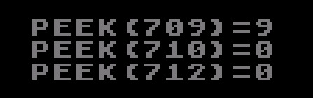

- Theme 03 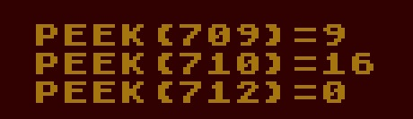

- Theme 04 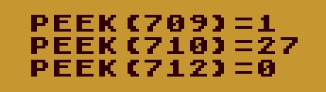

- Theme 05 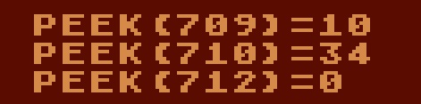

- Theme 06 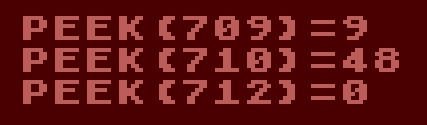

- Theme 07 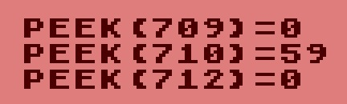

- Theme 08 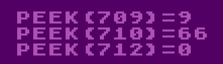

- Theme 09 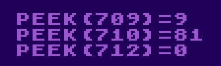

- Theme 10 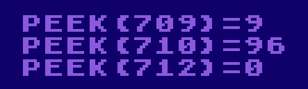

- Theme 11 

- Theme 12 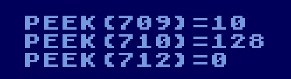

- Theme 13 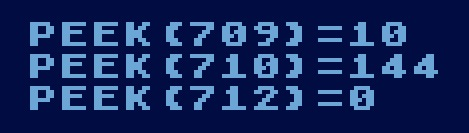

- Theme 14 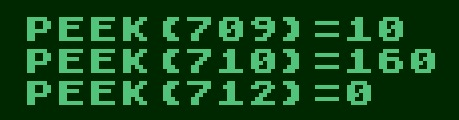

- Theme 15 

- Theme 16 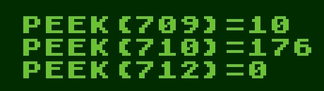

- Theme 17 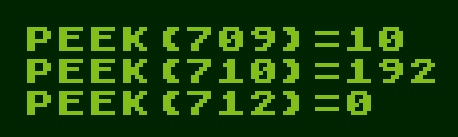

- Theme 18 

- Theme 19 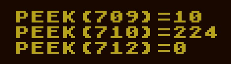

- Theme 20 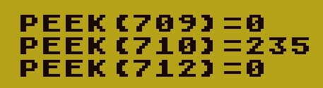

- Theme 21 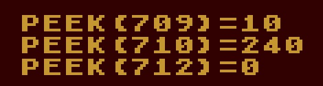

- Theme 22 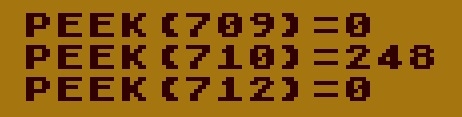
