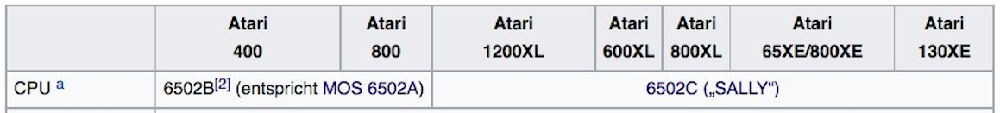
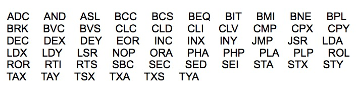
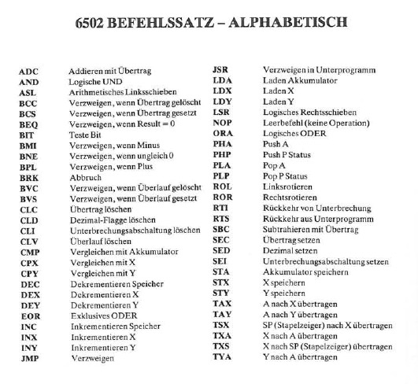
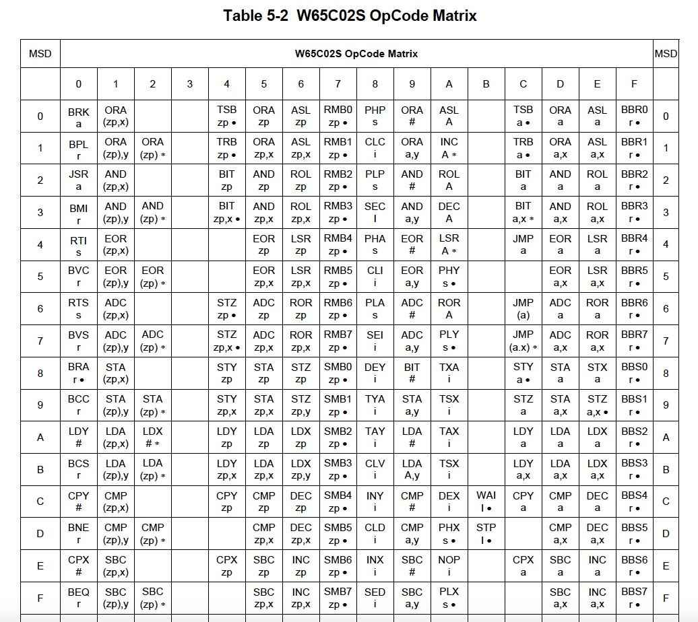
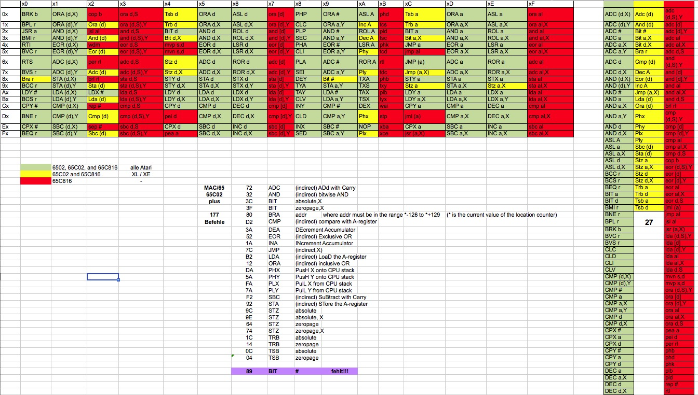
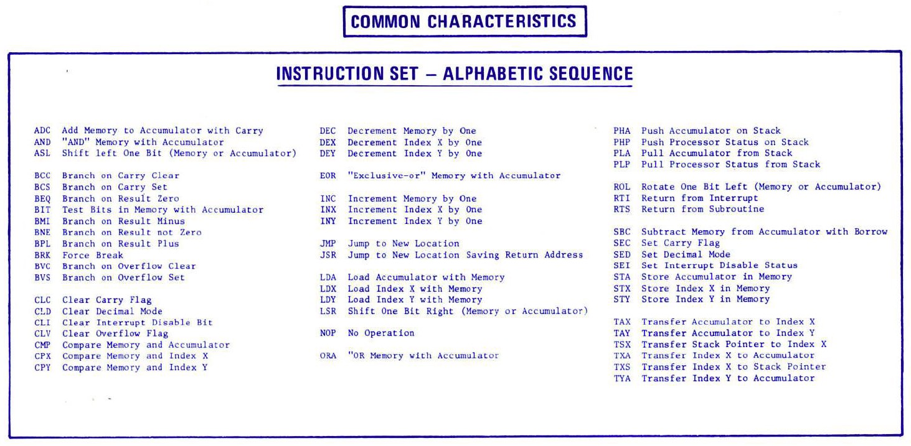

# OpCodes for 6502, 65C02 and 65C816 microprocessors

## OpCodes in an Excel sheet

- [6502\_OpCodes.xlsx](attachments/6502_OpCodes.xlsx)

## Pictures

- Verwendete Prozessoren in den Atari Computern 

- MOS 6502 OpCodes - Stardard ; diese Befehle versteht jeder Atari Computer 

- 6502 Befehlssatz-alphabetisch 

- OpCodes 

- 6502, 65C02 und 65C816-Befehlssatz, \_\_ Der MAC/65 versteht alle grün und gelb markierten Befehle, mit Ausnahme von BIT #\_\_ 

- Official MOS instruction set - alphabetic ; **opcode ROR is missing, but every 6502 microprocessor and higher understands it** 
