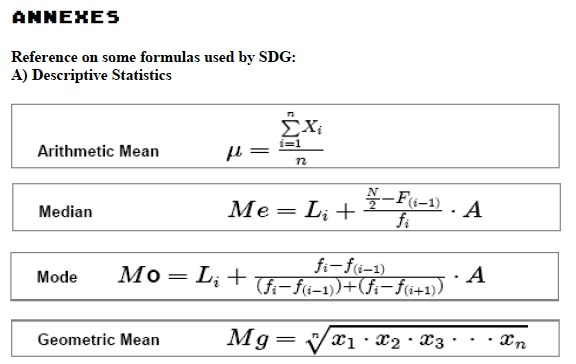
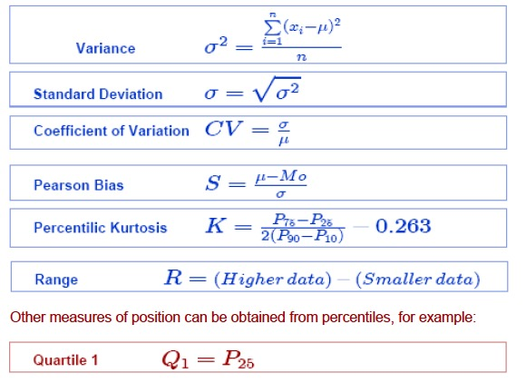
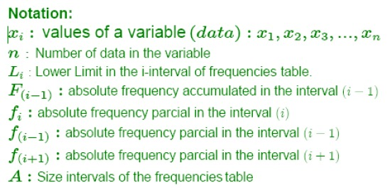
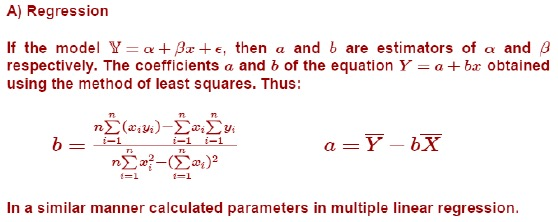

# SDG Statistical Data Graphics \& Analysis

By Claudio Fernandez Loquenz

Gigantisches Statistik-Paket für den Atari. Es nicht zu kennen, ist eine Bildungslücke. Veröffentlicht im Abbuc Sondermagazin Nummer 40 als Beilage. Vielen lieben Dank an den [Abbuc e. V.](http://www.abbuc.de), das ist ein Hammer-Programm! Aber sehen Sie selber:

## ATR Images

- [SDGA.atr](attachments/SDGA.atr) ; SDG-ATR-Image Part A
- [SDGB.atr](attachments/SDGB.atr) ; SDG-ATR-Image Part B
- [SDGC.atr](attachments/SDGC.atr) ; SDG-ATR-Image Part C

## Manual

- [SDG-Manual.pdf](attachments/SDG-Manual.pdf) ; ab Seite 31 in der PDF-Datei.

## Pictures

- SDG-Logo 

- Annexes from SDG 

- Used formulas in SDG 

- Notations in SDG 

- Regression in SDG 
